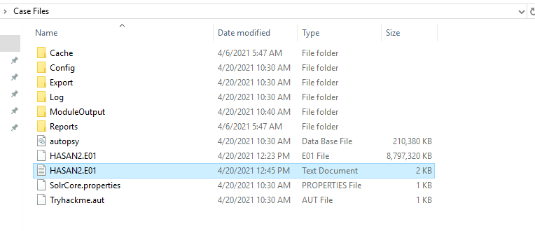
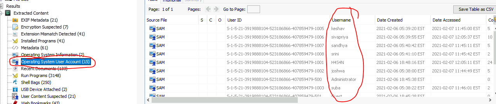
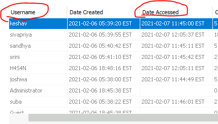
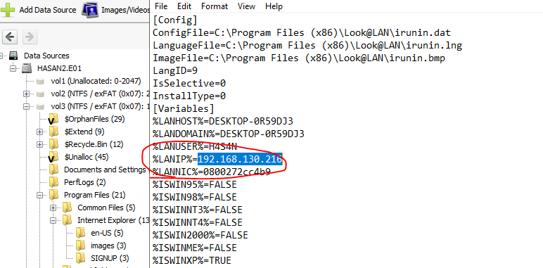
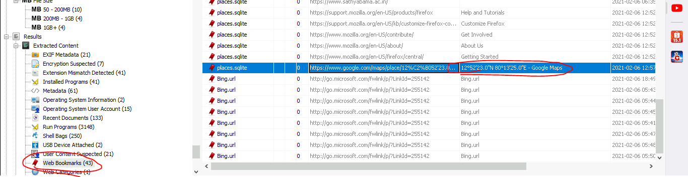

## Lab 
> https://tryhackme.com/room/autopsy2ze0
## Giải
### What is the MD5 hash of the E01 image?
- Để trả lời được câu hỏi này ta truy cập vào file `HANSAN2.txt`
- 
- Kéo xuống, lần lượt thu được các thông tin về file cần phân tích
> 3f08c518adb3b5c1359849657a9b2079
### What is the computer account name?
- Thông tin account được lưu tại 
- 
> DESKTOP-0R59DJ3	
### List all the user accounts. (alphabetical order)
- Lấy tất cả các user của hệ thống tại 
- 
> H4S4N,joshwa,keshav,sandhya,shreya,sivapriya,srini,suba
### Who was the last user to log into the computer?
- Để xác định được người cuối cùng đăng nhập vào máy tính, em sẽ tiến hành kiểm tra thời gian truy cập 
- 
> sivapriya	
### What was the IP address of the computer?
- IP của máy em tìm thấy tại path `Program Files (x86) > Look@LAN > irunin.ini`, đây là nơi lưu các thông tin về local network
- 
> 192.168.130.216
### What was the MAC address of the computer? (XX-XX-XX-XX-XX-XX)
- Địa chỉ mac chính là giá trị của LAN IC
- 
> 08-00-27-2c-c4-b9
### What is the name of the network card on this computer?
- Để lấy được name của card mạng em sẽ dựa vào các hives của registry
-  Đường dẫn chứa các thôg tin hệ thống nằm ở sofware
### What is the name of the network monitoring tool?
- Để biết được em sẽ xem phần chương trình đã chạy , sau đó tìm các phần mềm liên quan
### A user bookmarked a Google Maps location. What are the coordinates of the location?
- Muốn biết vị trí đã đánh dấu ta cần try cập web bookmarked để xem 
- 
> 12°52'23.0"N 80°13'25.0"E
### A user has his full name printed on his desktop wallpaper. What is the user's full name?
- Em sẽ kiểm tra ảnh trên máy trước
### A user had a file on her desktop. It had a flag but she changed the flag using PowerShell. What was the first flag?
- Đầu tiên em truy cập vào lịch sử PowerShell trước 
- Em sẽ kiểm tra lần lượt từng user
