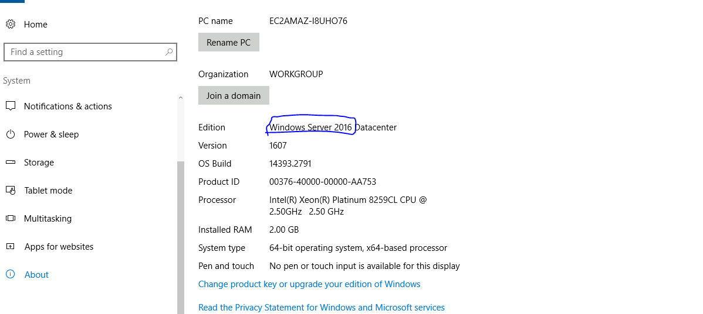
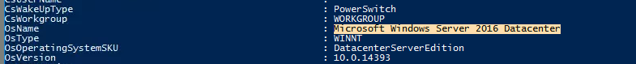

## Đề
```
This is a challenge that is exactly what is says on the tin, there are a few challenges around investigating a windows machine that has been previously compromised.

Connect to the machine using RDP. The credentials the machine are as follows:

Username: Administrator
Password: letmein123!

Please note that this machine does not respond to ping (ICMP) and may take a few minutes to boot up.
```
## Connect
- https://tryhackme.com/room/investigatingwindows
## GIải 
### Câu hỏi 1 : Whats the version and year of the windows machine?
- Để trả lời được câu hoie này em có 2 cách 
#### Cách 1 : Tìm bằng giao điện người dùng 
- Setting > system > about 
- 
#### Cách 2 : Tìm bằng command line 
- Đầu tiên em sẽ mở powershell lên và gõ lệnh `Get-ComputerInfo` để liệt kê tất cả các thông tin về hệ thống 
- 
> Windows Server 2016
### Câu hỏi 2 : Which user logged in last?
