## Đề
```
This is a challenge that is exactly what is says on the tin, there are a few challenges around investigating a windows machine that has been previously compromised.

Connect to the machine using RDP. The credentials the machine are as follows:

Username: Administrator
Password: letmein123!

Please note that this machine does not respond to ping (ICMP) and may take a few minutes to boot up.
```
## Connect
- https://tryhackme.com/room/investigatingwindows
## GIải 
### Câu hỏi 1 : Whats the version and year of the windows machine?
- Để trả lời được câu hoie này em có 2 cách 
#### Cách 1 : Tìm bằng giao điện người dùng 
- Setting > system > about 
- 
#### Cách 2 : Tìm bằng command line 
- Đầu tiên em sẽ mở powershell lên và gõ lệnh `Get-ComputerInfo` để liệt kê tất cả các thông tin về hệ thống 
- 
> Windows Server 2016
### Câu hỏi 2 : Which user logged in last?
- Để trả lời câu hỏi này hướng đi đầu tiên của em là kiểm tra phần SAM của registry nhưng máy ảo không có. Em chuyển sang đọc Event Viewer
- 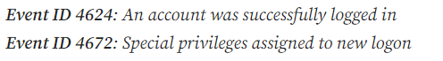
- Em sẽ dựa vào thông tin trên để tìm các id tương ứng
> Administrator
### Câu hỏi 3 : When did John log onto the system last?
- 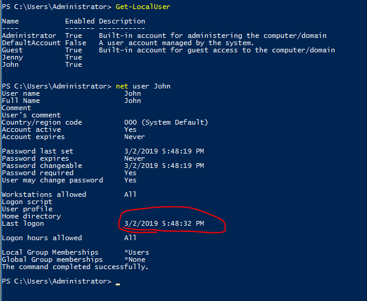
> 03/02/2019 5:48:32 PM
### Câu hỏi 4 : What IP does the system connect to when it first starts?
- 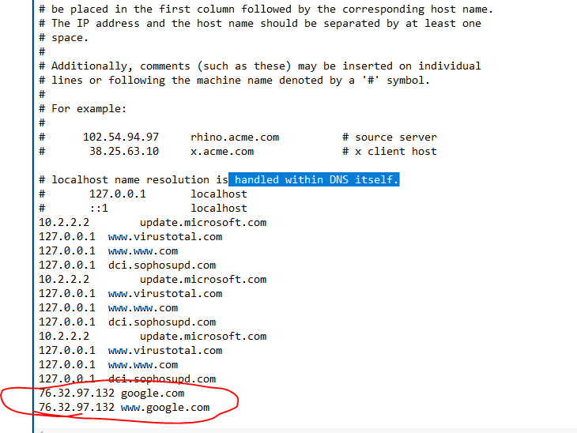
> 10.34.2.3
### Câu hỏi 5 : What two accounts had administrative privileges (other than the Administrator user)?
- Em kiểm tra group của từng user
- 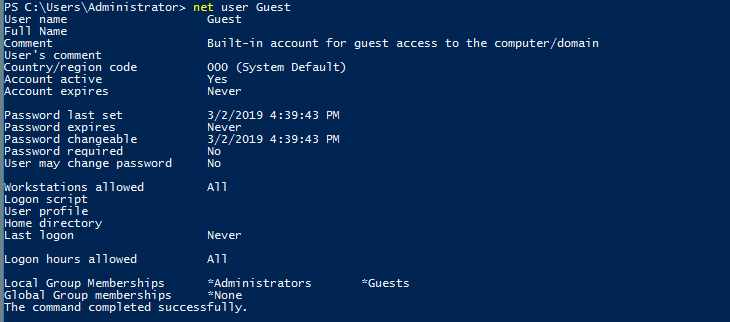
- 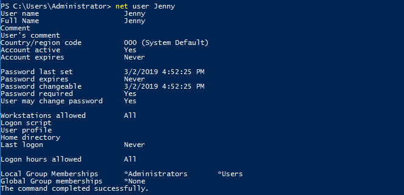
> Jenny,Guest
### Whats the name of the scheduled task that is malicous.
- Em bắt đầu mở Computer Management bằng lệnh `compmgmt.msc` trên run 
- 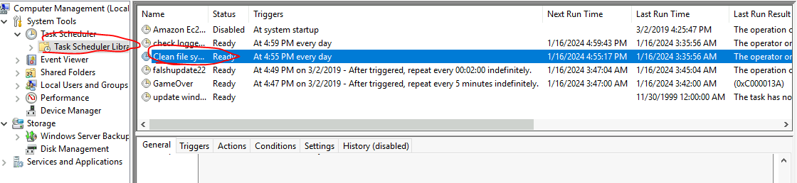
> Clean file system
### What file was the task trying to run daily?
>  nc.ps1
### What port did this file listen locally for?
> 1348
### When did Jenny last logon?
- 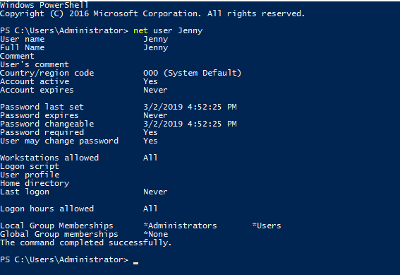
> never
### At what date did the compromise take place?
> 03/02/2019
### During the compromise, at what time did Windows first assign special privileges to a new logon?
> 03/02/2019 4:04:49 PM
### What tool was used to get Windows passwords?
> Mimikatz
### What was the attackers external control and command servers IP?
- Truy cập lại vào `C:\Windows\System32\drivers\etc\host`
- 
- Kiểm tra ping google thì em thấyy ip khác nhau 
- 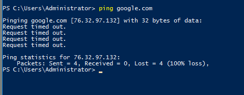
> 76.32.97.132
### What was the extension name of the shell uploaded via the servers website?
- Tại `C:\inetpub` chứa nội dung của máy chủ web
- 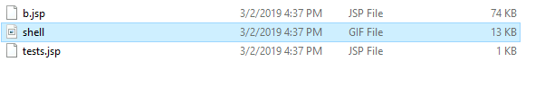
> .jsp
### What was the last port the attacker opened?
- Em sẽ dùng filter trong firewall
- 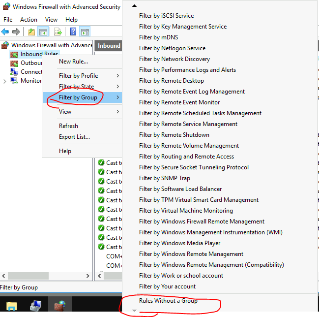
- 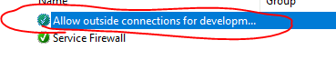
- 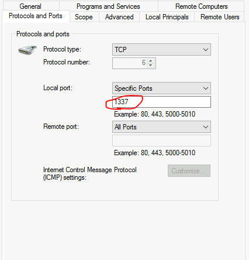
> 1337
### Check for DNS poisoning, what site was targeted?
- Dựa vào tệp host tại `C:\Windows\System32\drivers\etc\host`
> google.com