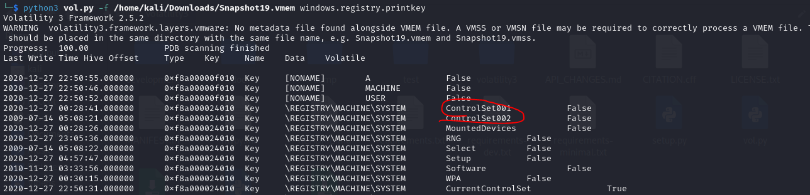
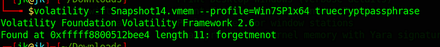

## Task 2 : Login
```
The forensic investigator on-site has performed the initial forensic analysis of John's computer and handed you the memory dump he generated on the computer. As the secondary forensic investigator, it is up to you to find all the required information in the memory dump.

```
- Sau khi tải xuống, em sử dụng công cụ vol3 để phân tích memory dump 
> Q1 : What is John's password?
- Để xác định được mật hẩu của user john em sử dụng plugin hashdump của vol3
```
┌──(kali㉿kali)-[~/volatility3]
└─$ python3 vol.py -f /home/kali/Downloads/Snapshot6.vmem windows.hashdump.Hashdump
Volatility 3 Framework 2.5.2
WARNING  volatility3.framework.layers.vmware: No metadata file found alongside VMEM file. A VMSS or VMSN file may be required to correctly process a VMEM file. These should be placed in the same directory with the same file name, e.g. Snapshot6.vmem and Snapshot6.vmss.
Progress:  100.00               PDB scanning finished                        
User    rid     lmhash  nthash

Administrator   500     aad3b435b51404eeaad3b435b51404ee        31d6cfe0d16ae931b73c59d7e0c089c0
Guest   501     aad3b435b51404eeaad3b435b51404ee        31d6cfe0d16ae931b73c59d7e0c089c0
John    1001    aad3b435b51404eeaad3b435b51404ee        47fbd6536d7868c873d5ea455f2fc0c9
HomeGroupUser$  1002    aad3b435b51404eeaad3b435b51404ee        91c34c06b7988e216c3bfeb9530cabfb
```
- Các mật khẩu được mã hoá nên em sẽ sử dụng john để crack nó 
- Em sẽ lưu vào 1 file cho đúng định dạng `John:1001:aad3b435b51404eeaad3b435b51404ee:47fbd6536d7868c873d5ea455f2fc0c9:::`
> Command : john --wordlist=/usr/share/wordlists/rockyou.txt hash --format=NT
```
Created directory: /root/.john
Using default input encoding: UTF-8
Loaded 1 password hash (NT [MD4 128/128 AVX 4x3])
Warning: no OpenMP support for this hash type, consider --fork=4
Press 'q' or Ctrl-C to abort, almost any other key for status
charmander999    (John)     
1g 0:00:00:01 DONE (2024-01-29 21:06) 0.6369g/s 5847Kp/s 5847Kc/s 5847KC/s charmcez..charmaise
Use the "--show --format=NT" options to display all of the cracked passwords reliably
Session completed. 
```
Có thể thấy mật khẩu là `charmander999`
> charmander999
## Task 3 :   Analysis
```
On arrival a picture was taken of the suspect's machine, on it, you could see that John had a command prompt window open. The picture wasn't very clear, sadly, and you could not see what John was doing in the command prompt window.

To complete your forensic timeline, you should also have a look at what other information you can find, when was the last time John turned off his computer?
```
> Q1 : When was the machine last shutdown?
- Vì em dùng vol3 nên có 1 và hạn chế lớn trong việc tìm các thông tin của hệ thống
- Để tìm được thông tin về lần tắt cuối cùng, em phải truy cập vào các registry trên máy 
- Các thông tin này thông thường nằm tại vị trí    `HKEY_LOCAL_MACHINE\SYSTEM\ControlSet\Control\Windows`
- Ở đây chỉ có CurrentControlSet001 và CurrentControlSet002, em sẽ kiểm tra lần lượt
- 
```
┌──(kali㉿kali)-[~/volatility3]
└─$ python3 vol.py -f /home/kali/Downloads/Snapshot19.vmem windows.registry.printkey --key "ControlSet001\Control\Windows" --offset 0xf8a000024010 
Volatility 3 Framework 2.5.2
WARNING  volatility3.framework.layers.vmware: No metadata file found alongside VMEM file. A VMSS or VMSN file may be required to correctly process a VMEM file. These should be placed in the same directory with the same file name, e.g. Snapshot19.vmem and Snapshot19.vmss.
Progress:  100.00               PDB scanning finished                        
Last Write Time Hive Offset     Type    Key     Name    Data    Volatile

2020-12-27 22:50:12.000000      0xf8a000024010  REG_DWORD       \REGISTRY\MACHINE\SYSTEM\ControlSet001\Control\Windows  ErrorMode       0       False
2020-12-27 22:50:12.000000      0xf8a000024010  REG_EXPAND_SZ   \REGISTRY\MACHINE\SYSTEM\ControlSet001\Control\Windows  Directory       "%SystemRoot%"  False
2020-12-27 22:50:12.000000      0xf8a000024010  REG_DWORD       \REGISTRY\MACHINE\SYSTEM\ControlSet001\Control\Windows  NoInteractiveServices   0       False
2020-12-27 22:50:12.000000      0xf8a000024010  REG_EXPAND_SZ   \REGISTRY\MACHINE\SYSTEM\ControlSet001\Control\Windows  SystemDirectory "%SystemRoot%\system32" False
2020-12-27 22:50:12.000000      0xf8a000024010  REG_DWORD       \REGISTRY\MACHINE\SYSTEM\ControlSet001\Control\Windows  ShellErrorMode  1       False
2020-12-27 22:50:12.000000      0xf8a000024010  REG_DWORD       \REGISTRY\MACHINE\SYSTEM\ControlSet001\Control\Windows  CSDVersion      256     False
2020-12-27 22:50:12.000000      0xf8a000024010  REG_DWORD       \REGISTRY\MACHINE\SYSTEM\ControlSet001\Control\Windows  CSDReleaseType  0       False
2020-12-27 22:50:12.000000      0xf8a000024010  REG_DWORD       \REGISTRY\MACHINE\SYSTEM\ControlSet001\Control\Windows  CSDBuildNumber  17514   False
2020-12-27 22:50:12.000000      0xf8a000024010  REG_DWORD       \REGISTRY\MACHINE\SYSTEM\ControlSet001\Control\Windows  ComponentizedBuild      1       False
2020-12-27 22:50:12.000000      0xf8a000024010  REG_BINARY      \REGISTRY\MACHINE\SYSTEM\ControlSet001\Control\Windows  ShutdownTime    "
d2 e3 50 a2 a2 dc d6 01 ..P....."       False

```
> 2020-12-27 22:50:12
> Q2 : What did John write?
- Để xem được john viết gì trong cmd em sử dụng plugin cmdline, có thể thấy pid cmd.exe là 1920
- 
- Em sẽ sử dụng thêm plugin memdump được em tìm hiểu [tại đây](https://blog.onfvp.com/post/volatility-cheatsheet/)
- Sau khi thành công em strings để tìm các thứ các liên quan
```
┌──(kali㉿kali)-[~/volatility3/dump]
└─$ strings pid.1920.dmp | grep -i thm{
THM{You_found_me} 
THM{You_found_me} 
```
> You_found_me
## Task 4 : TrueCrypt
> Q1 : What is the TrueCrypt passphrase?
- Ở task này em dùng 1 vol2 vì nó có chưa sẵn plugin truecrypt
- 
> forgetmenot
