### Task 2 
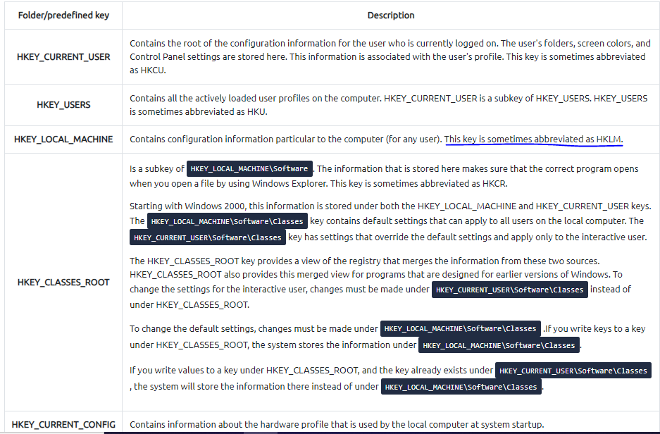
- Dựa vào ảnh trên em có thể trả lời cho câu hỏi của task 2
- Câu hỏi : What is the short form for HKEY_LOCAL_MACHINE?
> HKLM
### Task 4
- Câu hỏi : What is the path for the five main registry hives, DEFAULT, SAM, SECURITY, SOFTWARE, and SYSTEM?
- 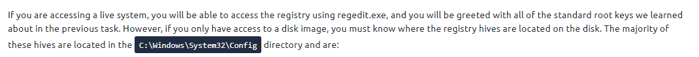
> C:\Windows\System32\Config
- Câu hỏi  : What is the path for the AmCache hive?
- 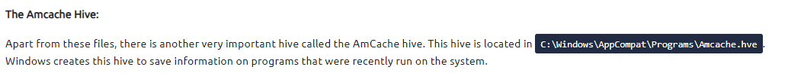
> C:\Windows\AppCompat\Programs\Amcache.hve
### Task 6
- Câu hỏi : What is the Current Build Number of the machine whose data is being investigated?
- 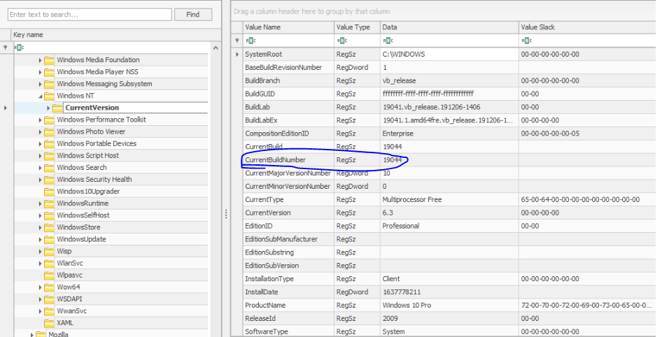
> 19044
- Câu hỏi : Which ControlSet contains the last known good configuration?
- 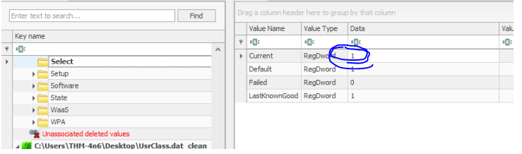
> 1
- Câu hỏi : What is the Computer Name of the computer?
- 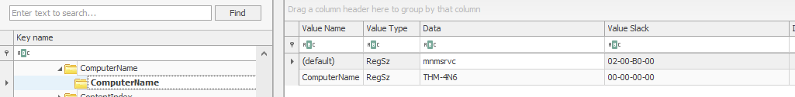
> THM-4n6
- Câu hỏi : What is the value of the TimeZoneKeyName?
- 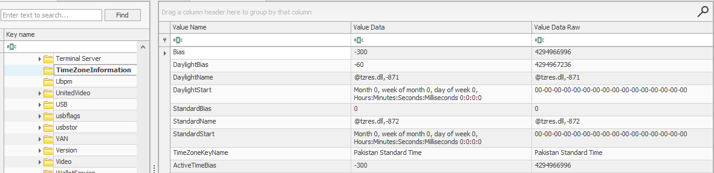
> Pakistan Standard Time
- Câu hỏi  What is the DHCP IP address
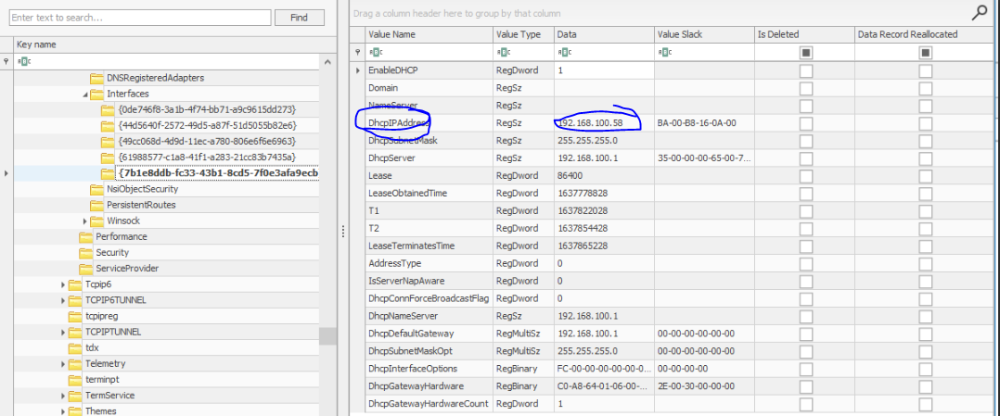
> 192.168.100.58
- Câu hỏi : What is the RID of the Guest User account?
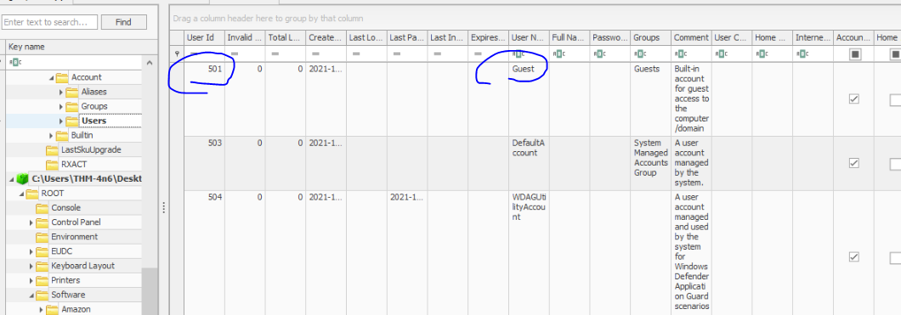
> 501
### Task 7
- Câu hỏi : When was EZtools opened?
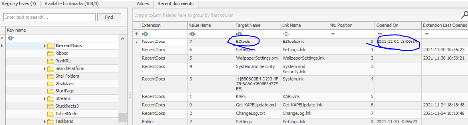
> 2021-12-01 13:00:34
- Câu hỏi : At what time was My Computer last interacted with?
- 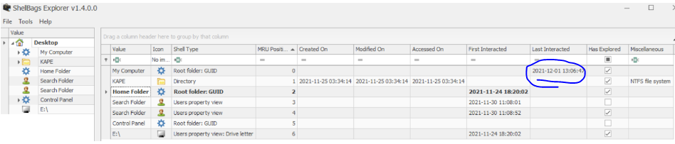
- Câu hỏi : What is the Absolute Path of the file opened using notepad.exe?
- 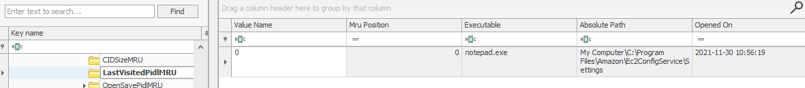
> C:\Program Files\Amazon\Ec2ConfigService\Setting
- Câu hỏi : When was this file opened?
- 
> 2021-11-30 10:56:19
### Task 8
- Câu hỏi : How many times was the File Explorer launched?
- [image](image/13.PNG)
> 26
- Câu hỏi : What is another name for ShimCache?
- [image](image/14.PNG)
> AppCompatCache
- Câu hỏi : Which of the artifacts also saves SHA1 hashes of the executed programs?
> AmCache
- Câu hỏi : Which of the artifacts saves the full path of the executed programs?
> BAM/DAM
### Task 9
- 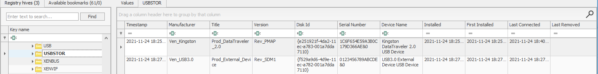
- Câu hỏi : What is the serial number of the device from the manufacturer 'Kingston'?
> 1C6f654E59A3B0C179D366AE&0
- Câu hỏi : What is the name of this device?
> Kingston Data Traveler 2.0 USB Device
- Câu hỏi : What is the friendly name of the device from the manufacturer 'Kingston'?
> Usb
### Task 10
- Truy cập vào `C:\Windows\System32\Config` để thực hiện lab
#### How many user created accounts are present on the system? 
- Vì đề hỏi có bao nhiêu tài khoản người dùng nên em check tại SAM trước
- 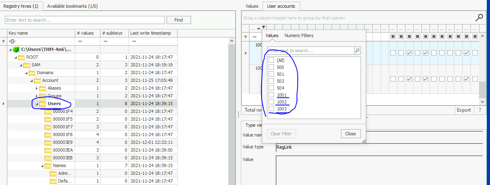
- Sau khi check và tìm hiểu em biết được tài khoản do người dùng tạo có RID là 10* nên ta có 3 user
> 3
### What is the username of the account that has never been logged in?
- Để biết được tài khoản nào chưa từng đăng nhập, em sẽ tiến hành kiểm tra thời gian truy cập cuối cùng. Nếu chưa đăng nhập chỉ số này sẽ không hiển thị 
- 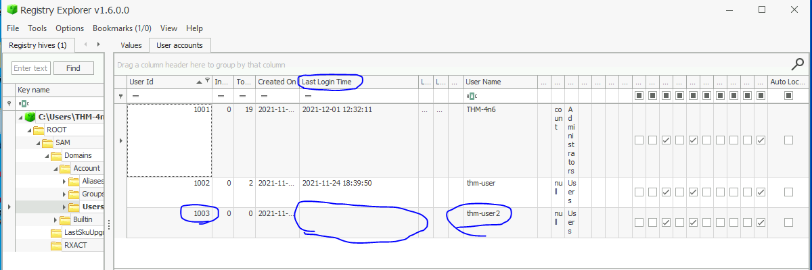
> thm-user2
### What's the password hint for the user THM-4n6?
- Dựa vào trường hint password để tìm được câu trả lời 
- 
> count
### When was the file 'Changelog.txt' accessed?
- Để biết được tệp Changelog.txt được truy cập khi nào em phải truy cập vào `NTUSER.DAT` được tìm thấy ở `C\Users\<user>`, vì vậy em sẽ truy cập vào `C:\Users\THM-4n6\Desktop\triage\C\Users\THM-4n6`
- Để nhanh chóng hơn em dùng ctrl F để tìm Changelog.txt
- 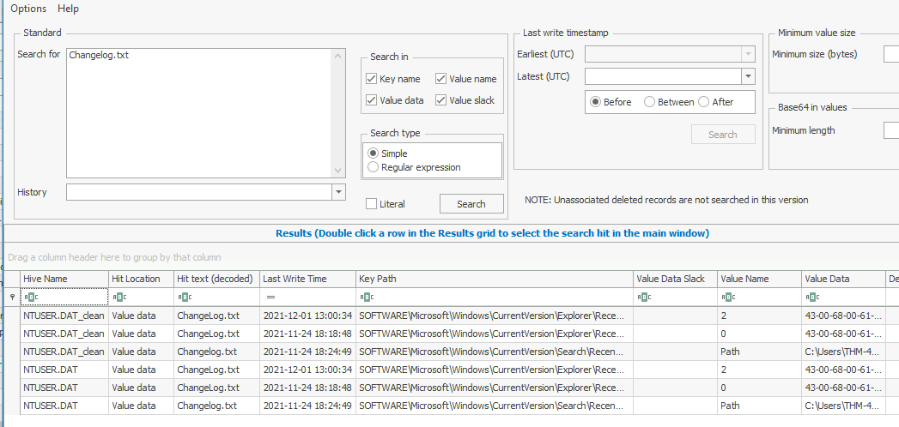
- Sau khi truy cập vào đường dẫn, em thu được thời gian mở cuối cùng 
- 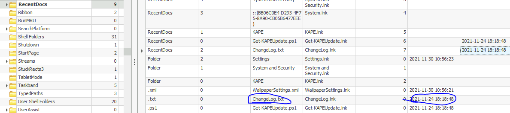
> 2021-11-24 18:18:48
### What is the complete path from where the python 3.8.2 installer was run? 
- Để tìm được đường dẫn gốc em truy cập vào `SOFTWARE\Microsoft\Windows\CurrentVersion\Explorer\UserAssist\...\Count` để tìm,
tại {CEBFF5CD-ACE2-4F4F-9178-9926F41749EA} em thấy được đường dẫn file .exe
> Z:\setups\python-3.8.2.exe
### When was the USB device with the friendly name 'USB' last connected?
- Để tìm lần kết nối cuối cùng của usb em truy cập vào `SYSTEM\CurrentControlSet\Enum\USBSTOR` và `SYSTEM\CurrentControlSet\Enum\USB` thì tại  `SYSTEM\CurrentControlSet\Enum\USBSTOR` em thấy được thông tin 
- 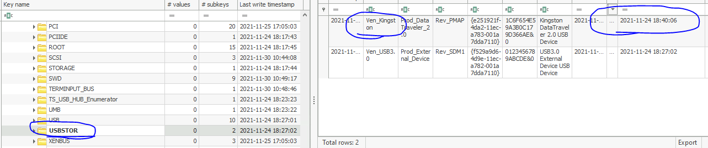
> 2021-11-24 18:40:06

