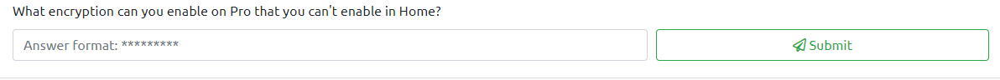
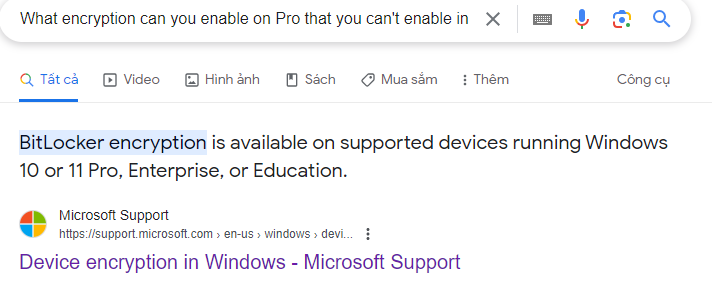
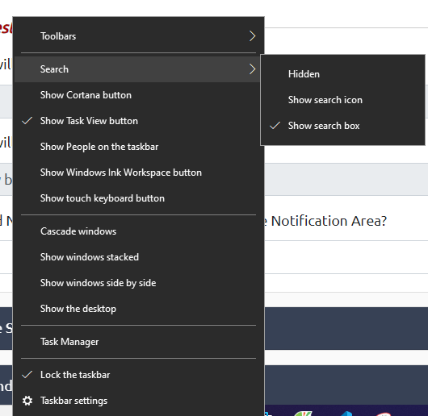
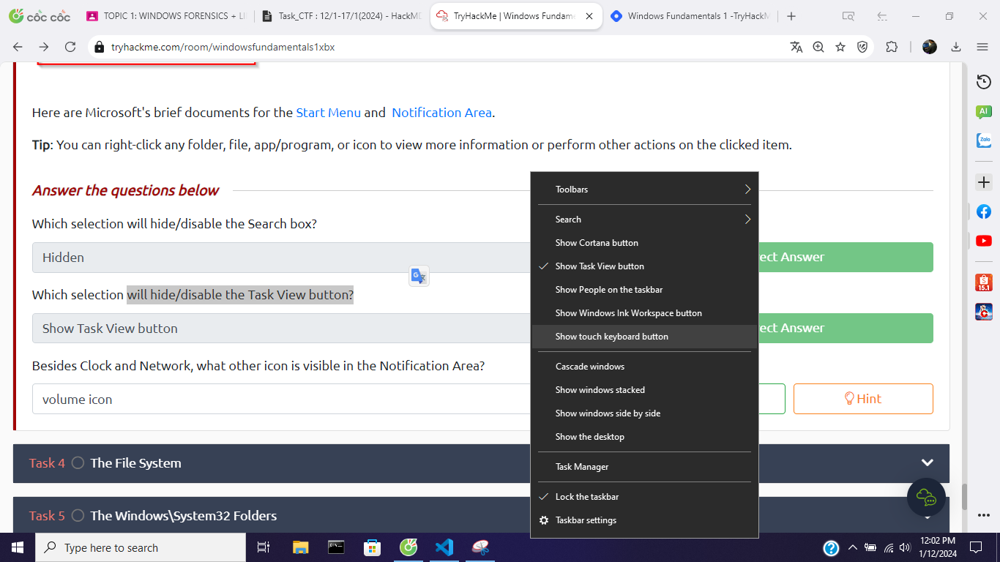
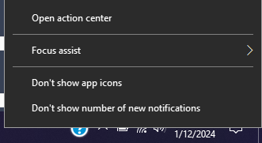
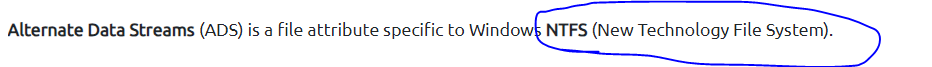

## Lab
> https://tryhackme.com/room/windowsfundamentals1xbx
## Giải 
### Task 2 : Windows Editions
- 
- Để làm được task này em cần phải thực hiện 1 vài kĩ năng tra google 
- 
> BitLocker 
#### Task 3 : The Desktop (GUI)
- Câu 1 : Which selection will hide/disable the Search box?
- 
> Đáp án : Hidden
- Câu 2 : Which selection will hide/disable the Task View button?
- 
> Đáp án : Show Task View button
- Câu 3 : Besides Clock and Network, what other icon is visible in the Notification Area?
- 
> Đáp án : Action Center
### Task 4 :  The File System
- Câu 1 : What is the meaning of NTFS?
- 
> Đáp án : New Technology File System
### Task 5 :  The Windows\System32 Folders
- Câu 1 : What is the system variable for the Windows folder?
> %windir%
### Task 6 : User Accounts, Profiles, and Permissions
- Câu 1 : 