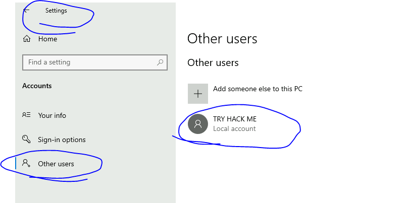
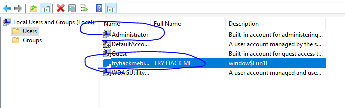
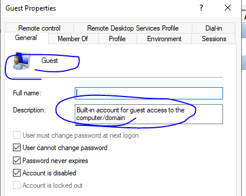
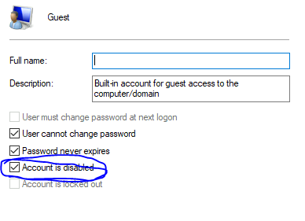

## Lab
> https://tryhackme.com/room/windowsfundamentals1xbx
## Giải 
### Task 2 : Windows Editions
- 
- Để làm được task này em cần phải thực hiện 1 vài kĩ năng tra google 
- 
> BitLocker 
#### Task 3 : The Desktop (GUI)
- Câu 1 : Which selection will hide/disable the Search box?
- 
> Đáp án : Hidden
- Câu 2 : Which selection will hide/disable the Task View button?
- 
> Đáp án : Show Task View button
- Câu 3 : Besides Clock and Network, what other icon is visible in the Notification Area?
- 
> Đáp án : Action Center
### Task 4 :  The File System
- Câu 1 : What is the meaning of NTFS?
- 
> Đáp án : New Technology File System
### Task 5 :  The Windows\System32 Folders
- Câu 1 : What is the system variable for the Windows folder?
> %windir%
### Task 6 : User Accounts, Profiles, and Permissions
- Câu 1 : What is the name of the other user account?
- Câu cầu có 2 cách trả lời : 
1. Cách 1 : Tìm bằng setting > accounts > other users
- 
2. Cách 2 : Dùng `lusrmgr.msc` tại hộp thoại run 
- 
> tryhackmebilly
- Câu 2 : What groups is this user a member of?
- Mở phần member of để trả lời câu hỏi này 
- 
> Remote Desktop Users, Users
- Câu 3 : What built-in account is for guest access to the computer?
-
> Guest
- Câu 3 : What is the account status?
- Để xem được trạng thái tài khoản ta xem các tuỳ chọn đã tick 
- 
> Account is disabled
### Task 7 : User Account Control
- Câu 1 : What does UAC mean?
> User Account Control
### Task 8 :  Settings and the Control Panel
- Câu 1 : In the Control Panel, change the view to Small icons. What is the last setting in the Control Panel view?
> Windows Defender Firewall
### Task Manager
- Câu 1 : What is the keyboard shortcut to open Task Manager?
> ctrl+shift+esc