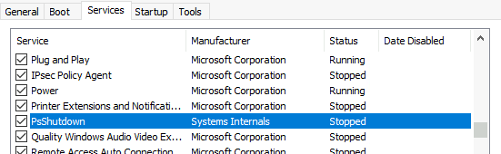
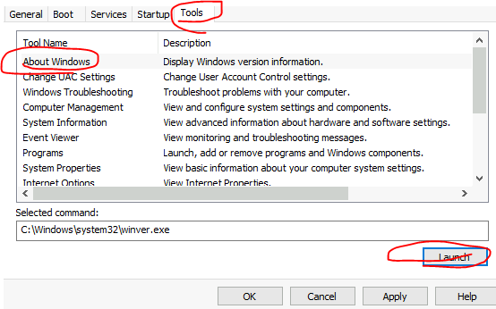
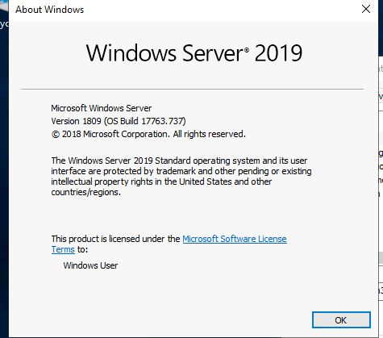
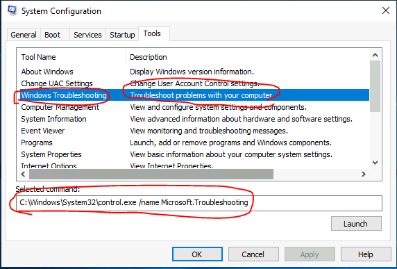
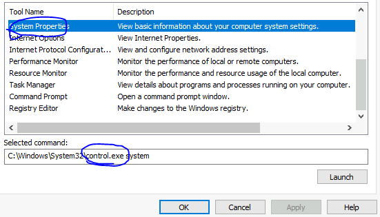
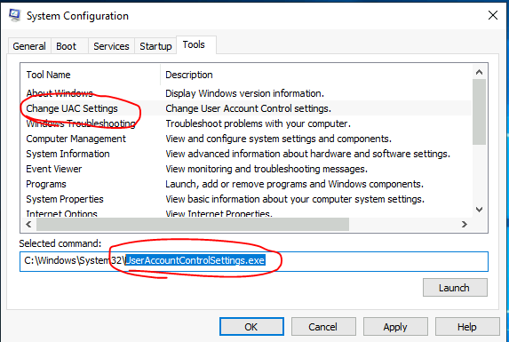
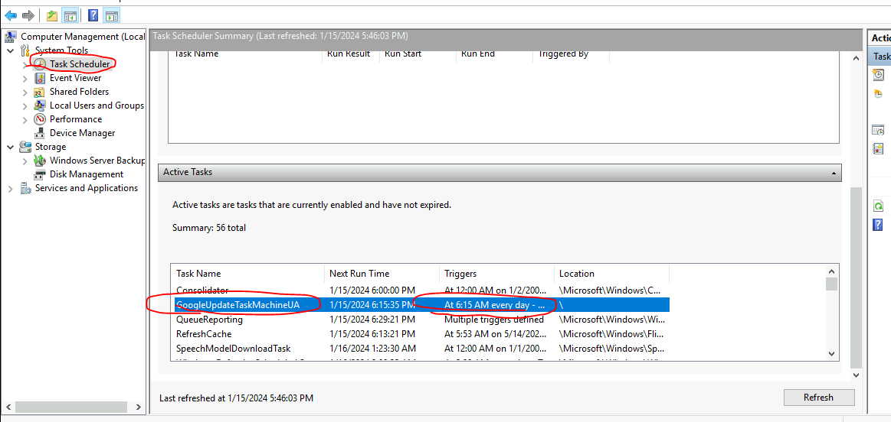
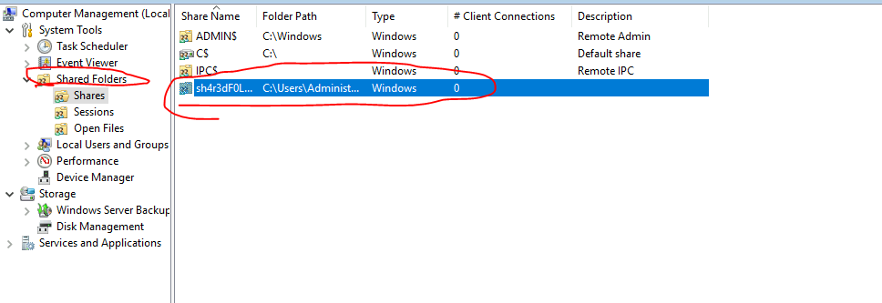
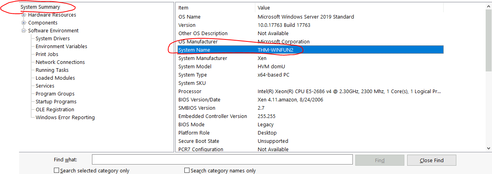
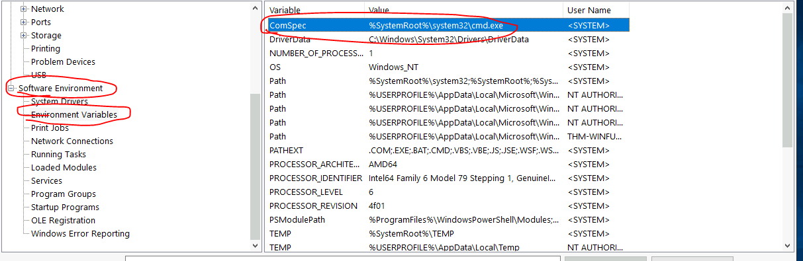

## Lab 
> https://tryhackme.com/room/windowsfundamentals2x0x
## Giải 
### Task 2  System Configuration
- Câu 1 : What is the name of the service that lists Systems Internals as the manufacturer?
- Dựa vào hộp thoại services để tìm 
- 
> PsShutdown
- Câu 2 : Whom is the Windows license registered to?
- Để xem được Windows license em chuyển đến tool > launch
- 
- 
> Windows user
- Câu 3 : What is the command for Windows Troubleshooting?
- Để tìm được lệnh khắc phục sự cố ta phải vào` Troubleshooting` ở phần tool 
- 
> C:\Windows\System32\control.exe /name Microsoft.Troubleshooting
- Câu 4 : What command will open the Control Panel? (The answer is  the name of .exe, not the full path)
- Để tìm được command để mở `Control Panel`, em vào hộp thoại `tool > system properties`
- 
> control.exe
### Task 3 :  Change UAC Settings
- Câu 1 : What is the command to open User Account Control Settings? (The answer is the name of the .exe file, not the full path)
- 
> UserAccountControlSettings.exe
### Task 4 :  Computer Management
- Câu 1 : What is the command to open Computer Management? (The answer is the name of the .msc file, not the full path)
- Dựa vào các kiến thức của lab em có thể trả lời các câu hỏi trên
> compmgmt.msc
- Câu 2 : At what time every day is the GoogleUpdateTaskMachineUA task configured to run?
- Em bắt đầu mở Computer Management bằng lệnh `compmgmt.msc` trên run 
- 
- 
> 6:15 AM
- Câu 3 : What is the name of the hidden folder that is shared?
- Em lần lượt vào folder share để xem
- 
>  sh4r3dF0Ld3r
### Task 5 : System Information
- Câu 1 : What is the command to open System Information? (The answer is the name of the .exe file, not the full path)
> msinfo32.exe
- Câu 2 : What is listed under System Name?
- 
> THM-WINFUN2
- Câu 3 : Under Environment Variables, what is the value for ComSpec?
- 
> %SystemRoot%\system32\cmd.exe
### Task 6 : Resource Monitor
- Câu 1 : What is the command to open Resource Monitor? (The answer is the name of the .exe file, not the full path)
> resmon.exe
### Task 7 :  Command Prompt
- Câu 1 : In System Configuration, what is the full command for Internet Protocol Configuration?
> C:\Windows\System32\cmd.exe /k %windir%\system32\ipconfig.exe
- Câu 2 : For the ipconfig command, how do you show detailed information?
> ipconfig /all
### Task 8 :  Registry Editor
- Câu 1 : What is the command to open the Registry Editor? (The answer is the name of  the .exe file, not the full path)
> regedt32.exe
