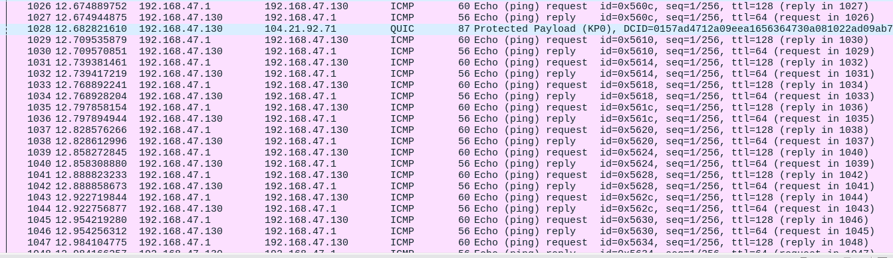
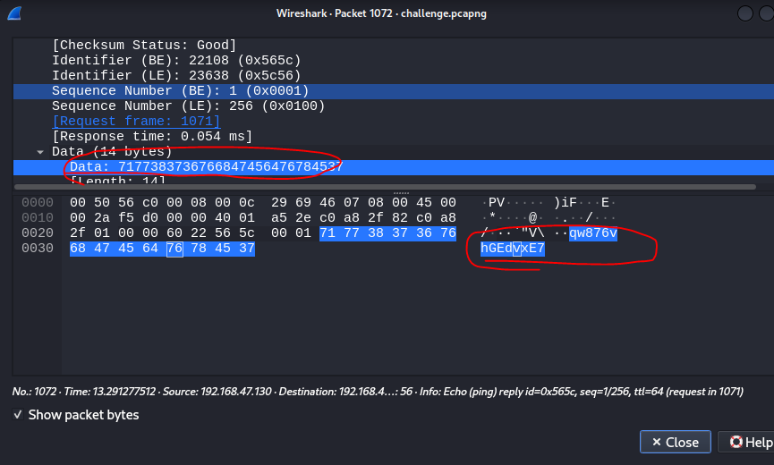
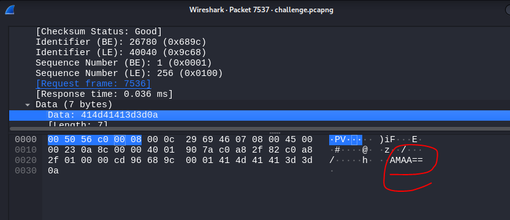
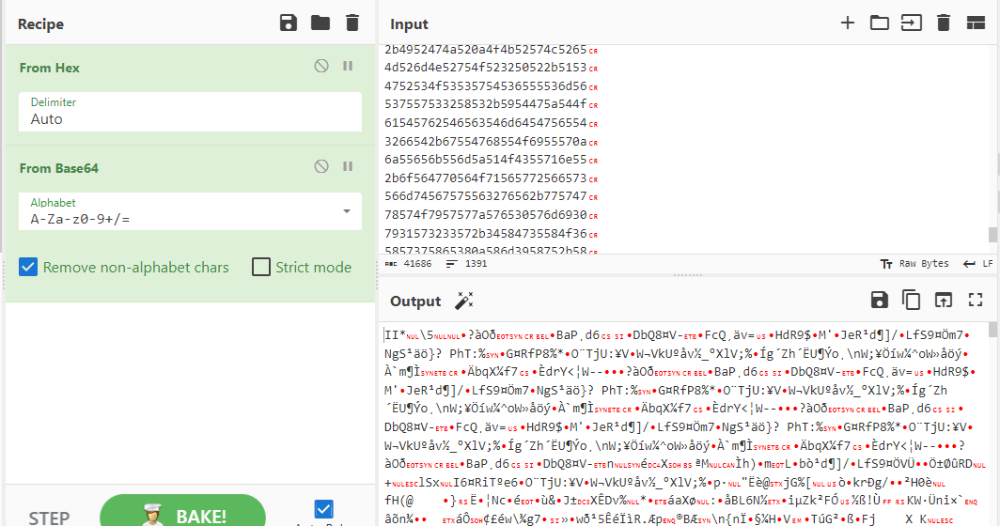
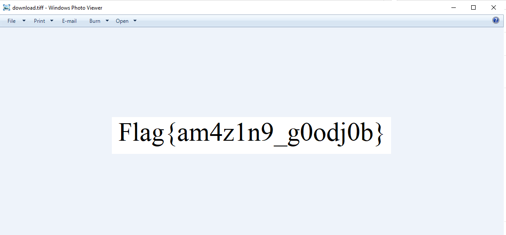

## Đề 
> There is a surprisingly high number of requests on our network. Investigate for me
## Link challenge 
> https://ctf.viblo.asia/puzzles/exfiltration-r1e1vwqk9q4
## Giải 
- Sau khi check file em thấy hàng loạt các giao thức icmp khả nghi, kiểm tra thì em thấy lớp data.data có nhiều chuỗi đáng nghi 
- 
- 
- Tại packet cuối cùng em thấy 1 vài dấu =, dựa vào kinh nghiệm có thể xác định đây là mã hoá base64 
- 
- Em thực hiện dump các dữ liệu này ra bằng tshark 
> tshark -r challenge.pcapng -Y "ip.src==192.168.47.1 and ip.dst==192.168.47.130" -e data.data -Tfields > a.txt
- Ở đây em lưu vào file tên b.txt rồi xử lý bằng cybercheff
- 
- Dựa vào "cây bút thần kì em xác định được đây là 1 file ảnh" tiff
- Xuất ảnh ra ta được flag 
- 
> Flag : Flag{am4z1n9_g0odj0b}