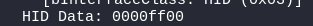
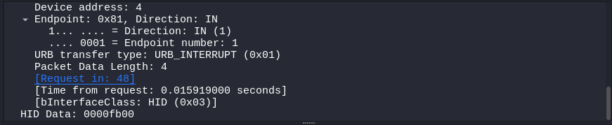

## Đề 
> I'm curious what my friend did with my computer. So I extracted the network capture for analysis, can you investigate what she typed?
## Link challenge 
> https://ctf.viblo.asia/puzzles/netlab7-usb-revenger-atajdwe0qdw
## Giải 
- Sau khi mở file lên và bắt đầu phân tích, em thấy 1 vài hid data của usb được hiển thị 
```
HID stands for human interface. This type is suitable for interactive applications such as keyboards, mice, gamepads, and digital display devices.
```
- 
- 
- Và còn nhiều cái khác ...
- Như ở write up bài URGGGGG của giải RITSET em bắt đầu dump các dữ liệu của hid data ra file data.txt
>  tshark -r netlab7.pcap -T fields -e usbhid.data 'usb.data_len==8' 
- Em sử dụng scipt lụm được trên github
```
#!/usr/bin/env python

import sys
import os

DataFileName = "usb.dat"

presses = []

normalKeys = {"04":"a", "05":"b", "06":"c", "07":"d", "08":"e", "09":"f", "0a":"g", "0b":"h", "0c":"i", "0d":"j", "0e":"k", "0f":"l", "10":"m", "11":"n", "12":"o", "13":"p", "14":"q", "15":"r", "16":"s", "17":"t", "18":"u", "19":"v", "1a":"w", "1b":"x", "1c":"y", "1d":"z","1e":"1", "1f":"2", "20":"3", "21":"4", "22":"5", "23":"6","24":"7","25":"8","26":"9","27":"0","28":"<RET>","29":"<ESC>","2a":"<DEL>", "2b":"\t","2c":"<SPACE>","2d":"-","2e":"=","2f":"[","30":"]","31":"\\","32":"<NON>","33":";","34":"'","35":"<GA>","36":",","37":".","38":"/","39":"<CAP>","3a":"<F1>","3b":"<F2>", "3c":"<F3>","3d":"<F4>","3e":"<F5>","3f":"<F6>","40":"<F7>","41":"<F8>","42":"<F9>","43":"<F10>","44":"<F11>","45":"<F12>","4f":"Right","50":"Left"}

shiftKeys = {"04":"A", "05":"B", "06":"C", "07":"D", "08":"E", "09":"F", "0a":"G", "0b":"H", "0c":"I", "0d":"J", "0e":"K", "0f":"L", "10":"M", "11":"N", "12":"O", "13":"P", "14":"Q", "15":"R", "16":"S", "17":"T", "18":"U", "19":"V", "1a":"W", "1b":"X", "1c":"Y", "1d":"Z","1e":"!", "1f":"@", "20":"#", "21":"$", "22":"%", "23":"^","24":"&","25":"*","26":"(","27":")","28":"<RET>","29":"<ESC>","2a":"<DEL>", "2b":"\t","2c":"<SPACE>","2d":"_","2e":"+","2f":"{","30":"}","31":"|","32":"<NON>","33":":","34":"\"","35":"<GA>","36":"<","37":">","38":"?","39":"<CAP>","3a":"<F1>","3b":"<F2>", "3c":"<F3>","3d":"<F4>","3e":"<F5>","3f":"<F6>","40":"<F7>","41":"<F8>","42":"<F9>","43":"<F10>","44":"<F11>","45":"<F12>","4f":"Right","50":"Left"}

def main():
    # check argv
    if len(sys.argv) != 2:
        print("Usage : ")
        print("        python UsbKeyboardHacker.py data.pcap")
        print("Tips : ")
        print("        To use this python script , you must install the tshark first.")
        print("        You can use `sudo apt-get install tshark` to install it")
        print("Author : ")
        print("        WangYihang <wangyihanger@gmail.com>")
        print("        If you have any questions , please contact me by email.")
        print("        Thank you for using.")
        exit(1)

    # get argv
    pcapFilePath = sys.argv[1]
    
    # get data of pcap
    os.system("tshark -r %s -T fields -e usbhid.data 'usb.data_len == 8' > %s" % (pcapFilePath, DataFileName))

    # read data
    with open(DataFileName, "r") as f:
        for line in f:
            presses.append(line[0:-1])
    # handle
    result = ""
    for press in presses:
        if press == '':
            continue
        if ':' in press:
            Bytes = press.split(":")
        else:
            Bytes = [press[i:i+2] for i in range(0, len(press), 2)]
        if Bytes[0] == "00":
            if Bytes[2] != "00" and normalKeys.get(Bytes[2]):
                result += normalKeys[Bytes[2]]
        elif int(Bytes[0],16) & 0b10 or int(Bytes[0],16) & 0b100000: # shift key is pressed.
            if Bytes[2] != "00" and normalKeys.get(Bytes[2]):
                result += shiftKeys[Bytes[2]]
        else:
            print("[-] Unknow Key : %s" % (Bytes[0]))
    print("[+] Found : %s" % (result))

    # clean the temp data
    os.system("rm ./%s" % (DataFileName))


if __name__ == "__main__":
    main()
```
- Và đây là kết quả ...
```
yyoutube.coom<RET>ggai<SPACE>xxinh<SPACE>tiktok<SPACE>laacc<SPACE><SPACE>mong<RET>google.coom<RET>Ttai<SPACE>ssai<SPACE><SPACE>em<DEL><DEL><DEL><DEL>oo<SPACE>emm<SPACE>thhayy<SPACE><SPACE>t<DEL>ddooir?/<SPACE>Aaanhh<SPACE>vvann<SPACE><SPACE>chhhuua<SPACE><SPACE>co<SPACE>ccaau<SPACE>ttraa<SPACE><SPACE>oi..<SPACE><SPACE>Lloi<SPACE><SPACE>chiaa<SPACE>ccatt<SPACE>chhuua<SPACE><SPACE>ttren<SPACE>mmoi,<SPACE>mma<SPACE><SPACE>tay<SPACE>ddaa<SPACE>buuonngg<SPACE><SPACE>aanh<SPACE>roia<DEL>Nhhin<SPACE>may<SPACE>ttroi<SPACE>mmai,<SPACE>anhh<SPACE><SPACE>t<DEL>chhii<SPACE>mongg<SPACE><SPACE>uuonn<SPACE>ttaa<SPACE>quay<SPACE>lai.<SPACE>giio<SPACE>em<SPACE>lo<SPACE>yeu<SPACE>thhhuonngg<SPACE><SPACE>ai,<SPACE><SPACE>thhii<SPACE>anhh<SPACE>ccchinhh<SPACE><SPACE>thhucc<SPACE>thhaatt<SPACE>baiTthhaatt<SPACE>su<SPACE>ttrronngg<SPACE>timm<SPACE>anhh<SPACE>giio<SPACE>cchhii<SPACE>mong,<SPACE>hhoii<SPACE>ngon<SPACE>ggiio<SPACE>dong.<SPACE>Ccuu<SPACE>vaan<SPACE>kip<SPACE>khonng???aa<DEL>Fflaag{s<DEL>Ssu__bLeftLeft4LeftLeftCchRightRightRightRight0r_ch$4<DEL>4LLLeftLeftLeftLeftLeftLeft1n9RightRightRightRightRightRight_1n_3v3rY<DEL><DEL><DEL><DEL>veRry_2jac<DEL><DEL><DEL><DEL>CTTFs}.<SPACE>Ggoodd<SPACE>luck!!!!cx<RET>                           
```
> Flag : Flag{SuCh_4_b0r1n9_ch4LL_1n_3veRy_CTFs}