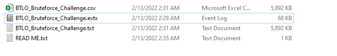
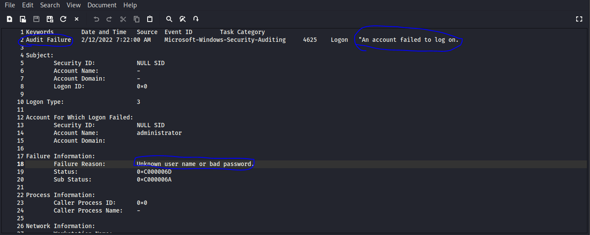
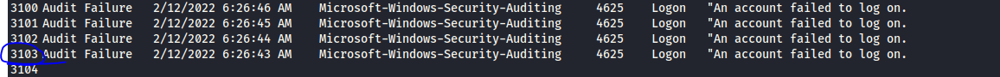
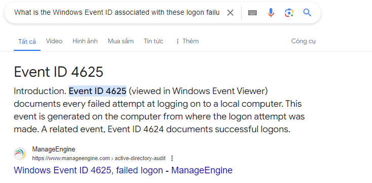
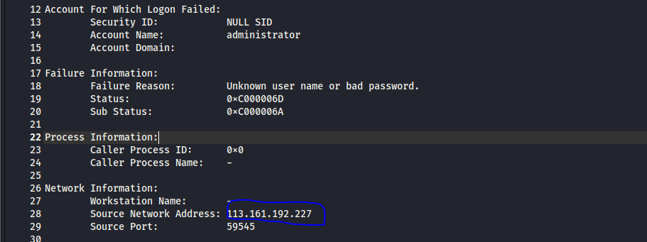

## Description 
- Can you analyze logs from an attempted RDP bruteforce attack?
- One of our system administrators identified a large number of Audit Failure events in the Windows Security Event log.
- There are a number of different ways to approach the analysis of these logs! Consider the suggested tools, but there are many others out there!
## Link challenge 
> https://blueteamlabs.online/home/challenge/bruteforce-16629bf9a2
## Solution 
- Phân tích ban đầu : Đề cho 1 file zip gồm nhiều file nhỏ
- 
- Nhưng tực ra đó đều cùng là 1 dữ liệu nên ta chỉ phân tích file txt
- **Question 1: How many Audit Failure events are there? (Format: Count of Events)**
- Nhìn sơ qua có rất nhiều phiên đăng nhập thất bại (có thể thấy bằng thông báo `Unknown user name or bad password.`)
- 
- Để trả lời câu hỏi 1 cần lọc các phiên đăng nhập thất bại 
> `strings BTLO_Bruteforce_Challenge.txt| grep -i "failed to log on" > a.txt`
- Chúng ta sẽ lưu vào file a.txt những chuỗi chứa "failed to log on"
- 
> A : 3103

- **Question 2: What is the username of the local account that is being targeted? (Format: Username)**
- Các xác lực không thành công đều đến từ user administrator

```
ccount For Which Logon Failed:
	Security ID:		NULL SID
	Account Name:		administrator
	Account Domain:		

Failure Information:
	Failure Reason:		Unknown user name or bad password.
	Status:			0xC000006D
	Sub Status:		0xC000006A

Process Information:
	Caller Process ID:	0x0
	Caller Process Name:	-

```
> A : administrator

- **Question 3: What is the failure reason related to the Audit Failure logs? (Format: String)**
- Nguyên nhân được thông báo là : Unknown user name or bad password.
> A : Unknown user name or bad password.

- **Question 4: What is the Windows Event ID associated with these logon failures? (Format: ID)**
- Câu này tra google là ra 😀
- 
> A : 4625

- **Question 5: What is the source IP conducting this attack? (Format: X.X.X.X)**
- 
- Chính nó 👉 113.161.192.227

- **Question 6: What country is this IP address associated with? (Format: Country)**
- [xem tại đây](https://whatismyipaddress.com/ip/113.161.192.227)
> A : Viet Nam

- **What is the range of source ports that were used by the attacker to make these login requests? (LowestPort-HighestPort - Ex: 100-541)**
> A: 49162–65534