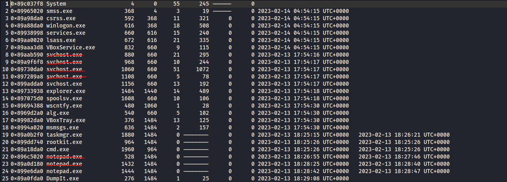
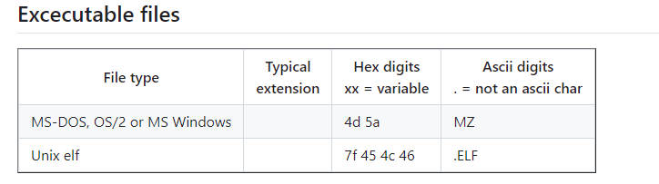

## Description 
> A multinational corporation has been hit by a cyber attack that has led to the theft of sensitive data. The attack was carried out using a variant of the BlackEnergy v2 malware that has never been seen before. The company's security team has acquired a memory dump of the infected machine, and they want you, as a soc analyst, to analyze the dump to understand the attack scope and impact.

## Link challenge 
> https://cyberdefenders.org/blueteam-ctf-challenges/blackenergy/

## Solution 

### 1. Which volatility profile would be best for this machine?
- Chỗ này dùng imageinfo là ra mình sẽ không nói nhiều nữa 😅
```
┌──(kali㉿kali)-[~/volatility]
└─$ python2 vol.py -f /home/kali/Downloads/CYBERDEF-567078-20230213-171333.raw imageinfo                                            
Volatility Foundation Volatility Framework 2.6.1
INFO    : volatility.debug    : Determining profile based on KDBG search...
          Suggested Profile(s) : WinXPSP2x86, WinXPSP3x86 (Instantiated with WinXPSP2x86)
                     AS Layer1 : IA32PagedMemory (Kernel AS)
                     AS Layer2 : FileAddressSpace (/home/kali/Downloads/CYBERDEF-567078-20230213-171333.raw)
                      PAE type : No PAE
                           DTB : 0x39000L
                          KDBG : 0x8054cde0L
          Number of Processors : 1
     Image Type (Service Pack) : 3
                KPCR for CPU 0 : 0xffdff000L
             KUSER_SHARED_DATA : 0xffdf0000L
           Image date and time : 2023-02-13 18:29:11 UTC+0000
     Image local date and time : 2023-02-13 10:29:11 -0800

```
### 2. How many processes were running when the image was acquired?
- Để xem được process và tiến trình của nó ta có nhiều cách, nhưng đơn giản nhất là dùng plugin pslist và pstree

<details>
<summary>
Plugin pslist
</summary>

```
┌──(kali㉿kali)-[~/volatility]
└─$ python2 vol.py -f /home/kali/Downloads/CYBERDEF-567078-20230213-171333.raw --profile=WinXPSP2x86 pslist                     
Volatility Foundation Volatility Framework 2.6.1
Offset(V)  Name                    PID   PPID   Thds     Hnds   Sess  Wow64 Start                          Exit                          
---------- -------------------- ------ ------ ------ -------- ------ ------ ------------------------------ ------------------------------
0x89c037f8 System                    4      0     55      245 ------      0                                                              
0x89965020 smss.exe                368      4      3       19 ------      0 2023-02-14 04:54:15 UTC+0000                                 
0x89a98da0 csrss.exe               592    368     11      321      0      0 2023-02-14 04:54:15 UTC+0000                                 
0x89a88da0 winlogon.exe            616    368     18      508      0      0 2023-02-14 04:54:15 UTC+0000                                 
0x89938998 services.exe            660    616     15      240      0      0 2023-02-14 04:54:15 UTC+0000                                 
0x89aa0020 lsass.exe               672    616     21      335      0      0 2023-02-14 04:54:15 UTC+0000                                 
0x89aaa3d8 VBoxService.exe         832    660      9      115      0      0 2023-02-14 04:54:15 UTC+0000                                 
0x89aab590 svchost.exe             880    660     21      295      0      0 2023-02-13 17:54:16 UTC+0000                                 
0x89a9f6f8 svchost.exe             968    660     10      244      0      0 2023-02-13 17:54:17 UTC+0000                                 
0x89730da0 svchost.exe            1060    660     51     1072      0      0 2023-02-13 17:54:17 UTC+0000                                 
0x897289a8 svchost.exe            1108    660      5       78      0      0 2023-02-13 17:54:17 UTC+0000                                 
0x899adda0 svchost.exe            1156    660     13      192      0      0 2023-02-13 17:54:17 UTC+0000                                 
0x89733938 explorer.exe           1484   1440     14      489      0      0 2023-02-13 17:54:18 UTC+0000                                 
0x897075d0 spoolsv.exe            1608    660     10      106      0      0 2023-02-13 17:54:18 UTC+0000                                 
0x89694388 wscntfy.exe             480   1060      1       28      0      0 2023-02-13 17:54:30 UTC+0000                                 
0x8969d2a0 alg.exe                 540    660      5      102      0      0 2023-02-13 17:54:30 UTC+0000                                 
0x89982da0 VBoxTray.exe            376   1484     13      125      0      0 2023-02-13 17:54:30 UTC+0000                                 
0x8994a020 msmsgs.exe              636   1484      2      157      0      0 2023-02-13 17:54:30 UTC+0000                                 
0x89a0b2f0 taskmgr.exe            1880   1484      0 --------      0      0 2023-02-13 18:25:15 UTC+0000   2023-02-13 18:26:21 UTC+0000  
0x899dd740 rootkit.exe             964   1484      0 --------      0      0 2023-02-13 18:25:26 UTC+0000   2023-02-13 18:25:26 UTC+0000  
0x89a18da0 cmd.exe                1960    964      0 --------      0      0 2023-02-13 18:25:26 UTC+0000   2023-02-13 18:25:26 UTC+0000  
0x896c5020 notepad.exe             528   1484      0 --------      0      0 2023-02-13 18:26:55 UTC+0000   2023-02-13 18:27:46 UTC+0000  
0x89a0d180 notepad.exe            1432   1484      0 --------      0      0 2023-02-13 18:28:25 UTC+0000   2023-02-13 18:28:40 UTC+0000  
0x899e6da0 notepad.exe            1444   1484      0 --------      0      0 2023-02-13 18:28:42 UTC+0000   2023-02-13 18:28:47 UTC+0000  
0x89a0fda0 DumpIt.exe              276   1484      1       25      0      0 2023-02-13 18:29:08 UTC+0000                                 
```

</details>

- 1 là đếm bằng tay, 2 là dùng công cụ, mình sẽ đưa nó vô mousepad đếm cho nhanh
- 
- Có 25 dòng mà có 6 process giống nhau nên ta bỏ (25-6 = 19)

### 3. What is the process ID of cmd.exe?
- Nhìn vào output plugin pslist thấy `cmd.exe` có pid là `1960`
### 4. What is the name of the most suspicious process?
- Có 1 tiến trình rất đáng ngờ tên `rootkit.exe`, tra google thì kết quả như thế này 
```
Rootkit (/ru:tkit/ đọc là rút-kít) là một bộ công cụ phần mềm do kẻ xâm nhập đưa vào máy tính nhằm mục đích cho phép quay lại xâm nhập máy tính đó và dùng nó cho các mục đích xấu mà không bị phát hiện, bộ công cụ này cho phép truy nhập vào hoạt động của máy tính ở mức căn bản nhất.
```
### 5. Which process shows the highest likelihood of code injection?
- Với câu hỏi này ta có 1 plugin tên là malfind
```
Lệnh malfind giúp tìm mã/DLL ẩn hoặc được chèn trong bộ nhớ chế độ người dùng, dựa trên các đặc điểm như thẻ VAD và quyền của trang.
```
- Khi in ta có thể thấy 1 tiến trình có header là MZ (đây là kí hiệu magic byte của tệp thực thi )
- 
```
Process: svchost.exe Pid: 880 Address: 0x980000
Vad Tag: VadS Protection: PAGE_EXECUTE_READWRITE
Flags: CommitCharge: 9, MemCommit: 1, PrivateMemory: 1, Protection: 6

0x0000000000980000  4d 5a 90 00 03 00 00 00 04 00 00 00 ff ff 00 00   MZ..............
0x0000000000980010  b8 00 00 00 00 00 00 00 40 00 00 00 00 00 00 00   ........@.......
0x0000000000980020  00 00 00 00 00 00 00 00 00 00 00 00 00 00 00 00   ................
0x0000000000980030  00 00 00 00 00 00 00 00 00 00 00 00 f8 00 00 00   ................
```

### 6. There is an odd file referenced in the recent process. Provide the full path of that file.
- Theo tiến trình `svchost.exe Pid: 880`, ta sẽ check các file có liên quan đến tiến trình này bằng plugin handes
```
Trong Volatility, một framework phổ biến dùng để phân tích bộ nhớ (memory forensics), công cụ "handles" được sử dụng để liệt kê các handle (tay cầm) trong hệ thống. Các handle này có thể là chỉ số liên kết tới các tài nguyên hệ thống như file, mutex, event, và nhiều đối tượng khác mà các tiến trình đang sử dụng. Điều này giúp phát hiện hoạt động đáng ngờ hoặc phân tích cách các ứng dụng và malware tương tác với hệ thống.
```

- Vì vậy ta sẽ đi cùng `grep File` và `--pid 880`
```
┌──(kali㉿kali)-[~/volatility]
└─$ python2 vol.py -f /home/kali/Downloads/CYBERDEF-567078-20230213-171333.raw --profile=WinXPSP2x86 handles -p 880 | grep File 
Volatility Foundation Volatility Framework 2.6.1
0x89a28890    880        0xc   0x100020 File             \Device\HarddiskVolume1\WINDOWS\system32
0x89a1a6f8    880       0x50   0x100001 File             \Device\KsecDD
0x89937358    880       0x68   0x100020 File             \Device\HarddiskVolume1\WINDOWS\WinSxS\x86_Microsoft.Windows.Common-Controls_6595b64144ccf1df_6.0.2600.5512_x-ww_35d4ce83
0x899d0250    880       0xbc   0x12019f File             \Device\NamedPipe\net\NtControlPipe2
0x89a17a50    880      0x100   0x100000 File             \Device\Dfs
0x89732cb8    880      0x158   0x12019f File             \Device\NamedPipe\lsarpc
0x8969fee0    880      0x274   0x12019f File             \Device\Termdd
0x89ab3478    880      0x294   0x12019f File             \Device\Termdd
0x89ab3978    880      0x29c   0x12019f File             \Device\Termdd
0x896bcd18    880      0x2b8   0x12019f File             \Device\NamedPipe\Ctx_WinStation_API_service
0x8997a248    880      0x2bc   0x12019f File             \Device\NamedPipe\Ctx_WinStation_API_service
0x899a24b0    880      0x304   0x12019f File             \Device\Termdd
0x89a00f90    880      0x33c   0x12019f File             \Device\{9DD6AFA1-8646-4720-836B-EDCB1085864A}
0x89af0cf0    880      0x340   0x12019f File             \Device\HarddiskVolume1\WINDOWS\system32\drivers\str.sys
0x89993f90    880      0x3d8   0x100020 File             \Device\HarddiskVolume1\WINDOWS\WinSxS\x86_Microsoft.Windows.Common-Controls_6595b64144ccf1df_6.0.2600.5512_x-ww_35d4ce83
0x89958b78    880      0x3e4   0x12019f File             \Device\HarddiskVolume1\WINDOWS\system32\config\systemprofile\Local Settings\Temporary Internet Files\Content.IE5\index.dat
0xe1a29fd8    880      0x3ec    0xf0007 Section          C:_WINDOWS_system32_config_systemprofile_Local Settings_Temporary Internet Files_Content.IE5_index.dat_32768
0x899fe2e0    880      0x3f8   0x12019f File             \Device\HarddiskVolume1\WINDOWS\system32\config\systemprofile\Cookies\index.dat
0x89a492e8    880      0x400   0x12019f File             \Device\HarddiskVolume1\WINDOWS\system32\config\systemprofile\Local Settings\History\History.IE5\index.dat
0x896811d8    880      0x424   0x100020 File             \Device\HarddiskVolume1\WINDOWS\WinSxS\x86_Microsoft.Windows.Common-Controls_6595b64144ccf1df_6.0.2600.5512_x-ww_35d4ce83
0x89965fe0    880      0x42c   0x100000 Mutant           RasPbFile
0x89bbc028    880      0x488   0x100020 File             \Device\HarddiskVolume1\WINDOWS\WinSxS\x86_Microsoft.Windows.Common-Controls_6595b64144ccf1df_6.0.2600.5512_x-ww_35d4ce83
0x89999980    880      0x4a8   0x1200a0 File             \Device\NetBT_Tcpip_{B35F0A5F-EBC3-4B5D-800D-7C1B64B30F14}

```
- Kết quả sẽ là `\Device\HarddiskVolume1\WINDOWS\system32\drivers\str.sys`, tuy nhiên ta nên đổi thành `C:\WINDOWS\system32\drivers\str.sys`

### 7. What is the name of the injected dll file loaded from the recent process?
- Sử dụng plugin ldrmodules để giải quyết câu hỏi này
```
┌──(kali㉿kali)-[~/volatility]
└─$ python2 vol.py -f /home/kali/Downloads/CYBERDEF-567078-20230213-171333.raw --profile=WinXPSP2x86 ldrmodules --pid 880       
Volatility Foundation Volatility Framework 2.6.1
Pid      Process              Base       InLoad InInit InMem MappedPath
-------- -------------------- ---------- ------ ------ ----- ----------
     880 svchost.exe          0x6f880000 True   True   True  \WINDOWS\AppPatch\AcGenral.dll
     880 svchost.exe          0x01000000 True   False  True  \WINDOWS\system32\svchost.exe
     880 svchost.exe          0x77f60000 True   True   True  \WINDOWS\system32\shlwapi.dll
     880 svchost.exe          0x74f70000 True   True   True  \WINDOWS\system32\icaapi.dll
     880 svchost.exe          0x76f60000 True   True   True  \WINDOWS\system32\wldap32.dll
     880 svchost.exe          0x77c00000 True   True   True  \WINDOWS\system32\version.dll
     880 svchost.exe          0x5ad70000 True   True   True  \WINDOWS\system32\uxtheme.dll
     880 svchost.exe          0x76e80000 True   True   True  \WINDOWS\system32\rtutils.dll
     880 svchost.exe          0x771b0000 True   True   True  \WINDOWS\system32\wininet.dll
     880 svchost.exe          0x76c90000 True   True   True  \WINDOWS\system32\imagehlp.dll
     880 svchost.exe          0x76bc0000 True   True   True  \WINDOWS\system32\regapi.dll
     880 svchost.exe          0x77dd0000 True   True   True  \WINDOWS\system32\advapi32.dll
     880 svchost.exe          0x76f20000 True   True   True  \WINDOWS\system32\dnsapi.dll
     880 svchost.exe          0x77be0000 True   True   True  \WINDOWS\system32\msacm32.dll
     880 svchost.exe          0x7e1e0000 True   True   True  \WINDOWS\system32\urlmon.dll
     880 svchost.exe          0x68000000 True   True   True  \WINDOWS\system32\rsaenh.dll
     880 svchost.exe          0x722b0000 True   True   True  \WINDOWS\system32\sensapi.dll
     880 svchost.exe          0x76e10000 True   True   True  \WINDOWS\system32\adsldpc.dll
     880 svchost.exe          0x76b40000 True   True   True  \WINDOWS\system32\winmm.dll
     880 svchost.exe          0x773d0000 True   True   True  \WINDOWS\WinSxS\x86_Microsoft.Windows.Common-Controls_6595b64144ccf1df_6.0.2600.5512_x-ww_35d4ce83\comctl32.dll
     880 svchost.exe          0x71a50000 True   True   True  \WINDOWS\system32\mswsock.dll
     880 svchost.exe          0x5b860000 True   True   True  \WINDOWS\system32\netapi32.dll
     880 svchost.exe          0x00670000 True   True   True  \WINDOWS\system32\xpsp2res.dll
     880 svchost.exe          0x76e90000 True   True   True  \WINDOWS\system32\rasman.dll
     880 svchost.exe          0x77a80000 True   True   True  \WINDOWS\system32\crypt32.dll
     880 svchost.exe          0x71ab0000 True   True   True  \WINDOWS\system32\ws2_32.dll
     880 svchost.exe          0x77cc0000 True   True   True  \WINDOWS\system32\activeds.dll
     880 svchost.exe          0x71ad0000 True   True   True  \WINDOWS\system32\wsock32.dll
     880 svchost.exe          0x774e0000 True   True   True  \WINDOWS\system32\ole32.dll
     880 svchost.exe          0x77920000 True   True   True  \WINDOWS\system32\setupapi.dll
     880 svchost.exe          0x7e410000 True   True   True  \WINDOWS\system32\user32.dll
     880 svchost.exe          0x7c900000 True   True   True  \WINDOWS\system32\ntdll.dll
     880 svchost.exe          0x77f10000 True   True   True  \WINDOWS\system32\gdi32.dll
     880 svchost.exe          0x77120000 True   True   True  \WINDOWS\system32\oleaut32.dll
     880 svchost.exe          0x5cb70000 True   True   True  \WINDOWS\system32\shimeng.dll
     880 svchost.exe          0x74980000 True   True   True  \WINDOWS\system32\msxml3.dll
     880 svchost.exe          0x009a0000 False  False  False \WINDOWS\system32\msxml3r.dll
     880 svchost.exe          0x77e70000 True   True   True  \WINDOWS\system32\rpcrt4.dll
     880 svchost.exe          0x769c0000 True   True   True  \WINDOWS\system32\userenv.dll
     880 svchost.exe          0x7c800000 True   True   True  \WINDOWS\system32\kernel32.dll
     880 svchost.exe          0x76fd0000 True   True   True  \WINDOWS\system32\clbcatq.dll
     880 svchost.exe          0x76b20000 True   True   True  \WINDOWS\system32\atl.dll
     880 svchost.exe          0x71bf0000 True   True   True  \WINDOWS\system32\samlib.dll
     880 svchost.exe          0x77690000 True   True   True  \WINDOWS\system32\ntmarta.dll
     880 svchost.exe          0x77c10000 True   True   True  \WINDOWS\system32\msvcrt.dll
     880 svchost.exe          0x760f0000 True   True   True  \WINDOWS\system32\termsrv.dll
     880 svchost.exe          0x76fc0000 True   True   True  \WINDOWS\system32\rasadhlp.dll
     880 svchost.exe          0x76c30000 True   True   True  \WINDOWS\system32\wintrust.dll
     880 svchost.exe          0x7c9c0000 True   True   True  \WINDOWS\system32\shell32.dll
     880 svchost.exe          0x77050000 True   True   True  \WINDOWS\system32\comres.dll
     880 svchost.exe          0x76eb0000 True   True   True  \WINDOWS\system32\tapi32.dll
     880 svchost.exe          0x76a80000 True   True   True  \WINDOWS\system32\rpcss.dll
     880 svchost.exe          0x5d090000 True   True   True  \WINDOWS\system32\comctl32.dll
     880 svchost.exe          0x71aa0000 True   True   True  \WINDOWS\system32\ws2help.dll
     880 svchost.exe          0x776c0000 True   True   True  \WINDOWS\system32\authz.dll
     880 svchost.exe          0x76ee0000 True   True   True  \WINDOWS\system32\rasapi32.dll
     880 svchost.exe          0x77b20000 True   True   True  \WINDOWS\system32\msasn1.dll
     880 svchost.exe          0x75110000 True   True   True  \WINDOWS\system32\mstlsapi.dll
     880 svchost.exe          0x77fe0000 True   True   True  \WINDOWS\system32\secur32.dll

```
- Trong đó các cột InLoad, InInit, InMem lần lượt là có trong LDR list hay không, có trong PEB list không và có trong memory (VAD) không 
- Thấy rằng ` 880 svchost.exe          0x009a0000 False  False  False \WINDOWS\system32\msxml3r.dll`, có sự khác biệt

<details>
<summary>
Tìm hiểu về chỗ này tí 
</summary>

```
Ý Nghĩa Kết Quả False cho Tất Cả Các Cột
InLoad=False: Module không được tìm thấy trong danh sách các module của trình tải (Loader).
InInit=False: Module không có trong danh sách các module khởi tạo (Initialization list) của PEB.
InMem=False: Module không được tìm thấy trong cây VAD (Virtual Address Descriptor).
Khả Năng Giải Thích
1. Phantom DLL Entry:

Phantom DLL: Có thể đây là một bản ghi DLL ảo (phantom DLL entry), tức là một module được liệt kê mà không thực sự tồn tại trong không gian bộ nhớ của tiến trình. Đây có thể là dấu hiệu của một kỹ thuật che giấu dấu vết của malware hoặc một dấu hiệu còn sót lại từ một hoạt động trước đó mà DLL không còn trong bộ nhớ nhưng vẫn nằm trong bảng PEB.
Tác động: Điều này có thể là một chỉ báo về hành vi đáng ngờ hoặc lỗi hệ thống nhưng cần thêm điều tra để xác định bản chất chính xác.
2. Removed or Unloaded DLL:

Removed DLL: DLL đã được gỡ bỏ hoặc không còn nằm trong bộ nhớ khi ảnh chụp (snapshot) được thực hiện.
Tác động: Có thể là một DLL đã được unload từ tiến trình nhưng vẫn còn sót lại trong danh sách của PEB do chưa được cập nhật đúng cách hoặc do một lỗi trong quản lý bộ nhớ của hệ điều hành.
3. Corrupted PEB or Loader Data:

Corruption: Thông tin trong PEB hoặc loader có thể đã bị hỏng, dẫn đến việc danh sách các module không chính xác hoặc không đầy đủ.
Tác động: Đây có thể là một lỗi hệ thống hoặc tác động của hoạt động của mã độc.
Injection Attempt Gone Wrong:

Injection Attempt: Đây có thể là dấu vết của một cố gắng tiêm DLL không thành công, nơi mà DLL được yêu cầu tải nhưng bị chặn hoặc thất bại.
Tác động: Nếu đây là kết quả của một nỗ lực tiêm không thành công, có thể có dấu hiệu của hành vi tấn công hoặc mã độc cố gắng tiêm DLL nhưng không hoàn thành được quá trình.
```
### Tiếp tục tìm hiểu về cách hoạt động của malware trong Phantom DLL:
- Hoạt Động của Malware:
- 1. Tự Che Giấu: Malware có thể tạo các mục nhập DLL giả để gây nhầm lẫn hoặc lừa các công cụ phát hiện.
- 2. Tiêm và Xóa: Malware tiêm DLL vào tiến trình và sau đó xóa hoặc che dấu sự hiện diện của chúng khỏi bảng quản lý, nhưng một số dấu vết vẫn có thể sót lại.
- Malware có thể tạo ra hoặc lợi dụng các phantom DLL entries như sau:

- 1. Che giấu Mã Độc: Malware tạo ra các mục nhập DLL giả trong bảng PEB/LDR mà không thực sự nạp DLL, làm cho các công cụ phân tích khó phát hiện ra chúng.
- 2. Tiêm Tạm Thời: Malware tiêm DLL vào tiến trình, thực hiện hoạt động, rồi rút DLL, nhưng bảng quản lý vẫn còn các mục nhập về DLL.
Tấn công Che Dấu: Các kỹ thuật tấn công tiên tiến như Process Hollowing, Reflective DLL Injection có thể dẫn đến các phantom entries khi các DLL được tải vào bộ nhớ mà không thông qua cơ chế tải chuẩn của hệ điều hành.

### Ví Dụ 1: Che giấu DLL để Tiến Hành Tấn Côngs
- 1. Malware Tiêm DLL: Malware tiêm một DLL vào một tiến trình hợp pháp như svchost.exe.
- 2. Hoàn Thành Nhiệm Vụ: DLL thực hiện hành động độc hại như đánh cắp thông tin, thực hiện các kết nối ra ngoài.
- 3. Gỡ DLL: DLL được gỡ bỏ hoặc ẩn đi, nhưng mục nhập về DLL vẫn còn trong bảng PEB hoặc VAD không chính xác.
### Ví Dụ 2: Tạo Phantom DLL để Gây Nhiễu
- 1. Malware Tạo Phantom Entry: Malware cố tình tạo các mục nhập DLL giả trong bảng PEB hoặc VAD mà không có tệp DLL thực sự.
- 2. Che Giấu Hành Động: Những mục nhập này có thể gây nhiễu cho các nhà phân tích, khiến việc phát hiện hoạt động độc hại khó khăn hơn.

</details>


