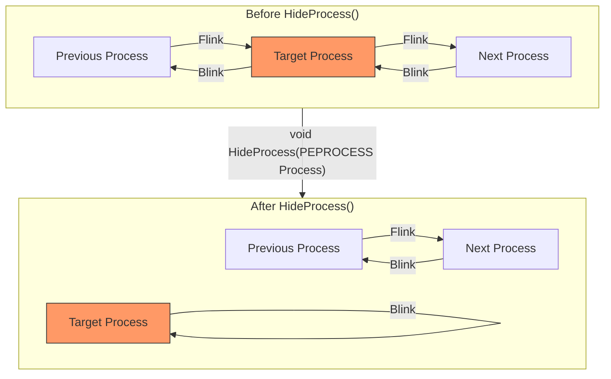

## Description 
```
You have given a memory image for a compromised machine. As a security blue team analyst Analyze the image and figure out attack details.
Resources
https://www.geoffchappell.com/studies/windows/km/ntoskrnl/api/ob/inc/header/infomask.htm 
```
## Solution
### 1. What profile should you use for this memory sample?
```
Volatility Foundation Volatility Framework 2.6.1
INFO    : volatility.debug    : Determining profile based on KDBG search...
          Suggested Profile(s) : Win7SP1x64, Win7SP0x64, Win2008R2SP0x64, Win2008R2SP1x64_24000, Win2008R2SP1x64_23418, Win2008R2SP1x64, Win7SP1x64_24000, Win7SP1x64_23418
                     AS Layer1 : WindowsAMD64PagedMemory (Kernel AS)
                     AS Layer2 : FileAddressSpace (/opt/cyberdefense/DeepDive/banking-malware.vmem)
                      PAE type : No PAE
                           DTB : 0x187000L
                          KDBG : 0xf80002bef120L
          Number of Processors : 1
     Image Type (Service Pack) : 1
                KPCR for CPU 0 : 0xfffff80002bf1000L
             KUSER_SHARED_DATA : 0xfffff78000000000L
           Image date and time : 2021-02-09 00:51:25 UTC+0000
     Image local date and time : 2021-02-08 22:51:25 -0200
```
##### Kết quả trả về rất nhiều profile, thử lần lượt từng cái thì đáp án đúng là : Win7SP1x64_24000
> Win7SP1x64_24000

### 2. What is the KDBG virtual address of the memory sample?
```
KDBG (Kernel Debugger Block) là một cấu trúc dữ liệu trong bộ nhớ của Windows, lưu trữ thông tin quan trọng về hệ điều hành và các tiến trình đang chạy. (Địa chỉ KDBG thường nằm trong vùng nhớ của kernel và có thể thay đổi tùy theo phiên bản Windows.)
```

##### Dựa vào trường `KDBG` ở câu hỏi số 1, ta xác định được `virtual address` là `0xf80002bef120L`
> 0xf80002bef120L

### 3. There is a malicious process running, but it's hidden. What's its name?
<details>
    <summary>
        Hidden Process Technique
    </summary>

- Hide process là một dạng mạnh sử dụng sự kết hợp giữa hooking kernel mode và chạy tiến trình. Những phương thức “siêu ẩn mình” rất khó để nhận biết, mặc dù bạn đã sử dụng các trình view process khá mạnh, nhưng hooking là một bài toán muôn hình muôn vẻ, bạn không bao giờ có thể chắc chắn rằng không có process nào đang ẩn mình trên máy tính bạn...
- Dưới đây là các phương pháp phổ biến mà malware sử dụng để ẩn tiến trình: 

#### 1. Hooking API (User-mode Hooking)

- Malware sửa đổi các hàm API Windows như NtQuerySystemInformation, EnumProcesses, ZwQuerySystemInformation để ẩn tiến trình khỏi Task Manager hoặc Process Explorer.
```
NtQuerySystemInformation

    Đây là một API từ NTAPI của Windows, dùng để truy vấn nhiều loại thông tin hệ thống.
    Nó nhận tham số SYSTEM_INFORMATION_CLASS để xác định loại thông tin cần lấy, ví dụ:
        SystemProcessInformation để lấy danh sách tiến trình.
        SystemModuleInformation để lấy danh sách module kernel đang tải.
    Hàm này thường được sử dụng trong phần mềm giám sát hệ thống hoặc mã độc để thu thập thông tin tiến trình và driver.

EnumProcesses

    Hàm từ PSAPI (Process Status API), được dùng để liệt kê danh sách tiến trình đang chạy trên hệ thống.
    Nó trả về một mảng chứa ID của các tiến trình. Sau đó, có thể dùng OpenProcess và GetModuleBaseName để lấy thêm thông tin.
    Đây là cách phổ biến để liệt kê tiến trình từ ứng dụng user-mode.

ZwQuerySystemInformation

    Giống như NtQuerySystemInformation, nhưng "Zw" là tiền tố dùng trong chế độ kernel.
    Khi gọi từ user-mode, ZwQuerySystemInformation thực chất ánh xạ đến NtQuerySystemInformation.
    Khi gọi từ kernel-mode, nó có thể hoạt động với quyền cao hơn.
```
- Khi một chương trình gọi API này để lấy danh sách tiến trình, malware sẽ lọc bỏ PID của nó khỏi danh sách trả về.

#### 2. DKOM (Direct Kernel Object Manipulation) 

- DKOM thay đổi trực tiếp EPROCESS trong kernel để xóa tiến trình khỏi danh sách PsActiveProcessHead.
- Không giống hooking API (ở user-mode), DKOM can thiệp trực tiếp vào cấu trúc dữ liệu trong kernel, khiến tiến trình bị ẩn khỏi tất cả công cụ quản lý tiến trình (Task Manager, Process Explorer, API Windows).
- Trên Windows, mỗi tiến trình được quản lý trong kernel thông qua một cấu trúc đặc biệt gọi là EPROCESS.

        EPROCESS là một struct trong kernel chứa tất cả thông tin về tiến trình, bao gồm PID, quyền hạn, danh sách module, danh sách luồng, v.v.
        Hệ điều hành duy trì một danh sách liên kết kép (doubly linked list) gọi là PsActiveProcessHead, chứa tất cả tiến trình đang chạy.
        Mỗi tiến trình có một LIST_ENTRY ActiveProcessLinks, liên kết tiến trình đó với danh sách toàn bộ tiến trình.
```python=
typedef struct _EPROCESS {
    ...
    LIST_ENTRY ActiveProcessLinks; // Trỏ đến tiến trình trước và sau trong danh sách
    ...
} EPROCESS, *PEPROCESS;

```
- Để ẩn một tiến trình bằng DKOM, mã độc chỉ cần sửa đổi ActiveProcessLinks để xóa tiến trình khỏi danh sách PsActiveProcessHead.
- **Ví dụ mã giả (pseudo-code) trong kernel-mode:**
```cpp
    void HideProcess(PEPROCESS Process) {
    PLIST_ENTRY CurrentList = (PLIST_ENTRY)((ULONG_PTR)Process + ActiveProcessLinksOffset);
    
    // Lấy tiến trình trước và sau
    PLIST_ENTRY PrevEntry = CurrentList->Blink;
    PLIST_ENTRY NextEntry = CurrentList->Flink;

    // Bỏ qua tiến trình cần ẩn
    PrevEntry->Flink = NextEntry;
    NextEntry->Blink = PrevEntry;

    // Tiến trình bị cắt khỏi danh sách
    CurrentList->Flink = CurrentList;
    CurrentList->Blink = CurrentList;
}

```


#### 3. Unlinking from EPROCESS List
🔹 Là một kỹ thuật cụ thể trong DKOM, tập trung vào việc gỡ tiến trình khỏi danh sách PsActiveProcessHead mà không kill tiến trình.
🔹 Mục tiêu: Ẩn tiến trình khỏi Task Manager, Process Explorer và API EnumProcesses().


#### 4. Hollow Process Injection (Process Hollowing)
- Malware tạo một tiến trình hợp lệ (ví dụ: svchost.exe), sau đó xóa bộ nhớ của nó và tiêm mã độc vào.
- Tiến trình trông có vẻ bình thường nhưng thực chất đang chạy mã độc.
- Process Hollowing là một kỹ thuật tiêm mã độc vào tiến trình hợp lệ bằng cách:
🔹 Tạo một tiến trình sạch (ví dụ: svchost.exe).
🔹 Xóa bộ nhớ của nó bằng NtUnmapViewOfSection().
🔹 Ghi mã độc vào vùng nhớ bị rỗng bằng WriteProcessMemory().
🔹 Thực thi mã độc bên trong tiến trình hợp lệ, đánh lừa các công cụ giám sát.
##### Cách thức hoạt động của Process Hollowing
🔹 Bước 1: Tạo tiến trình hợp lệ (Suspended Process)

📌 Malware sử dụng CreateProcess() với CREATE_SUSPENDED, để tạo một tiến trình hợp lệ (ví dụ: svchost.exe), nhưng không để nó chạy ngay.
```cpp=
STARTUPINFO si = { sizeof(si) };
PROCESS_INFORMATION pi;
CreateProcess(L"C:\\Windows\\System32\\svchost.exe", NULL, NULL, NULL, FALSE, CREATE_SUSPENDED, NULL, NULL, &si, &pi);
```
✅ Tiến trình này đang bị tạm dừng để malware có thể can thiệp vào bộ nhớ của nó.
🔹 Bước 2: Xóa bộ nhớ gốc của tiến trình

📌 Malware lấy thông tin về vùng nhớ gốc của svchost.exe bằng NtQueryInformationProcess().
📌 Sau đó, nó xóa vùng nhớ này bằng NtUnmapViewOfSection(), làm rỗng không gian bộ nhớ.
```cpp=
NtUnmapViewOfSection(pi.hProcess, baseAddress);
```
🔹 Bước 3: Tiêm mã độc vào vùng nhớ bị rỗng

📌 Malware cấp phát lại bộ nhớ trong tiến trình bằng VirtualAllocEx().
📌 Sao chép mã độc vào tiến trình bằng WriteProcessMemory().
```cpp=
LPVOID pRemoteCode = VirtualAllocEx(pi.hProcess, baseAddress, shellcode_size, MEM_COMMIT | MEM_RESERVE, PAGE_EXECUTE_READWRITE);
WriteProcessMemory(pi.hProcess, pRemoteCode, shellcode, shellcode_size, NULL);
```
🔹 Bước 4: Thay đổi Entry Point và thực thi mã độc

📌 Malware cập nhật địa chỉ Entry Point của tiến trình để trỏ đến mã độc.
📌 Sau đó, tiếp tục thực thi tiến trình bằng ResumeThread().
```cpp=
SetThreadContext(pi.hThread, &ctx);
ResumeThread(pi.hThread);
```
#### 5. Inline Hooking (Patch Kernel Code)
🔹 Inline Hooking là kỹ thuật mà malware sửa đổi mã máy trực tiếp trong .text section của kernel hoặc API hệ thống, nhằm:
✅ Thay đổi hành vi của API (ví dụ: ẩn tiến trình trong Task Manager).
✅ Chuyển hướng luồng thực thi đến mã độc thay vì API gốc.
✅ Tránh bị phát hiện bằng cách thao túng dữ liệu trả về.
📌 Ứng dụng chính của Inline Hooking:

    Ẩn tiến trình: Hook NtQuerySystemInformation() để che giấu tiến trình.
    Ẩn file: Hook NtQueryDirectoryFile() để giấu file độc hại.
    Chặn công cụ giám sát: Hook ZwOpenProcess() để ngăn debugger truy cập tiến trình.
##### Cách thức hoạt động của Inline Hooking
Ghi đè mã gốc bằng Jump (JMP Hooking)

📌 Malware ghi đè mã gốc trong .text section của kernel bằng một lệnh nhảy (JMP) đến mã độc.
📌 Ví dụ, lệnh gốc trong NtQuerySystemInformation() có thể là:
```asm=
mov r10, rcx  
mov eax, 0x36  
syscall  
ret  
```
📌 Malware thay đổi đoạn mã trên thành:
```asm=
jmp 0xDEADBEEF  ; Nhảy đến mã độc
nop
nop
nop
```
> 📌 Mã C++ mô phỏng kỹ thuật này:
```cpp=
BYTE* pNtQuerySysInfo = (BYTE*)GetProcAddress(GetModuleHandle(L"ntdll.dll"), "NtQuerySystemInformation");

// Ghi đè mã gốc bằng JMP đến mã độc
DWORD oldProtect;
VirtualProtect(pNtQuerySysInfo, 5, PAGE_EXECUTE_READWRITE, &oldProtect);
pNtQuerySysInfo[0] = 0xE9;  // JMP opcode
*(DWORD*)(pNtQuerySysInfo + 1) = (DWORD)((DWORD_PTR)&FakeNtQuerySystemInformation - (DWORD_PTR)pNtQuerySysInfo - 5);
VirtualProtect(pNtQuerySysInfo, 5, oldProtect, &oldProtect);
```
#### Ngoài ra sẽ còn 1 vài kỹ thuật khác ....
</details>

##### Như những challenge memory forensics khác, mình bắt đầu với plugin pslist để xem các tiến trình trong máy, tuy nhiên không có gì đáng ngờ lắm.
##### Xem lại các plugin của volatility mình nhận ra rằng có 1 plugin là psxview cho phép tìm kiếm các tiến trình ẩn.


##### Ta thấy rằng tiến trình `vds_ps.exe` với pid là `2448` không được tìm thấy bởi pslist và psscan nhưng nó vẫn có kết quả với `thrdproc, pspcid, csrss, session, deskthrd` cho thấy rằng nó vẫn có các luồng tương tác với hệ thống, nhưng bị che giấu khỏi danh sách tiến trình thông thường.
> vds_ps.exe

### 4. What is the physical offset of the malicious process?
##### Dựa vào kết quả hiển thị trong psxview...
> 0x000000007d336950

### 5. What is the full path (including executable name) of the hidden executable?
##### Bây giờ đã xác định được tên file độc hại, ta tiến hành tìm tên file này trong bộ nhớ với plugin filescan.

> C:\Users\john\AppData\Local\api-ms-win-service-management-l2-1-0\vds_ps.exe
### 6. Which malware is this?
##### Sử dụng plugin dumpfiles để trích xuất nó ra 

##### Dựa vào hash  mình tìm thấy 1 vài báo cáo về nó trên internet
```
┌──(kali㉿kali)-[~/Downloads]
└─$ sha256sum file.None.0xfffffa8004536e60.img 
4a9e32bc5348265c43945adaaf140b98b64329bd05878bc13671fa916f423710  file.None.0xfffffa8004536e60.img
```

> emotet

### 7. The malicious process had two PEs injected into its memory. What's the size in bytes of the Vad that contains the largest injected PE? Answer in hex, like: 0xABC
##### Để tìm kích thước vùng nhớ bị inject, trước tiên ta phải tìm vùng nhớ bị inject => lấy thông tin về VAD tương ứng 
**Ví dụ: Nếu tiến trình hợp lệ explorer.exe bị inject một mã độc vào một vùng nhớ mới, ta sẽ thấy cấu trúc như sau:**
```pgsql
Process: explorer.exe (PID 1234)
 ├── .text          (Executable Code)
 ├── .rdata         (Read-Only Data)
 ├── .data          (Writable Data)
 ├── Heap           (Dynamically Allocated Memory)
 ├── Stack          (Function Call Stack)
 ├── **0x400000 RWX**  (New Injected Memory)
      ├── Shellcode (Malware Code)
      ├── Malicious DLL
      ├── Hooks
```
##### Để tìm được vùng nhớ ta sử dụng malfind, vì tiến trình bị ẩn nên ta cần sử dụng option là offset 
```
┌──(kali㉿kali)-[~/Personal/CTF/volatility]
└─$ python2 vol.py -f ~/Downloads/Cyberdefenders/banking-malware.vmem --profile=Win7SP1x64_24000 malfind --offset=0x000000007d336950 | grep Address 
Volatility Foundation Volatility Framework 2.6.1
Process: vds_ps.exe Pid: 2448 Address: 0x220000
Process: vds_ps.exe Pid: 2448 Address: 0x2a10000
Process: vds_ps.exe Pid: 2448 Address: 0x2a80000
```
##### Plugin malfind phát hiện được 3 vùng nhớ bị inject, ta dùng valinfo để lấy thông tin vùng nhớ

##### Okay, bây giờ trừ các End và Start với nhau để lấy kích thước.
##### Mình sử dụng công cụ [này](https://www.calculator.net/hex-calculator.html) để tính toán


##### Vậy kích thước lớn nhất là 0x36FFF
> 0x36FFF

### 8. This process was unlinked from the ActiveProcessLinks list. Follow its forward link. Which process does it lead to? Answer with its name and extension

##### Quan sát PID của các tiến trình, đây là danh sách các tiến trình từ đầu ra của psxview đã được sắp xếp theo  PID
```
Offset(P)          Name                    PID pslist psscan thrdproc pspcid csrss session deskthrd ExitTime
------------------ -------------------- ------ ------ ------ -------- ------ ----- ------- -------- --------
0x000000007ffad860 System                    4 True   True   True     True   False False   False    
0x000000007ee7d6c0 smss.exe                272 True   True   True     True   False False   False    
0x000000007dde39a0 csrss.exe               360 True   True   True     True   False True    True     
0x000000007d97f940 svchost.exe             356 True   True   True     True   True  True    True     
0x000000007e9c6060 csrss.exe               424 True   True   True     True   False True    True     
0x000000007e8906d0 wininit.exe             412 True   True   True     True   True  True    True     
0x000000007da0a060 winlogon.exe            480 True   True   True     True   True  True    True     
0x000000007e651b00 services.exe            500 True   True   True     True   True  True    False    
0x000000007db38930 lsass.exe               508 True   True   True     True   True  True    False    
0x000000007da4bb00 lsm.exe                 516 True   True   True     True   True  True    False    
0x000000007d97f940 svchost.exe             356 True   True   True     True   True  True    True     
0x000000007d827710 svchost.exe             636 True   True   True     True   True  True    True     
0x000000007e5f45c0 svchost.exe             704 True   True   True     True   True  True    True     
0x000000007d8a7b00 svchost.exe             756 True   True   True     True   True  True    True     
0x000000007d902060 svchost.exe             868 True   True   True     True   True  True    True     
0x000000007ddcf060 svchost.exe             916 True   True   True     True   True  True    True     
0x000000007e1bfb00 svchost.exe            3324 True   True   True     True   True  True    False    
0x000000007d989b00 spoolsv.exe            1096 True   True   True     True   True  True    True     
0x000000007d9ff610 svchost.exe            1132 True   True   True     True   True  True    True     
0x000000007d69bb00 svchost.exe            1288 True   True   True     True   True  True    True     
0x000000007d6bab00 VGAuthService.         1432 True   True   True     True   True  True    True     
0x000000007feb8b00 vmtoolsd.exe           1484 True   True   True     True   True  True    True     
0x000000007d9b4b00 svchost.exe            1772 True   True   True     True   True  True    True     
0x000000007d5d7b00 WmiPrvSE.exe           1812 True   True   True     True   True  True    True     
0x000000007d203930 dllhost.exe            1832 True   True   True     True   True  True    True     
0x000000007d6dbb00 msdtc.exe              1968 True   True   True     True   True  True    True     
0x000000007d2735e0 dllhost.exe            2044 True   True   True     True   True  True    True     
0x000000007d2e5060 VSSVC.exe              2104 True   True   True     True   True  True    True     
0x000000007d353b00 dwm.exe                2236 True   True   True     True   True  True    True     
0x000000007d3535a0 taskeng.exe            2244 True   True   True     True   True  True    True     
0x000000007d35db00 explorer.exe           2260 True   True   True     True   True  True    True     
0x000000007d682b00 taskhost.exe           2344 True   True   True     True   True  True    True     
0x000000007d38cb00 vm3dservice.ex         2416 True   True   True     True   True  True    True     
0x000000007d3fc3e0 vmtoolsd.exe           2424 True   True   True     True   True  True    True     
0x000000007d336950 vds_ps.exe             2448 False  False  True     True   True  True    True     
0x000000007df7db00 SearchIndexer.         2616 True   True   True     True   True  True    True     
0x000000007e462b00 CompatTelRunne         2688 True   True   True     True   True  True    True     
0x000000007e770060 SDXHelper.exe          2828 True   True   True     True   True  True    True     
0x000000007eae4060 CompatTelRunne         2984 True   True   True     True   True  True    True     
0x000000007fc46b00 cmd.exe                3732 True   True   False    True   False True    False    2021-02-09 00:51:25 UTC+0000
0x000000007fd4a6e0 ipconfig.exe           4008 True   True   False    True   False True    False    2021-02-09 00:51:25 UTC+0000
```

##### Ngay sau tiến trình vds_ps.exe là SearchIndexer.exe, process `vds_ps.exe` đã bị unlinked nên vmtoolsd.exe sẽ có flink mới là SearchIndexer.exe. Sở dĩ ta biết được điều này là do `Windows sử dụng một bộ đếm để gán PID cho các tiến trình mới. Giá trị PID tăng dần theo mỗi tiến trình được tạo.`

### 9. What is the pooltag of the malicious process in ascii? (HINT: use volshell)
##### Pooltag nằm trong cấu trúc _POOL_HEADER
##### Cấu trúc _POOL_HEADER trong Windows là một phần quan trọng trong việc quản lý bộ nhớ trong hệ điều hành. Nó là một phần của hệ thống quản lý bộ nhớ kernel, giúp theo dõi các khối bộ nhớ trong pool của hệ thống. Pool là khu vực bộ nhớ được cấp phát động trong kernel, nơi chứa các đối tượng kernel và dữ liệu hệ thống cần được quản lý và truy xuất nhanh chóng.
##### Đây là cấu trúc của `_POOL_HEADER` trong hệ thống 


##### Bởi vì chúng ta chỉ có địa chỉ của EPROCESS (<malware_physical_address>) mà không có địa chỉ của _POOL_HEADER vì vậy ta sẽ tính toán địa chỉ dựa trên EPROCESS
##### Các optional header sẽ tồn tại tùy thuộc vào InfoMask, nên ta kiểm tra nó trước.


##### Vì vậy ta chỉ có `_OBJECT_HEADER_QUOTA_INFO` có kích thước là 32 byte  ~ 0x20 bytes
##### EPROCESS có offset là `0x000000007d336950` - `0x30 bytes` (object_header) - `-0x20 bytes` (_OBJECT_HEADER_QUOTA_INFO) - `0x10 bytes` (pool_header) = 0x7D3368F0

##### Bây giờ sử dụng volatility truy xuất các dữ liệu đó ra

##### Vì dữ liệu này được biểu diễn trong bộ nhớ dưới dạng int và reverse nên ta chuyển nó về ascii và reverse ngược lại.

> R0oT

### 10. What is the physical address of the hidden executable's pooltag? (HINT: use volshell)


##### Thấy rằng kích thước từ _POOL_HEADER đến pooltag là 0x4 byte  nên cộng 0x04 bytes nữa. (0x7D3368F0 + 0x04 = 0x7D3368F4) 
> 0x7D3368F4
