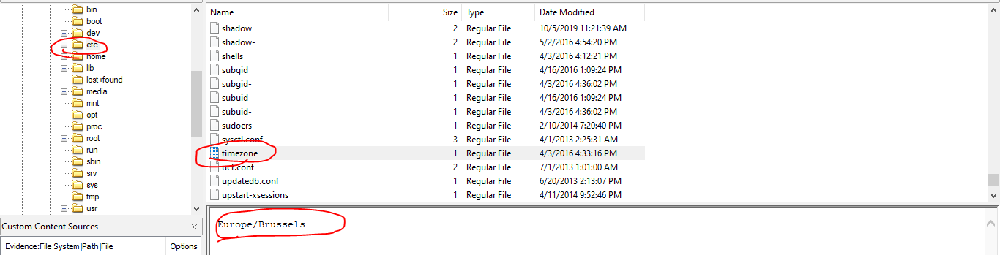
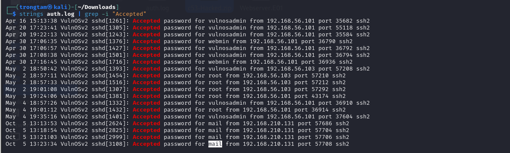
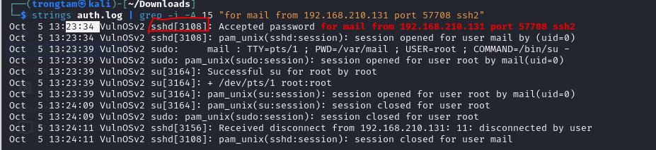
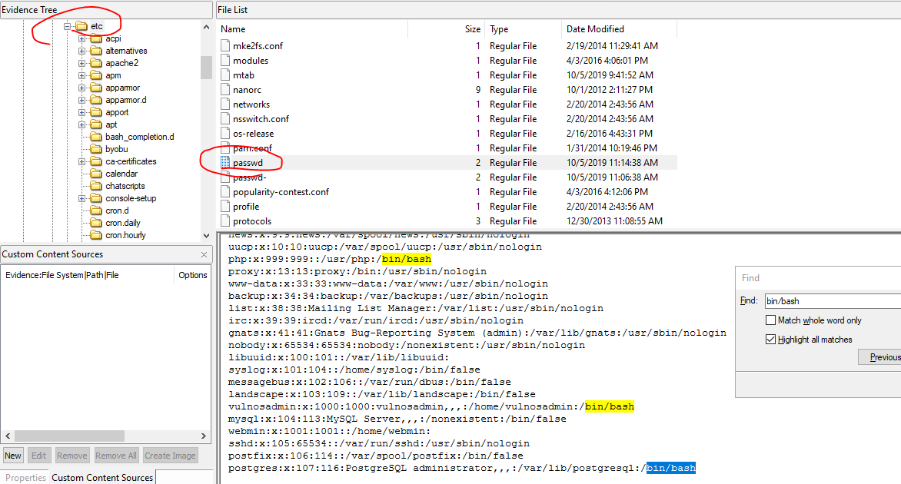
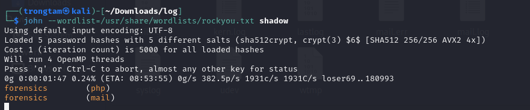
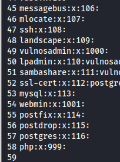
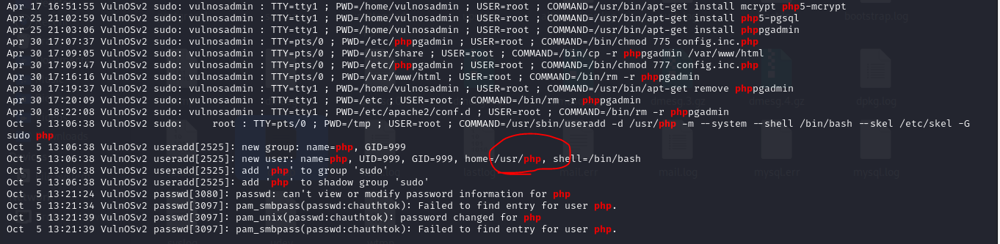
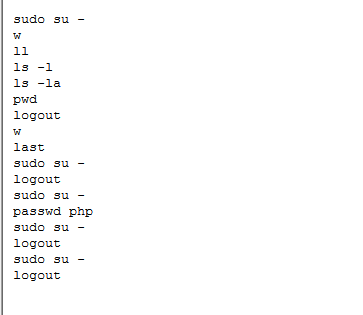
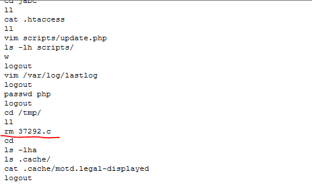
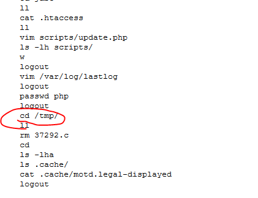

## Lab 
> https://cyberdefenders.org/blueteam-ctf-challenges/71#nav-questions
## Giải
### What is the system timezone?
- Trong linux có 1 thư mục etc chứa các cấu hình hệ thống bao gồm timezone, em sẽ kiểm tra nơi này trước 
- 
> Europe/Brussels
### Who was the last user to log in to the system?
- Để trả lời được câu hỏi này đầu tiên em phải check log trước. Log của linux nằm ở `/var/log/`
- Em sẽ phân tích từ tệp auth.log để check các đăng nhập thành công 
- 
> mail
### What was the source port the user 'mail' connected from?
- 
> 57708
### How long was the last session for user 'mail'? (Minutes only)
```
┌──(trongtam㉿kali)-[~/Downloads]
└─$ strings auth.log | grep -i -A 15 "for mail from 192.168.210.131 port 57708 ssh2"
Oct  5 13:23:34 VulnOSv2 sshd[3108]: Accepted password for mail from 192.168.210.131 port 57708 ssh2
Oct  5 13:23:34 VulnOSv2 sshd[3108]: pam_unix(sshd:session): session opened for user mail by (uid=0)
Oct  5 13:23:39 VulnOSv2 sudo:     mail : TTY=pts/1 ; PWD=/var/mail ; USER=root ; COMMAND=/bin/su -
Oct  5 13:23:39 VulnOSv2 sudo: pam_unix(sudo:session): session opened for user root by mail(uid=0)
Oct  5 13:23:39 VulnOSv2 su[3164]: Successful su for root by root
Oct  5 13:23:39 VulnOSv2 su[3164]: + /dev/pts/1 root:root
Oct  5 13:23:39 VulnOSv2 su[3164]: pam_unix(su:session): session opened for user root by mail(uid=0)
Oct  5 13:24:09 VulnOSv2 su[3164]: pam_unix(su:session): session closed for user root
Oct  5 13:24:09 VulnOSv2 sudo: pam_unix(sudo:session): session closed for user root
Oct  5 13:24:11 VulnOSv2 sshd[3156]: Received disconnect from 192.168.210.131: 11: disconnected by user
Oct  5 13:24:11 VulnOSv2 sshd[3108]: pam_unix(sshd:session): session closed for user mail

```
- Thời gian mở và đóng của user mail là `13:23:34` và `13:24:11` => 1 phút
> 1
### Which server service did the last user use to log in to the system?
- 
> sshd
### What type of authentication attack was performed against the target machine?
> brute-force
### How many IP addresses are listed in the '/var/log/lastlog' file?
- Em sẽ mở tệp lastlog để xem 
```
┌──(trongtam㉿kali)-[~/Downloads/log]
└─$ strings lastlog 
'3*Wtty1
]pts/1
192.168.210.131
2*Wpts/0
192.168.56.101
)Wtty1
```
> 2
### How many users have a login shell?
- Tại /etc/passwd sẽ lưu các thông tin về hệ thống và mật khẩu tương ứng 
- Những người dùng đăng nhập shell sẽ chứa bin/bash
- 
> 5
### What is the password of the mail user?
- Đầu tiên em sẽ kiểm tra /etc/shadow để lấy mật khẩu tương ứng 
> mail:$6$zLaoLV8N$BNxYZUxvXiZwb3UjBhCxnxd9Mb02DDUF.GfMj1kbLB.s/quBVtMM4QjfOvmZvfqeh7BuLXaRvRSfpQgNI5prE.:18174:0:99999:7:::
- Tiếp theo em sử dụng john để brute force mật khẩu ta được kết quả là forensics
- 
> forensics
### Which user account was created by the attacker?
> php
### How many user groups exist on the machine?
- Để biết bao nhiêu ta chỉ cần kiểm tra tại đường dẫn /etc/group
- 
> 58
### How many users have sudo access?
> 2
### What is the home directory of the PHP user?
- Dựa vào lệnh ` strings auth.log | grep -i php  ` để tìm thư mục chính của user php
- 
> /usr/php
### What command did the attacker use to gain root privilege? (Answer contains two spaces).
- Để biết câu lệnh attacker sử dụng chỉ cần kiểm tra tại /var/mail/.bash_history
- 
> sudo su -
### Which file did the user 'root' delete?
- Tại /root/.bash_history
- 
> 37292.c
### Recover the deleted file, open it and extract the exploit author name
- Xác định ban đầu tệp nằm tại /tmp/
- 
> rebel
### What is the content management system (CMS) installed on the machine?
- Kiểm tra tại `/var/www/html/index.php` 
> drupal
### What is the version of the CMS installed on the machine?
> 7.26
### Which port was listening to receive the attacker's reverse shell?
- Check tại /var/log/apache2/access.log
> 4444