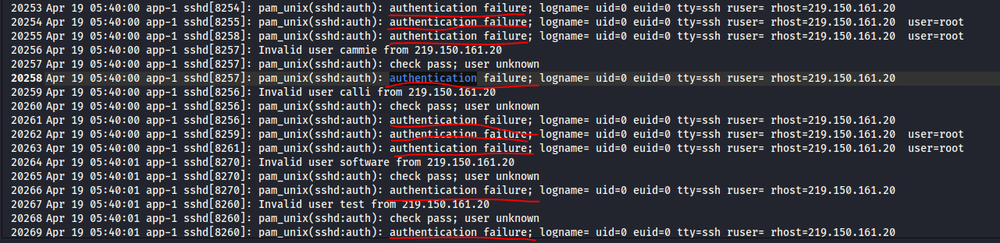
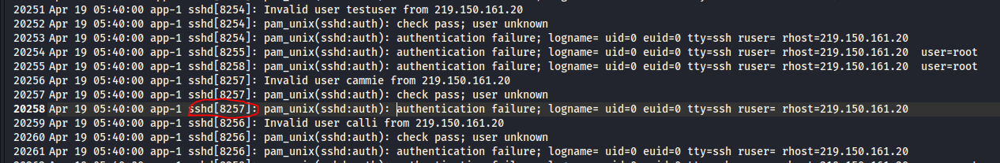
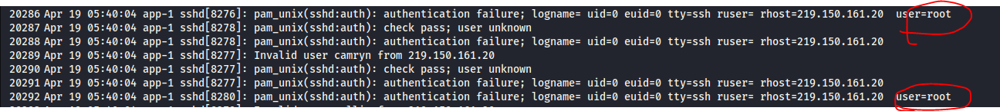
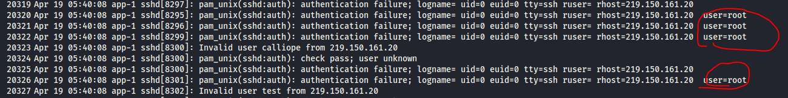
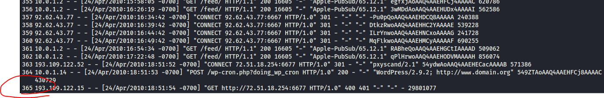
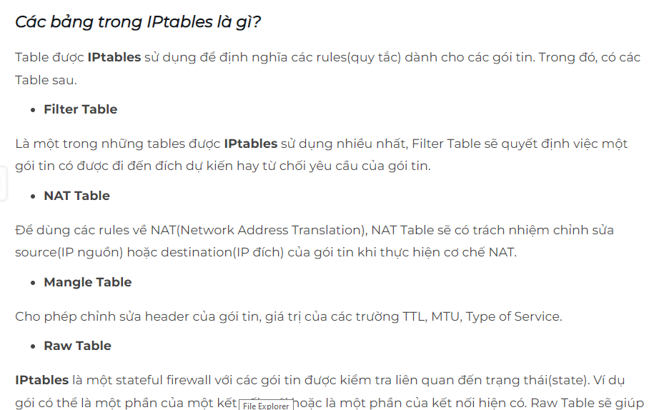
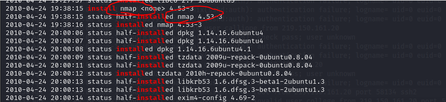

## Giải 
### Which service did the attackers use to gain access to the system?
- Sau quá trình phân tích log em thấy có rất nhiều đăng nhập bị failed
- 
- Rõ ràng nhận thấy được hacker đang cố gắng bruteforce đến sever
- Dựa vào đây để biết được dịch vụ mà hacker sử dụng 
- 
> ssh
### What is the operating system version of the targeted system? (one word)
- Dựa vào 1 vài kiến thức em đã tìm hiểu về log của linux em biết được `kern.log` là nơi chứa các thông tin về hệ điều hành
- Em tiến hành check thử file kern.log 
- 
> 4.2.4-1ubuntu3
### What is the name of the compromised account?
- Sau khi đọc log 1 vòng em nhận thấy rằng hầu hết các  `authentication failure` đều đến từ 1 user root (điều này khẳng định rằng user root đang bị tấn công)
- 
- 
- 
> root 
### Consider that each unique IP represents a different attacker. How many attackers were able to get access to the system?
- Chúng ta đã biết tài khoản bị xâm nhập là root, em sẽ viết 1 đoạn command lọc các user là root và đăng nhập không thành công (authentication failure)
```text
┌──(trongtam㉿kali)-[~/Downloads/Hammered]
└─$ strings auth.log | grep "authentication failure" | grep "user=root"  
Mar 18 11:20:17 app-1 su[9504]: pam_unix(su:auth): authentication failure; logname=user1 uid=1001 euid=0 tty=pts/0 ruser=user1 rhost=  user=root
Mar 18 11:20:24 app-1 su[9506]: pam_unix(su:auth): authentication failure; logname=user1 uid=1001 euid=0 tty=pts/0 ruser=user1 rhost=  user=root
Mar 18 17:01:15 app-1 su[14542]: pam_unix(su:auth): authentication failure; logname=user3 uid=1000 euid=0 tty=pts/1 ruser=user3 rhost=  user=root
Apr 18 18:22:07 app-1 sshd[5266]: pam_unix(sshd:auth): authentication failure; logname= uid=0 euid=0 tty=ssh ruser= rhost=61.151.246.140  user=root
Apr 18 18:22:11 app-1 sshd[5268]: pam_unix(sshd:auth): authentication failure; logname= uid=0 euid=0 tty=ssh ruser= rhost=61.151.246.140  user=root
Apr 18 18:22:15 app-1 sshd[5270]: pam_unix(sshd:auth): authentication failure; logname= uid=0 euid=0 tty=ssh ruser= rhost=61.151.246.140  user=root
Apr 18 18:22:18 app-1 sshd[5272]: pam_unix(sshd:auth): authentication failure; logname= uid=0 euid=0 tty=ssh ruser= rhost=61.151.246.140  user=root
Apr 18 18:22:22 app-1 sshd[5274]: pam_unix(sshd:auth): authentication failure; logname= uid=0 euid=0 tty=ssh ruser= rhost=61.151.246.140  user=root
...
```
- Có thể thấy ở đây có rất nhiều ip bị lặp nhau. Ý tưởng của em xoá các ip trùng nhau, để làm được em phải lọc được ip ra sau đó dùng uniq để in trên 1 dòng 
```
┌──(trongtam㉿kali)-[~/Downloads/Hammered]
└─$ strings auth.log | grep "authentication failure" | grep "user=root" | cut -c 124- | sed 's/user=root//' | sort | uniq -u
.128  
12.172.224.140  
122.165.9.200  
124.51.108.68  
4.52.185.9  
65.208.122.48  

```
- Lệnh cut -c 124- cắt chuỗi từ kí tự có chỉ số 124 trở về sau 
- lệnh sed 's/user=root//' : thay thế user=root thành 1 kí tự trống
- sort : Sắp xếp
- uniq -u : in mỗi cái dòng (khác nhau)
> 6
### Which attacker's IP address successfully logged into the system the most number of times?
- Đầu tiên em sẽ lọc các đăng nhập thành công vào tài khoản root
```
strings auth.log | grep "Accepted password" | grep "for root" | cut -b 64- | cut -b -19 | uniq -c
      1 rom 10.0.1.2 port 5
      2 om 219.150.161.20 p
      2 rom 219.150.161.20 
      1 rom 222.66.204.246 
      1 rom 201.229.176.217
      1 rom 190.167.70.87 p
      3 om 190.166.87.164 p
      1 rom 121.11.66.70 po
      1 om 193.1.186.197 po
      1 om 151.81.205.100 p
      1 om 151.82.3.201 por
      1 om 151.81.204.141 p
      1 om 222.169.224.197 
      2 rom 122.226.202.12 
      1 rom 121.11.66.70 po
      1 rom 61.168.227.12 p
      1 rom 188.131.22.69 p
      1 rom 190.167.74.184 
      1 om 94.52.185.9 port
      4 rom 188.131.23.37 p
```
- Tuy nhiên trong này có 1 số ip của người dùng, em sẽ check từng ip để xem cái nào là của attacker
> strings auth.log | grep -B 5 "219.150.161.20"
> Câu trả lời `219.150.161.20`
### How many requests were sent to the Apache Server?
- Để kiểm tra được số yêu cầu gửi đến Apache Server em check mục /apache2/www-access.log, em sẽ mở bằng mousepad để kiểm tra số dòng(vì mỗi dòng chính là 1 request)
- 
> 365
### How many rules have been added to the firewall?
- Sau 1 vài bước tìm kiếm, em biết được các rules được lưu trong 1 bảng tên IPtables 
- 
- Em filter các chuỗi chứa IPtables
```
┌──(trongtam㉿kali)-[~/Downloads/Hammered]
└─$ strings auth.log | grep -i "IPtables"                                                                                           
Apr 15 12:49:09 app-1 sudo:   user1 : TTY=pts/0 ; PWD=/opt/software/web/app ; USER=root ; COMMAND=/usr/bin/tee ../templates/proxy/iptables.conf
Apr 15 15:06:13 app-1 sudo:   user1 : TTY=pts/1 ; PWD=/opt/software/web/app ; USER=root ; COMMAND=/usr/bin/tee ../templates/proxy/iptables.conf
Apr 15 15:17:45 app-1 sudo:   user1 : TTY=pts/1 ; PWD=/opt/software/web/app ; USER=root ; COMMAND=/usr/bin/tee ../templates/proxy/iptables.conf
Apr 15 15:18:23 app-1 sudo:   user1 : TTY=pts/1 ; PWD=/opt/software/web/app ; USER=root ; COMMAND=/usr/bin/tee ../templates/proxy/iptables.conf
Apr 24 19:25:37 app-1 sudo:     root : TTY=pts/2 ; PWD=/etc ; USER=root ; COMMAND=/sbin/iptables -L
Apr 24 20:03:06 app-1 sudo:     root : TTY=pts/2 ; PWD=/etc ; USER=root ; COMMAND=/sbin/iptables -A INPUT -p ssh -dport 2424 -j ACCEPT
Apr 24 20:03:44 app-1 sudo:     root : TTY=pts/2 ; PWD=/etc ; USER=root ; COMMAND=/sbin/iptables -A INPUT -p tcp -dport 53 -j ACCEPT
Apr 24 20:04:13 app-1 sudo:     root : TTY=pts/2 ; PWD=/etc ; USER=root ; COMMAND=/sbin/iptables -A INPUT -p udp -dport 53 -j ACCEPT
Apr 24 20:06:22 app-1 sudo:     root : TTY=pts/2 ; PWD=/etc ; USER=root ; COMMAND=/sbin/iptables -A INPUT -p tcp --dport ssh -j ACCEPT
Apr 24 20:11:00 app-1 sudo:     root : TTY=pts/2 ; PWD=/etc ; USER=root ; COMMAND=/sbin/iptables -A INPUT -p tcp --dport 53 -j ACCEPT
Apr 24 20:11:08 app-1 sudo:     root : TTY=pts/2 ; PWD=/etc ; USER=root ; COMMAND=/sbin/iptables -A INPUT -p tcp --dport 113 -j ACCEPT
```
- Những đoạn có -A chính là các rules ta cần tìm 
> 6
### One of the downloaded files to the target system is a scanning tool. Provide the tool name.
- Có 1 tệp log được dùng để quản lý các gói và tải xuống các gói. Đó chính là tệp `dpkg.log`
- Em sẽ kiểm tra các công cụ được tải xuống trên máy
> strings dpkg.log | grep install
- 
> nmap
### When was the last login from the attacker with IP 219.150.161.20? Format: MM/DD/YYYY HH:MM:SS AM
- Trước tiên em sẽ lọc các gói có ip là `219.150.161.20` và đăng nhập thành công 
```
┌──(trongtam㉿kali)-[~/Downloads/Hammered]
└─$ strings auth.log | grep "219.150.161.20" | grep -i "Accepted password"
Apr 19 05:41:44 app-1 sshd[8810]: Accepted password for root from 219.150.161.20 port 51249 ssh2
Apr 19 05:42:27 app-1 sshd[9031]: Accepted password for root from 219.150.161.20 port 40877 ssh2
Apr 19 05:55:20 app-1 sshd[12996]: Accepted password for root from 219.150.161.20 port 55545 ssh2
Apr 19 05:56:05 app-1 sshd[13218]: Accepted password for root from 219.150.161.20 port 36585 ssh2
```
- Dòng cuối cùng chính là lần đăng nhập cuối cùng nhưng chưa đúng định dạng (thiếu năm)
- Em sẽ dùng exiftool để xác định thời gian (năm) tập tin được tạo
```
┌──(trongtam㉿kali)-[~/Downloads/Hammered]
└─$ exiftool auth.log 
ExifTool Version Number         : 12.65
File Name                       : auth.log
Directory                       : .
File Size                       : 10 MB
File Modification Date/Time     : 2010:07:04 00:53:20+07:00
File Access Date/Time           : 2024:01:17 17:45:02+07:00
File Inode Change Date/Time     : 2024:01:17 17:44:20+07:00
File Permissions                : -rw-r-----
File Type                       : TXT
File Type Extension             : txt
MIME Type                       : text/plain
MIME Encoding                   : us-ascii
Newlines                        : Unix LF
Line Count                      : 102164
Word Count                      : 1289927
```
> 04/19/2010 05:56:05 AM
### The database displayed two warning messages, provide the most important and dangerous one.
- Em xác định tệp daemon.log chính là tệp tin cần phân tích bởi vì nó chứa các các sự kiện như khởi động, dừng, lỗi, thông tin về các tiến trình chạy nền.
- Em sẽ bắt đầu bằng cách lọc chuỗi `mysql` và `warning`
```
┌──(trongtam㉿kali)-[~/Downloads/Hammered]
└─$ strings daemon.log | grep -i mysql | grep -i warning
Mar 18 10:18:42 app-1 /etc/mysql/debian-start[7566]: WARNING: mysql.user contains 2 root accounts without password!
Mar 18 17:01:44 app-1 /etc/mysql/debian-start[14717]: WARNING: mysql.user contains 2 root accounts without password!
Mar 22 13:49:49 app-1 /etc/mysql/debian-start[5599]: WARNING: mysql.user contains 2 root accounts without password!
Mar 22 18:43:41 app-1 /etc/mysql/debian-start[4755]: WARNING: mysql.user contains 2 root accounts without password!
Mar 22 18:45:25 app-1 /etc/mysql/debian-start[4749]: WARNING: mysql.user contains 2 root accounts without password!
Mar 25 11:56:53 app-1 /etc/mysql/debian-start[4848]: WARNING: mysql.user contains 2 root accounts without password!
Apr 14 14:44:34 app-1 /etc/mysql/debian-start[5369]: WARNING: mysql.user contains 2 root accounts without password!
Apr 14 14:44:36 app-1 /etc/mysql/debian-start[5624]: WARNING: mysqlcheck has found corrupt tables
Apr 18 18:04:00 app-1 /etc/mysql/debian-start[4647]: WARNING: mysql.user contains 2 root accounts without password!
Apr 24 20:21:24 app-1 /etc/mysql/debian-start[5427]: WARNING: mysql.user contains 2 root accounts without password!
Apr 28 07:34:26 app-1 /etc/mysql/debian-start[4782]: WARNING: mysql.user contains 2 root accounts without password!
Apr 28 07:34:27 app-1 /etc/mysql/debian-start[5032]: WARNING: mysqlcheck has found corrupt tables
Apr 28 07:34:27 app-1 /etc/mysql/debian-start[5032]: warning  : 1 client is using or hasn't closed the table properly
Apr 28 07:34:27 app-1 /etc/mysql/debian-start[5032]: warning  : 1 client is using or hasn't closed the table properly
May  2 23:05:54 app-1 /etc/mysql/debian-start[4774]: WARNING: mysql.user contains 2 root accounts without password!                                                                                                                          
```
- Có thể thấy có 1 vài cảnh báo về mysql ở đây
> mysql.user contains 2 root accounts without password!
### Multiple accounts were created on the target system. Which one was created on Apr 26 04:43:15?
- Em vẫn sẽ sử dụng grep để lọc như cũ
```
┌──(trongtam㉿kali)-[~/Downloads/Hammered]
└─$ strings auth.log | grep "Apr 26 04:43:15"                                                                                       
Apr 26 04:43:15 app-1 groupadd[20114]: new group: name=wind3str0y, GID=1005
Apr 26 04:43:15 app-1 useradd[20115]: new user: name=wind3str0y, UID=1004, GID=1005, home=/home/wind3str0y, shell=/bin/bash
```
> wind3str0y
### Few attackers were using a proxy to run their scans. What is the corresponding user-agent used by this proxy?
- Em sẽ  kiểm tra các user-agent tại apache2/www-access.log
- 
