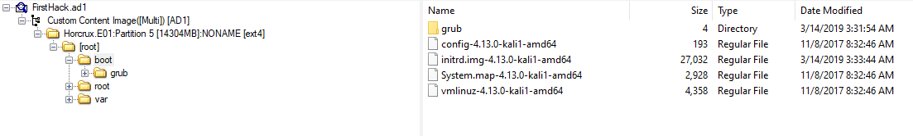
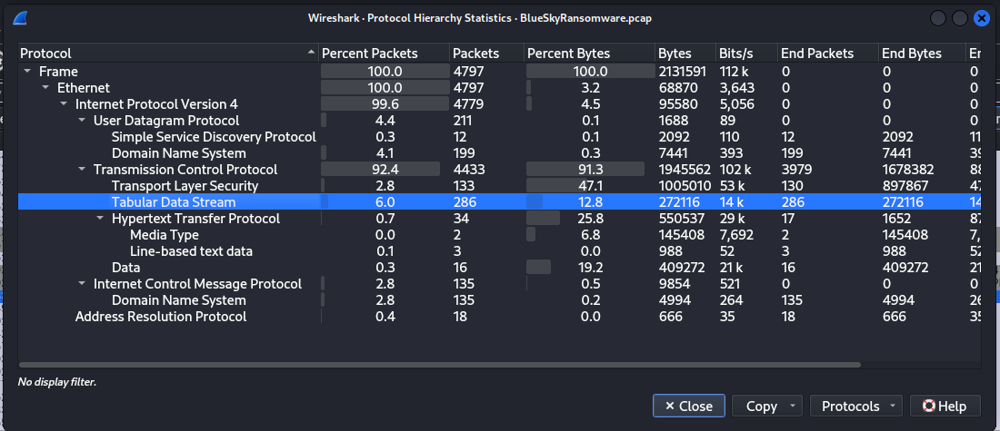
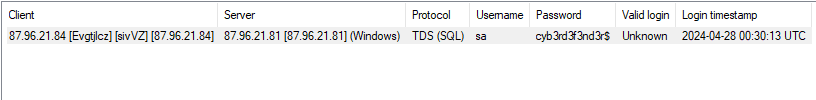
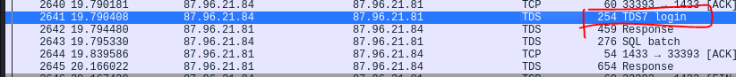
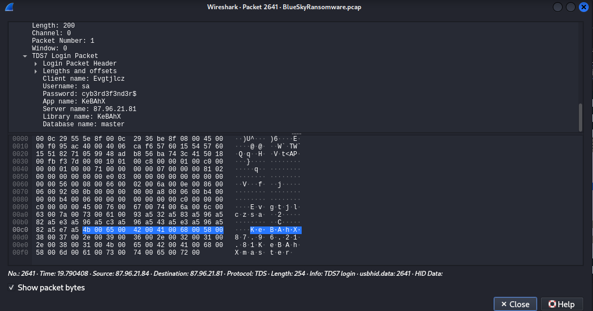
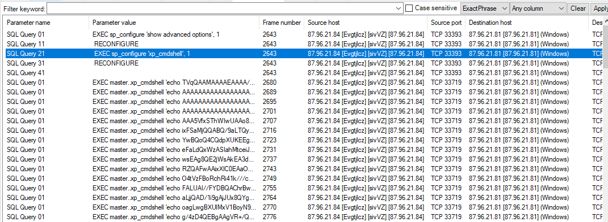
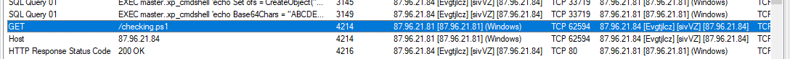

## Lab
> https://cyberdefenders.org/blueteam-ctf-challenges/62#nav-questions
## Giải 
- Sau khi tải về em được 2 file Horcrux.ad1 và Horcrux.ad1.txt, tiến hành mở nó bằng công cụ FTK image
- Trả lời lần lượt từng câu hỏi 
### What is the administrator's username?
- Tiến hành phân tích Sam từ registry để xem các user trên máy 
- 
- Tiếp theo mở nó trên registry explorer để tiến hành phân tích
- 
> karen
### What is the OS's build number?
- Đầu tiên export hives software để xem các thông tin về os 
- 
### What is the hostname of the computer?
- hives system là nơi chưa hostname của máy, check tại "ControlSet001\Control\ComputerName\ComputerName"
- 
> TOTALLYNOTAHACK
### A messaging application was used to communicate with a fellow Alpaca enthusiest. What is the name of the software?
- Để xem các application chúng ta check tại SOFTWARE 
- Microsoft\Windows\CurrentVersion\App Paths
- 
> SKYPE
### What is the zip code of the administrator's post?
- 
> 19709
### What are the initials of the person who contacted the admin user from TAAUSAI?
- Tìm người liên hệ, em sẽ kiểm tra phần outlook trước 
- 
- Ở đây có 1 cái mail
- Để mở được file ost em dùng trang web [này](https://products.groupdocs.app/viewer/app/?lang=en)
- 
### How much money was TAAUSAI willing to pay upfront?
> 150000
### What country is the admin user meeting the hacker group in?
- Đọc lần lượt các mail, em nhận thấy có 1 toạ độ, check toạ độ ta sẽ có được đáp án 
> egypt
### What is the machine's timezone? (Use the three-letter abbreviation)
- Để kiểm tra múi giờ ta kiểm tra phần timezone infomation của hives system
- 
> UTC
### When was AlpacaCare.docx last accessed?
- 
> 03/17/2019 09:52 PM
### There was a second partition on the drive. What is the letter assigned to it?
> A
### What is the answer to the question Company's manager asked Karen?
> TheCardCriesNoMore
### What is the job position offered to Karen? (3 words, 2 spaces in between)
- 
> cyber security analyst
### When was the admin user password last changed?
- Để xem các thông tin về người dùng ở hives SAM
- 
> 03/21/2019 19:13:09
### What version of Chrome is installed on the machine?
- XEm các phiên bản được cài trên máy ở software  `WOW6432Node\Microsoft\Windows\CurrentVersion\`
- 
> 72.0.3626.121
### What is the HostUrl of Skype?
- 
> https://download.skype.com/s4l/download/win/Skype-8.41.0.54.exe
### What is the domain name of the website Karen browsed on Alpaca care that the file AlpacaCare.docx is based on?
- Đầu tiên em export file ra từ ftk image
- 
- 
- 
> palominoalpacafarm.com