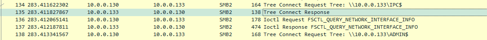
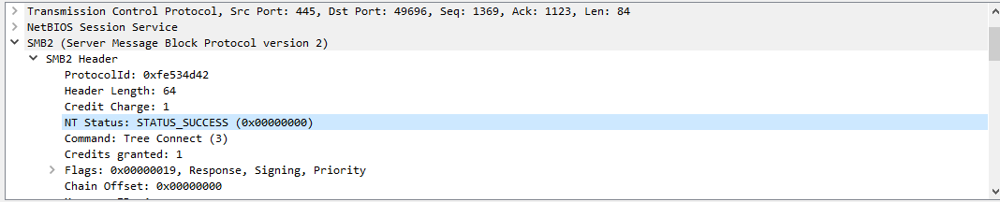
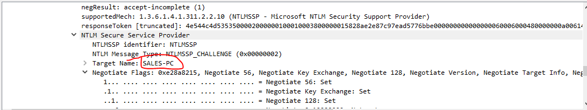

## Description 
> Our Intrusion Detection System (IDS) has raised an alert, indicating suspicious lateral movement activity involving the use of PsExec. To effectively respond to this incident, your role as a SOC Analyst is to analyze the captured network traffic stored in a PCAP file.

## Link challenge 
> https://cyberdefenders.org/blueteam-ctf-challenges/psexec-hunt/

## Solution 
- Tìm hiểu về 1 số khái niệm 1 tí 

```
PsExec là một công cụ quản trị hệ thống đa năng của Microsoft mà bạn có thể dùng để truy cập từ xa một máy chủ đích. Công cụ tiện ích này là một phần của Sysinternals Suites do Mark Russinovich tạo ra. Mục đích chính của nó là giúp quản trị viên hệ thống thực hiện các nhiệm vụ bảo trì từ xa và thực thi các lệnh trên máy chủ đích. Là một giao diện dòng lệnh, công cụ này chỉ yêu cầu bạn cung cấp địa chỉ đích, chi tiết người dùng và mật khẩu để có quyền truy cập vào máy tính đích. 
 PsExec không yêu cầu bạn cài đặt một chương trình khách trên PC của bạn hoặc một phần mềm khác trên máy chủ từ xa. PsExec có thể chuyển hướng đầu vào và đầu ra của các ứng dụng bảng điều khiển.

Ví dụ: nếu bạn truy cập từ xa một máy tính có địa chỉ IP 192.168.79.32 và chạy lệnh ipconfig trên PsExec, tức là:
```
`Psexec \\192.168.79.32 ipconfig`
```
Bạn sẽ thấy đầu ra ipconfig (tức là cấu hình TCP/IP của hệ thống từ xa) trên máy tính cá nhân của mình, giống như khi bạn chạy lệnh trên localhost.
```

### In order to effectively trace the attacker's activities within our network, can you determine the IP address of the machine where the attacker initially gained access?

- Bắt đầu phân tích file pcap, tại gói 134 có 1 yêu cầu được gửi đến yêu cầu sử dụng tài nguyên ICP và gói 138 cũng tương tự cho ADMIN
- 
- Dựa vào respone có thể xác định rằng việc kết nối đã thành công 
- 
```
Access Mask: 0x011f01ff
    .... .... .... .... .... .... .... ...1 = Read: READ access
    .... .... .... .... .... .... .... ..1. = Write: WRITE access
    .... .... .... .... .... .... .... .1.. = Append: APPEND access
    .... .... .... .... .... .... .... 1... = Read EA: READ EXTENDED ATTRIBUTES access
    .... .... .... .... .... .... ...1 .... = Write EA: WRITE EXTENDED ATTRIBUTES access
    .... .... .... .... .... .... ..1. .... = Execute: EXECUTE access
    .... .... .... .... .... .... .1.. .... = Delete Child: DELETE CHILD access
    .... .... .... .... .... .... 1... .... = Read Attributes: READ ATTRIBUTES access
    .... .... .... .... .... ...1 .... .... = Write Attributes: WRITE ATTRIBUTES access
    .... .... .... ...1 .... .... .... .... = Delete: DELETE access
    .... .... .... ..1. .... .... .... .... = Read Control: READ ACCESS to owner, group and ACL of the SID
    .... .... .... .1.. .... .... .... .... = Write DAC: OWNER may WRITE the DAC
    .... .... .... 1... .... .... .... .... = Write Owner: Can WRITE OWNER (take ownership)
    .... .... ...1 .... .... .... .... .... = Synchronize: Can wait on handle to SYNCHRONIZE on completion of I/O
    .... ...1 .... .... .... .... .... .... = System Security: SYSTEM SECURITY is set
    .... ..0. .... .... .... .... .... .... = Maximum Allowed: Maximum allowed is NOT set
    ...0 .... .... .... .... .... .... .... = Generic All: Generic all is NOT set
    ..0. .... .... .... .... .... .... .... = Generic Execute: Generic execute is NOT set
    .0.. .... .... .... .... .... .... .... = Generic Write: Generic write is NOT set
    0... .... .... .... .... .... .... .... = Generic Read: Generic read is NOT set

```
- Đây là 1 số quyền được phép 
- Tiếp theo tại gói 144 ip `10.0.0.130` taoj 1 request file psexesvc.exe. Đến đây có thể dễ dàng xác định ip của attacker là `10.0.0.130`

### To fully comprehend the extent of the breach, can you determine the machine's hostname to which the attacker first pivoted?
- Để xác định được ta chỉ cần xem các request mà ip `10.0.0.130` đã gửi 
- 

### After identifying the initial entry point, it's crucial to understand how far the attacker has moved laterally within our network. Knowing the username of the account the attacker used for authentication will give us insights into the extent of the breach. What is the username utilized by the attacker for authentication?
- Tại gói 132 ta thấy yêu cầu Session Setup Request trong giao thức SMB2 (Server Message Block Protocol version 2), cụ thể là với cơ chế NTLM (NT LAN Manager). Đây là một phần của quá trình xác thực để thiết lập phiên giữa client và server. Sử dụng username là `ssales`

### After figuring out how the attacker moved within our network, we need to know what they did on the target machine. What's the name of the service executable the attacker set up on the target?
- Như đã nói ở câu đầu tiên hacker thiết lập 1 file `psexesvc.exe`, sau đó đọc và ghi dữ liệu vào file này


================================== CHƯA XONG =================================================
