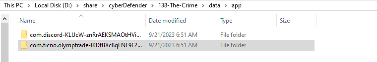
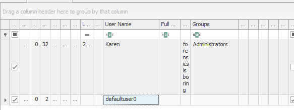
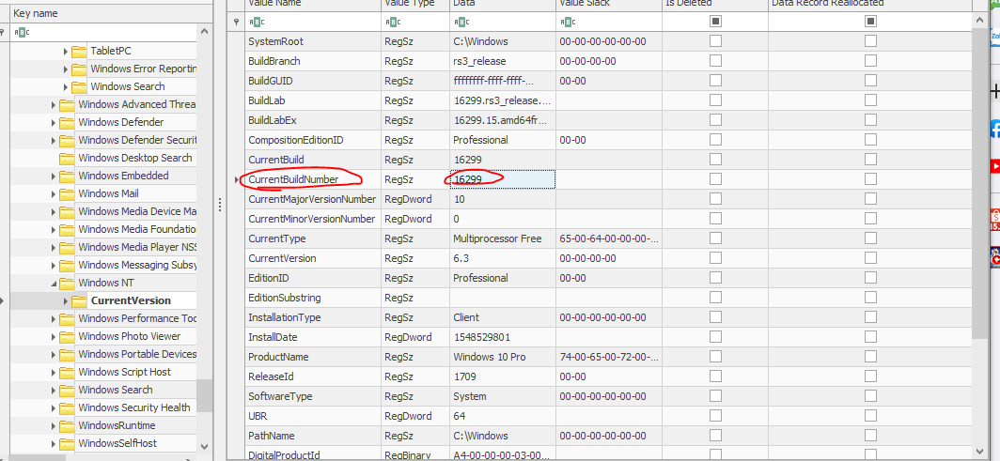

## Description 
> We're currently in the midst of a murder investigation, and we've obtained the victim's phone as a key piece of evidence. After conducting interviews with witnesses and those in the victim's inner circle, your objective is to meticulously analyze the information we've gathered and diligently trace the evidence to piece together the sequence of events leading up to the incident.
## Link challenge 
> https://cyberdefenders.org/blueteam-ctf-challenges/the-crime/
## Solution
### 1. ***Based on the accounts of the witnesses and individuals close to the victim, it has become clear that the victim was interested in trading. This has led him to invest all of his money and acquire debt. Can you identify which trading application the victim primarily used on his phone?***
- Để xác định được các ứng dụng có trên máy ta truy cập vào đường dẫn `****\138-The-Crime\data\app` thì thấy hiện tại có 2 ứng dụng 
- 
- 1 là discord còn ứng dụng thứ 2 em tìm trên [google](https://www.google.com/search?q=ticno+olymtrade+app&sca_esv=9ff24e19fce44e89&sxsrf=ADLYWII8GelE0QzkiAEgwnk1B0CHv4NnTg%3A1715575160565&ei=eJlBZruPIvWq0-kP_e6S8AQ&udm=&ved=0ahUKEwi7q5_A54mGAxV11TQHHX23BE4Q4dUDCBA&uact=5&oq=ticno+olymtrade+app&gs_lp=Egxnd3Mtd2l6LXNlcnAiE3RpY25vIG9seW10cmFkZSBhcHAyCBAAGIAEGKIEMggQABiiBBiJBTIIEAAYgAQYogRI-B5QqQZYjB1wAXgBkAEAmAHIAaABxAuqAQUwLjkuMbgBA8gBAPgBAZgCCaACtgnCAgoQABiwAxjWBBhHwgINEAAYgAQYsAMYQxiKBcICExAuGIAEGLADGNEDGEMYxwEYigXCAgcQIxiwAhgnwgIGEAAYDRgewgIMEAAYBRgHGAoYHhgPwgIIEAAYBRgNGB7CAgwQABgFGAoYDRgeGA-YAwDiAwUSATEgQIgGAZAGCpIHAzEuOKAH8yY&sclient=gws-wiz-serp) thì biết được đây là ứng dụng dùng để giao dịch

> A : Olymp Trade

### 2. ***According to the testimony of the victim's best friend, he said, "While we were together, my friend got several calls he avoided. He said he owed the caller a lot of money but couldn't repay now". How much does the victim owe this person?***
- Để tìm được vị trí lưu tin nhắn trong diện thoại, mình tra google với từ khoá `sms storage location in android` thì biết được nó được lưu tại ` data > user_de > 0 > com.android > providers.telephony > databases > mmssms.db`
- Để mở được tệp có đuôi .db ta cần mở file với các công cụ có sẵn, ta sử dụng công cụ online `https://sqliteviewer.app/`
- 
- Tại phần sms thấy được 1 đoạn tin nhắn có nội dung như sau 
```
It's time for you to pay back the money you owe me, but you're not picking up my calls. You better think twice about not paying, because it won't end well for you. Prepare the sum of 250,000 EGP, and I'll expect your call within an hour at most.
```
### 3. ***What is the name of the person to whom the victim owes money?***
- Từ trên ta biết được sđt của người cho mượn tiền là `+201172137258`
- Ý tưởng là tìm thông tin qua tên được lưu trên điện thoại
- Sau 1 hồi mò [google](https://www.quora.com/What-is-the-storage-location-of-contacts-saved-in-Android-phones) thì mình biết được vị trí lưu thông tin này nằm ở `data/data/com.Android.provider.contacts/databases/contacts.db` mở bằng công cụ xem sqlite3 và tìm sđt của nghi phạm thì ta xác định được tên là `Shady Wahab`
> A : Shady Wahab


### 4. ***The detective continued his investigation by questioning the hotel lobby. She informed him that the victim had reserved the room for 10 days and had a flight scheduled thereafter. The investigator believes that the victim may have stored his ticket information on his phone. Look for where the victim intended to travel.***
- Rõ ràng thông tin của vé đã được lưu vào điện thoại ta kiểm tra lần lượt các thư mục người dùng của android, tại `***\data\media\0\Download` có 1 vé máy bay 
- 
- Thấy rằng nạn nhân đặt vé đến Las Vegas vào ngày 1.10.2023
> Las Vegas

### 5. ***After examining the victim's Discord conversations, we discovered he had arranged to meet a friend at a specific location. Can you determine where this meeting was supposed to occur?***
- Với câu hỏi này đầu tiên làm mình nghĩ ngay đến google map, tuy nhiên trên máy nạn nhân không có ứng dụng này

### 6. ***Based on the statement from the victim's family, they said that on September 20, 2023, he departed from his residence without informing anyone of his destination. Where was the victim located at that moment?***
- Câu này chưa làm được

