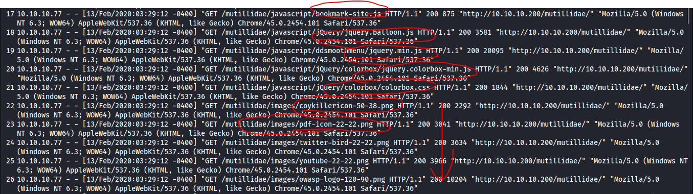
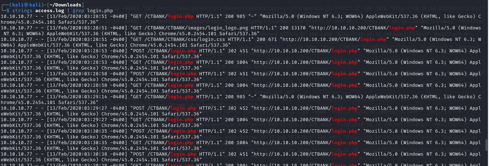
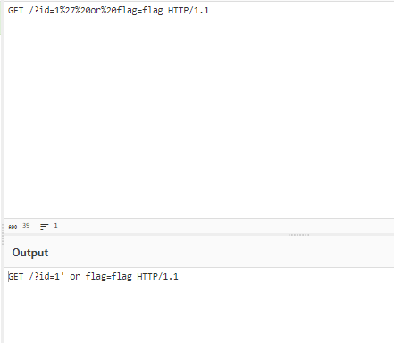
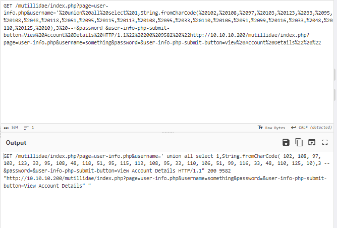

## Decription
> our client bank is under attack, may the logs will help
## Link challenge
> https://cybertalents.com/challenges/forensics/ctbank
## Solution
- Đầu tiên em phân tích tệp log, thấy rằng có rất nhiều request gửi đến host để thăm dò từng path của nó 
- 
- Nhưng điều đặc biệt là, hầu hết các request chỉ nhắm vào form login.php => Phân tích bắt đầu từ đây
- 
- Có rất nhiều câu query rất đáng ngờ như 
```
10.10.10.77 - - [13/Feb/2020:03:35:08 -0400] "GET /mutillidae/index.php?page=login.php HTTP/1.1" 200 9268 "http://10.10.10.200/mutillidae/index.php?page=user-info.php&username=something&password=&user-info-php-submit-button=View+Account+Details" "Mozilla/5.0 (Windows NT 6.3; WOW64) AppleWebKit/537.36 (KHTML, like Gecko) Chrome/45.0.2454.101 Safari/537.36"

10.10.10.77 - - [13/Feb/2020:03:40:53 -0400] "GET /CTBANK/login.php?username=did+you+get+the+flag%21&password=&Login=Login HTTP/1.1" 200 986 "http://10.10.10.200/CTBANK/login.php" "Mozilla/5.0 (Windows NT 6.3; WOW64) AppleWebKit/537.36 (KHTML, like Gecko) Chrome/45.0.2454.101 Safari/537.36"

```
- Và 1 dòng quan trọng xác định mọi vấn đề `GET /?id=1%27%20or%20flag=flag HTTP/1.1`
- 
- Đây chính xác là tấn công sql injection
```
SQL Injection là một kỹ thuật lợi dụng những lỗ hổng về câu truy vấn của các ứng dụng. Được thực hiện bằng cách chèn thêm một đoạn SQL để làm sai lệnh đi câu truy vấn ban đầu, từ đó có thể khai thác dữ liệu từ database. SQL injection có thể cho phép những kẻ tấn công thực hiện các thao tác như một người quản trị web, trên cơ sở dữ liệu của ứng dụng.
```
- Tìm thêm 1 tí nữa ta có tiếp 1 dòng truy vấn union
- 
- Convert decimal sang ascii ta được flag 
> flag{!_l0v3_sql_!nj3ct!0n}