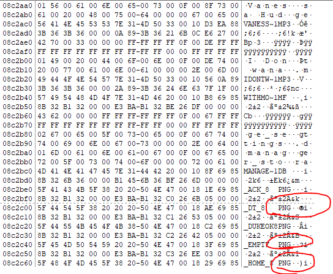
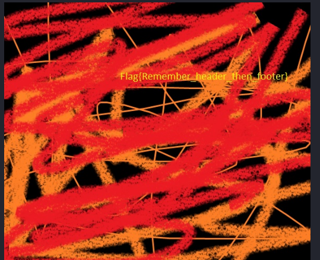

## Description 
> this is a JTAG mobile Extraction for a handset in a criminal case. Catch the Flag
## Link challenge 
> https://cybertalents.com/challenges/forensics/jtag-dump
## Solution 
- Trước tiên em tải xuống và xem nó bằng công cụ hexeditor trước thì thấy có nhiều file png ẩn ở trong 
- 
- Dùng binwalk để extract chúng ra 
```┌──(kali㉿kali)-[~/Downloads]
└─$ binwalk -e Jtag-dump.bin

DECIMAL       HEXADECIMAL     DESCRIPTION
--------------------------------------------------------------------------------
550144        0x86500         JPEG image data, JFIF standard 1.01
623589        0x983E5         JPEG image data, JFIF standard 1.02
623619        0x98403         TIFF image data, little-endian offset of first image directory: 8
633855        0x9ABFF         JPEG image data, JFIF standard 1.01
7977024       0x79B840        JPEG image data, EXIF standard
7977036       0x79B84C        TIFF image data, little-endian offset of first image directory: 8
10179269      0x9B52C5        gzip compressed data, from FAT filesystem (MS-DOS, OS/2, NT), last modified: 1970-01-01 00:00:00 (null date)
13916992      0xD45B40        JPEG image data, EXIF standard
13917004      0xD45B4C        TIFF image data, big-endian, offset of first image directory: 8
15746496      0xF045C0        JPEG image data, EXIF standard
15746508      0xF045CC        TIFF image data, big-endian, offset of first image directory: 8
15781376      0xF0CE00        GIF image data, version "89a", 240 x 266
16194245      0xF71AC5        gzip compressed data, from FAT filesystem (MS-DOS, OS/2, NT), last modified: 1970-01-01 00:00:00 (null date)
16672640      0xFE6780        GIF image data, version "89a", 160 x 120
16710656      0xFEFC00        JPEG image data, EXIF standard
16710668      0xFEFC0C        TIFF image data, little-endian offset of first image directory: 8
16736000      0xFF5F00        JPEG image data, EXIF standard
16736012      0xFF5F0C        TIFF image data, little-endian offset of first image directory: 8
19660608      0x12BFF40       GIF image data, version "89a", 101 x 80
19666944      0x12C1800       GIF image data, version "89a", 176 x 144
22944768      0x15E1C00       GIF image data, version "89a", 250 x 200
23654659      0x168F103       MySQL ISAM compressed data file Version 7
29935488      0x1C8C780       JPEG image data, JFIF standard 1.01
31805632      0x1E550C0       JPEG image data, EXIF standard
31805644      0x1E550CC       TIFF image data, little-endian offset of first image directory: 8
31879552      0x1E67180       JPEG image data, EXIF standard
31879564      0x1E6718C       TIFF image data, little-endian offset of first image directory: 8
35580864      0x21EEBC0       JPEG image data, JFIF standard 1.01
35581376      0x21EEDC0       GIF image data, version "89a", 393 x 275
35640512      0x21FD4C0       PNG image, 278 x 57, 8-bit colormap, non-interlaced
35682752      0x22079C0       JPEG image data, JFIF standard 1.01
36024384      0x225B040       GIF image data, version "89a", 174 x 132
36034368      0x225D740       JPEG image data, EXIF standard
36034380      0x225D74C       TIFF image data, big-endian, offset of first image directory: 8
36065536      0x2265100       JPEG image data, JFIF standard 1.02
36079808      0x22688C0       JPEG image data, JFIF standard 1.02
...
```
- 
> Flag : Flag{Remember_header_then_footer}