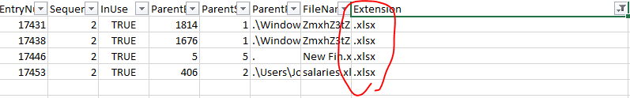
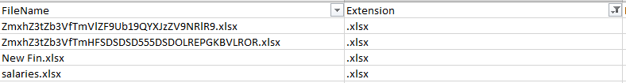
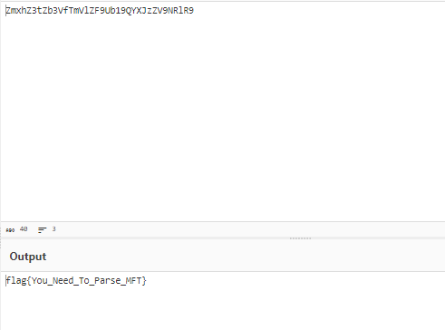

## Description
> an incident handler has acquired a MFT file from NTFS partition from an employee workstation  which is suspected to steal excel file sheets so , can you help! .    
## Link challenge 
> https://cybertalents.com/challenges/forensics/mft
## Solution 
- Trước tiên để phân tích file mft em sử dụng công cụ  MFTECmd được tải [ở đây](https://ericzimmerman.github.io/#!index.md)
                Sau khi tải về em convert nó sang file csv để dễ dàng phân tích 
```
PS D:\share\MFTECmd> .\MFTECmd.exe -f "D:\share\MFT" --csv a.csv
MFTECmd version 1.2.2.1

Author: Eric Zimmerman (saericzimmerman@gmail.com)
https://github.com/EricZimmerman/MFTECmd

Command line: -f D:\share\MFT --csv a.csv

Warning: Administrator privileges not found!

File type: Mft

Processed D:\share\MFT in 1.5947 seconds

D:\share\MFT: FILE records found: 42,831 (Free records: 177) File size: 42MB
Path to a.csv doesn't exist. Creating...
        CSV output will be saved to a.csv\20240328060713_MFTECmd_$MFT_Output.csv
```
- Dựa vào mô tả, em thấy các file excel đã bị ăn trộm. Nên em filter các file có đuôi của excel ra 
- 
- 
- Ta thấy 1 vài file có tên được mã hoá base64
- Decode ta thu được flag 
- 
> flag{You_Need_To_Parse_MFT}

