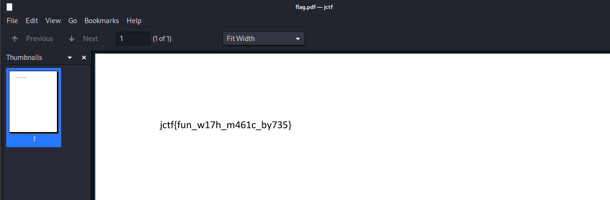

## Đề
- Giải này là giải cũ nên em lấy file backup lưu [ở đây](https://drive.google.com/file/d/1qunUKkNXpyShXq59pM6C_XbKsFbzRGmV/view?usp=sharing)
## Description
> The backup of our data was somehow corrupted. Recover the data and be rewarded with a flag.
## Solution 
- Sau khi tải file backup về em thu được 1 tệp tin không có đuôi, để xác định loại file em dùng lệnh file 
```
┌──(kali㉿kali)-[~/Downloads]
└─$ file data-backup 
data-backup: Zip archive data, made by v3.0 UNIX, extract using at least v2.0, last modified, last modified Sun, Mar 19 2021 19:09:12, uncompressed size 767672, method=deflate
```
- Tiếp theo em chuyển nó sang file zip rồi giải nén 
```
┌──(kali㉿kali)-[~/Downloads]
└─$ mv data-backup data-backup.zip                                                  
                                                                                                                                                                        
┌──(kali㉿kali)-[~/Downloads]
└─$ ls
3360.dmp                data-backup.zip          final.pcapng  living-on-the-edge.vmem  save     secret-tunnels.pcapng  the-panglao-watchtower.jpg
a_sticky_situation.ad1  digitalfootprint.pcapng  itsacap.pcap  locked-out.zip           SECRETS  skimmer.exe            the-panglao-watchtower.zip
                                                                                                                                                                        
┌──(kali㉿kali)-[~/Downloads]
└─$ unzip data-backup.zip 
Archive:  data-backup.zip
file #1:  bad zipfile offset (local header sig):  0
  inflating: flag.pdf                
  inflating: flag.png                
  inflating: student_list.txt        
  inflating: students.csv            
  inflating: students_file.json      
  inflating: students.xlsx           
                                      
```
- Kiểm tra lần lượt từng file ta thu được flag ở file flag.pdf
- 
