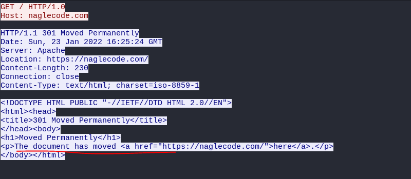
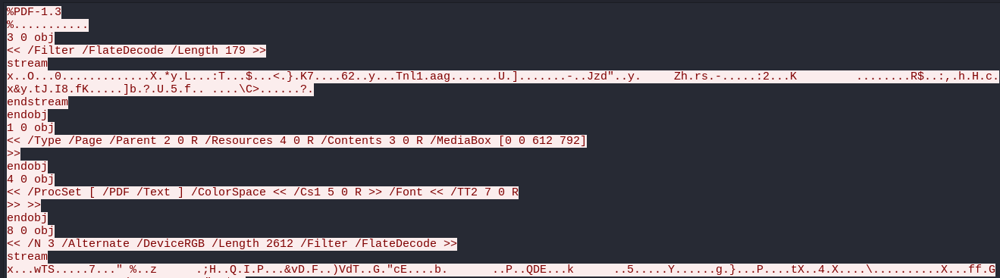

## Đề :
> Someone accessed the server and stole the flag. Use the network packet capture to find it.
## Hint 
> Look for unusual ports.
## Link chall 
> https://drive.google.com/drive/folders/1ZNcMZxA9fQGiI3-7n8vJgGPU5RkOdjMz?usp=sharing
## Solution
- Đầu tiên dựa theo manh mối của đề, em tìm các cổng đáng nghi nhưng không thấy
- Em theo dõi luồng tcp thì thấy 1 và điểm như sau 
```
USER anonymous
PASS anonymous
quit
220 Please use http://ftp.acc.umu.se/ whenever possible.
331 Please specify the password.
230 Login successful.
221 Goodbye.
```
- 
- Và 1 file pdf, lấy file pdf ra ta được flag
- 
> Flag : jctf{0v3r_7h3_w1r3}