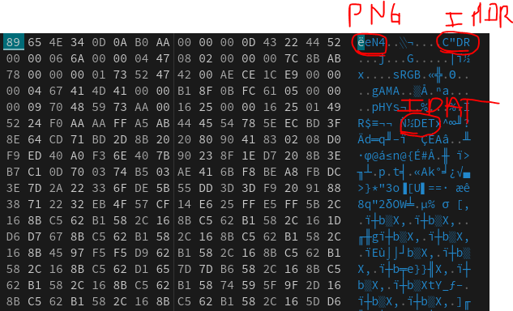
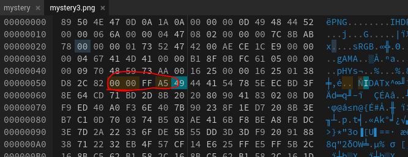
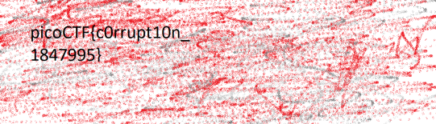

## Description 
> We found this file. Recover the flag.
## Link challenge 
> https://play.picoctf.org/practice/challenge/53?assigned=0&category=4&page=1&solved=1
## Solution
- Sau khi tải file và kiểm tra loại file bằng lệnh file thì không có, check magic byte để xem thì header đã bị hỏng.
- Tiến hành fix magic byte + 1 vài chỗ khác 
- 
- Tiếp theo kiểm tra lại bằng pngcheck -v 
```
┌──(kali㉿kali)-[~/Downloads]
└─$ pngcheck -v mystery3.png
File: mystery3.png (202940 bytes)
  chunk IHDR at offset 0x0000c, length 13
    1642 x 1095 image, 24-bit RGB, non-interlaced
  chunk sRGB at offset 0x00025, length 1
    rendering intent = perceptual
  chunk gAMA at offset 0x00032, length 4: 0.45455
  chunk pHYs at offset 0x00042, length 9: 2852132389x5669 pixels/meter
:  invalid chunk length (too large)
ERRORS DETECTED in mystery3.png

```
- Có vẻ như CRC bị lỗi 
- Để tính được giá trị của CRC ta sử dụng công thức sau:
    offset IDAT tiếp theo - offset IDAT hiện tại - 8 byte 
    0x00010008 − 0x00000057 - 0x12 (4 byte IDAT đầu, 4 byte IDAT thứ 2, 4 byte CRC)= 0xffa5
- 
- 